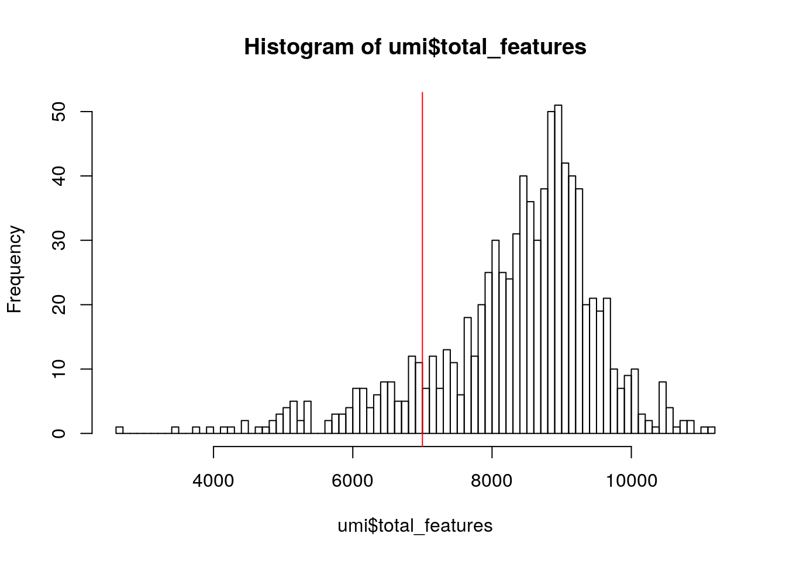
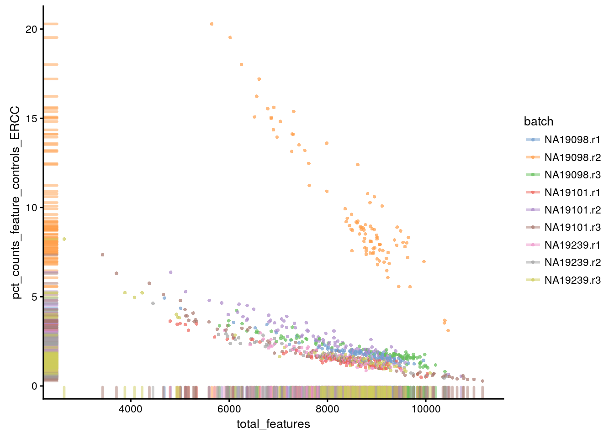
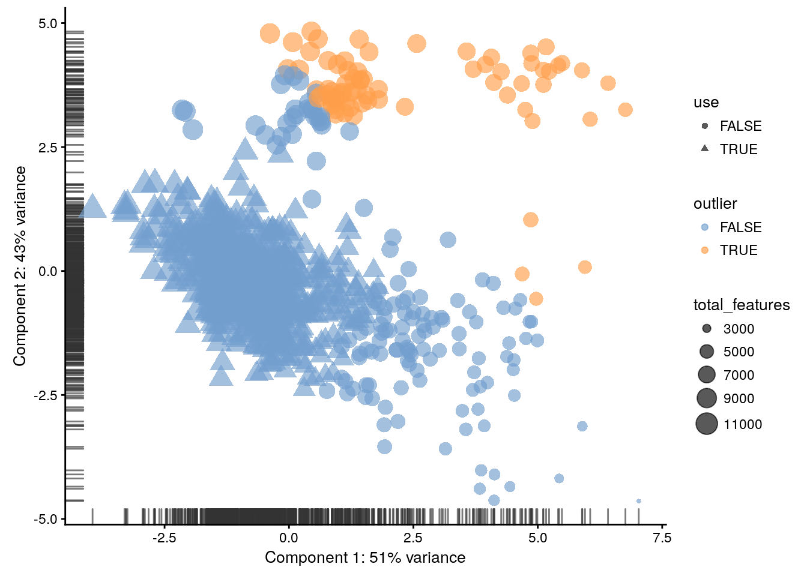
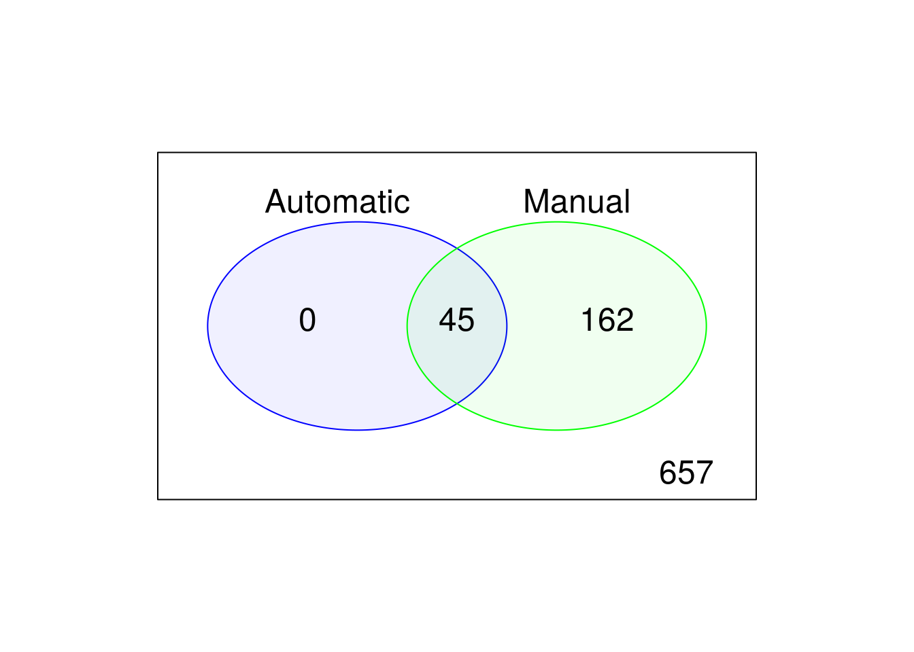

# Expression QC (UMI) {#exprs-qc}

## Introduction

Once gene expression has been quantified it is summarized as an __expression matrix__ where each row corresponds to a gene (or transcript) and each column corresponds to a single cell. This matrix should be examined to remove poor quality cells which were not detected in either read QC or mapping QC steps. Failure to remove low quality cells at this
stage may add technical noise which has the potential to obscure
the biological signals of interest in the downstream analysis. 

Since there is currently no standard method for performing scRNASeq the expected values for the various QC measures that will be presented here can vary substantially from experiment to experiment. Thus, to perform QC we will be looking for cells which are outliers with respect to the rest of the dataset rather than comparing to independent quality standards. Consequently, care should be taken when comparing quality metrics across datasets collected using different protocols.


## Tung dataset

To illustrate cell QC, we consider a
[dataset](http://jdblischak.github.io/singleCellSeq/analysis/) of
 induced pluripotent stem cells generated from three different individuals [@Tung2017-ba] in [Yoav Gilad](http://giladlab.uchicago.edu/)'s lab at the
University of Chicago. The experiments were carried out on the
Fluidigm C1 platform and to facilitate the quantification both unique
molecular identifiers (UMIs) and ERCC _spike-ins_ were used. The data files are located in the `tung` folder in your working directory. These files are the copies of the original files made on the 15/03/16. We will use these copies for reproducibility purposes.


```r
library(SingleCellExperiment)
library(scater)
library(knitr)
options(stringsAsFactors = FALSE)
```

Load the data and annotations:

```r
molecules <- read.table("tung/molecules.txt", sep = "\t")
anno <- read.table("tung/annotation.txt", sep = "\t", header = TRUE)
```

Inspect a small portion of the expression matrix

```r
knitr::kable(
    head(molecules[ , 1:3]), booktabs = TRUE,
    caption = 'A table of the first 6 rows and 3 columns of the molecules table.'
)
```


Table: (\#tab:unnamed-chunk-4)A table of the first 6 rows and 3 columns of the molecules table.

                   NA19098.r1.A01   NA19098.r1.A02   NA19098.r1.A03
----------------  ---------------  ---------------  ---------------
ENSG00000237683                 0                0                0
ENSG00000187634                 0                0                0
ENSG00000188976                 3                6                1
ENSG00000187961                 0                0                0
ENSG00000187583                 0                0                0
ENSG00000187642                 0                0                0

```r
knitr::kable(
    head(anno), booktabs = TRUE,
    caption = 'A table of the first 6 rows of the anno table.'
)
```


Table: (\#tab:unnamed-chunk-4)A table of the first 6 rows of the anno table.

individual   replicate   well   batch        sample_id      
-----------  ----------  -----  -----------  ---------------
NA19098      r1          A01    NA19098.r1   NA19098.r1.A01 
NA19098      r1          A02    NA19098.r1   NA19098.r1.A02 
NA19098      r1          A03    NA19098.r1   NA19098.r1.A03 
NA19098      r1          A04    NA19098.r1   NA19098.r1.A04 
NA19098      r1          A05    NA19098.r1   NA19098.r1.A05 
NA19098      r1          A06    NA19098.r1   NA19098.r1.A06 

The data consists of 3 individuals and 3 replicates and therefore has 9 batches in total.

We standardize the analysis by using the scater package. First, create the scater SCESet classes:

```r
umi <- SingleCellExperiment(assays = list(counts = as.matrix(molecules)), colData = anno)
```

Remove genes that are not expressed in any cell:

```r
keep_feature <- rowSums(counts(umi) > 0) > 0
umi <- umi[keep_feature, ]
```

Define control features (genes) - ERCC spike-ins and mitochondrial genes ([provided](http://jdblischak.github.io/singleCellSeq/analysis/qc-filter-ipsc.html) by the authors):

```r
isSpike(umi, "ERCC") <- grepl("^ERCC-", rownames(umi))
isSpike(umi, "MT") <- rownames(umi) %in% 
    c("ENSG00000198899", "ENSG00000198727", "ENSG00000198888",
    "ENSG00000198886", "ENSG00000212907", "ENSG00000198786",
    "ENSG00000198695", "ENSG00000198712", "ENSG00000198804",
    "ENSG00000198763", "ENSG00000228253", "ENSG00000198938",
    "ENSG00000198840")
```

Calculate the quality metrics:

```r
umi <- calculateQCMetrics(
    umi,
    feature_controls = list(ERCC = isSpike(umi, "ERCC"), MT = isSpike(umi, "MT"))
)
```


## Cell QC

### Library size

Next we consider the total number of RNA molecules detected per
sample (if we were using read counts rather than UMI counts this would
be the total number of reads). Wells with few reads/molecules are likely to have
been broken or failed to capture a cell, and should thus be removed.


```r
hist(
    umi$total_counts,
    breaks = 100
)
abline(v = 25000, col = "red")
```

<div class="figure" style="text-align: center">

<p class="caption">(\#fig:total-counts-hist)Histogram of library sizes for all cells</p>
</div>

__Exercise 1__

1. How many cells does our filter remove?

2. What distribution do you expect that the
total number of molecules for each cell should follow?

__Our answer__


Table: (\#tab:unnamed-chunk-9)The number of cells removed by total counts filter (FALSE)

filter_by_total_counts    Freq
-----------------------  -----
FALSE                       46
TRUE                       818

### Detected genes (1)

In addition to ensuring sufficient sequencing depth for each sample, we also want to make sure that the reads are distributed across the transcriptome. Thus, we count the total number of unique genes detected in each sample.


```r
hist(
    umi$total_features,
    breaks = 100
)
abline(v = 7000, col = "red")
```

<div class="figure" style="text-align: center">

<p class="caption">(\#fig:total-features-hist)Histogram of the number of detected genes in all cells</p>
</div>

From the plot we conclude that most cells have between 7,000-10,000 detected genes,
which is normal for high-depth scRNA-seq. However, this varies by
experimental protocol and sequencing depth. For example, droplet-based methods
or samples with lower sequencing-depth typically detect fewer genes per cell. The most notable feature in the above plot is the __"heavy tail"__ on the left hand side of the
distribution. If detection rates were equal across the cells then the
distribution should be approximately normal. Thus we remove those
cells in the tail of the distribution (fewer than 7,000 detected genes).

__Exercise 2__

How many cells does our filter remove?

__Our answer__


Table: (\#tab:unnamed-chunk-10)The number of cells removed by total features filter (FALSE)

filter_by_expr_features    Freq
------------------------  -----
FALSE                       116
TRUE                        748

### ERCCs and MTs

Another measure of cell quality is the ratio between ERCC _spike-in_
RNAs and endogenous RNAs. This ratio can be used to estimate the total amount
of RNA in the captured cells. Cells with a high level of _spike-in_ RNAs
had low starting amounts of RNA, likely due to the cell being
dead or stressed which may result in the RNA being degraded.


```r
plotPhenoData(
    umi,
    aes_string(x = "total_features",
               y = "pct_counts_MT",
               colour = "batch")
)
```

<div class="figure" style="text-align: center">

<p class="caption">(\#fig:mt-vs-counts)Percentage of counts in MT genes</p>
</div>


```r
plotPhenoData(
    umi,
    aes_string(x = "total_features",
               y = "pct_counts_ERCC",
               colour = "batch")
)
```

<div class="figure" style="text-align: center">

<p class="caption">(\#fig:ercc-vs-counts)Percentage of counts in ERCCs</p>
</div>

The above analysis shows that majority of the cells from NA19098.r2 batch have a very high ERCC/Endo ratio. Indeed, it has been shown by the authors that this batch contains cells of smaller size. 

__Exercise 3__

Create filters for removing batch NA19098.r2 and cells with high expression of mitochondrial genes (>10% of total counts in a cell).

__Our answer__


Table: (\#tab:unnamed-chunk-11)The number of cells removed by ERCC filter (FALSE)

filter_by_ERCC    Freq
---------------  -----
FALSE               96
TRUE               768


Table: (\#tab:unnamed-chunk-11)The number of cells removed by MT filter (FALSE)

filter_by_MT    Freq
-------------  -----
FALSE             31
TRUE             833

__Exercise 4__

What would you expect to see in the ERCC vs counts plot if you were examining a dataset containing cells of different sizes (eg. normal & senescent cells)?

__Answer__

You would expect to see a group corresponding to the smaller cells (normal) with a higher fraction of ERCC reads than a separate group corresponding to the larger cells (senescent).

## Cell filtering

### Manual

Now we can define a cell filter based on our previous analysis:


```r
umi$use <- (
    # sufficient features (genes)
    filter_by_expr_features &
    # sufficient molecules counted
    filter_by_total_counts &
    # sufficient endogenous RNA
    filter_by_ERCC &
    # remove cells with unusual number of reads in MT genes
    filter_by_MT
)
```


```r
knitr::kable(
  as.data.frame(table(umi$use)),
  booktabs = TRUE,
  row.names = FALSE,
  caption = 'The number of cells removed by manual filter (FALSE)'
)
```


Table: (\#tab:unnamed-chunk-13)The number of cells removed by manual filter (FALSE)

Var1     Freq
------  -----
FALSE     207
TRUE      657

### Automatic

Another option available in __scater__ is to conduct PCA on a set of QC metrics and then use automatic outlier detection to identify potentially problematic cells. 

By default, the following metrics are used for PCA-based outlier detection:

* __pct_counts_top_100_features__
* __total_features__
* __pct_counts_feature_controls__
* __n_detected_feature_controls__
* __log10_counts_endogenous_features__
* __log10_counts_feature_controls__

scater first creates a matrix where the rows represent cells and the columns represent the different QC metrics. Here, the PCA plot provides a 2D representation of cells ordered by their quality metrics. The outliers are then detected using methods from the mvoutlier package. 


```r
umi <-
plotPCA(umi,
        size_by = "total_features", 
        shape_by = "use",
        pca_data_input = "pdata",
        detect_outliers = TRUE,
        return_SCE = TRUE)
```

<div class="figure" style="text-align: center">

<p class="caption">(\#fig:auto-cell-filt)PCA plot used for automatic detection of cell outliers</p>
</div>


```r
knitr::kable(
  as.data.frame(table(umi$outlier)),
  booktabs = TRUE,
  row.names = FALSE,
  caption = 'The number of cells removed by automatic filter (FALSE)'
)
```


Table: (\#tab:unnamed-chunk-14)The number of cells removed by automatic filter (FALSE)

Var1     Freq
------  -----
FALSE     819
TRUE       45

## Compare filterings

__Exercise 5__

Compare the default, automatic and manual cell filters. Plot a Venn diagram of the outlier cells from these filterings.

__Hint__: Use `limma::vennCounts` and `limma::vennDiagram` functions from the [limma](https://bioconductor.org/packages/release/bioc/html/limma.html) package to make a Venn diagram.

__Answer__

<div class="figure" style="text-align: center">

<p class="caption">(\#fig:cell-filt-comp)Comparison of the default, automatic and manual cell filters</p>
</div>

## Gene analysis

### Gene expression

In addition to removing cells with poor quality, it is usually a good idea to exclude genes where we suspect that technical artefacts may have skewed the results. Moreover, inspection of the gene expression profiles may provide insights about how the experimental procedures could be improved.

It is often instructive to consider the number of reads consumed by the top 50 expressed genes.


```r
plotQC(umi, type = "highest-expression")
```

<div class="figure" style="text-align: center">

<p class="caption">(\#fig:top50-gene-expr)Number of total counts consumed by the top 50 expressed genes</p>
</div>

The distributions are relatively flat indicating (but not guaranteeing!) good coverage of the full transcriptome of these cells. However, there are several spike-ins in the top 15 genes which suggests a greater dilution of the spike-ins may be preferrable if the experiment is to be repeated.


### Gene filtering

It is typically a good idea to remove genes whose expression level is considered __"undetectable"__. We define a gene as  detectable if at least two cells contain more than 1 transcript from the gene. If we were considering read counts rather than UMI counts a reasonable threshold is to require at least five reads in at least two cells. However, in both cases the threshold strongly depends on the sequencing depth. It is important to keep in mind that genes must be filtered after cell filtering since some genes may only be detected in poor quality cells (__note__ `colData(umi)$use` filter applied to the `umi` dataset).


```r
filter_genes <- apply(counts(umi[ , colData(umi)$use]), 1, 
                      function(x) length(x[x > 1]) >= 2)
rowData(umi)$use <- filter_genes
```


```r
knitr::kable(
    as.data.frame(table(filter_genes)),
    booktabs = TRUE,
    row.names = FALSE,
    caption = 'The number of genes removed by gene filter (FALSE)'
)
```


Table: (\#tab:unnamed-chunk-16)The number of genes removed by gene filter (FALSE)

filter_genes     Freq
-------------  ------
FALSE            4660
TRUE            14066

Depending on the cell-type, protocol and sequencing depth, other cut-offs may be appropriate.


## Save the data

Dimensions of the QCed dataset (do not forget about the gene filter we defined above):

```r
dim(umi[rowData(umi)$use, colData(umi)$use])
```

```
## [1] 14066   657
```

Let's create an additional slot with log-transformed counts (we will need it in the next chapters) and remove saved PCA results from the `reducedDim` slot:

```r
assay(umi, "log2_counts") <- log2(counts(umi) + 1)
reducedDim(umi) <- NULL
```

Save the data:

```r
saveRDS(umi, file = "tung/umi.rds")
```

## Big Exercise

Perform exactly the same QC analysis with read counts of the same Blischak data. Use `tung/reads.txt` file to load the reads. Once you have finished please compare your results to ours (next chapter).

## sessionInfo()


```
## R version 3.4.2 (2017-09-28)
## Platform: x86_64-pc-linux-gnu (64-bit)
## Running under: Debian GNU/Linux buster/sid
## 
## Matrix products: default
## BLAS: /usr/lib/x86_64-linux-gnu/blas/libblas.so.3.7.1
## LAPACK: /usr/lib/x86_64-linux-gnu/lapack/liblapack.so.3.7.1
## 
## locale:
##  [1] LC_CTYPE=en_US.UTF-8       LC_NUMERIC=C              
##  [3] LC_TIME=en_US.UTF-8        LC_COLLATE=en_US.UTF-8    
##  [5] LC_MONETARY=en_US.UTF-8    LC_MESSAGES=en_US.UTF-8   
##  [7] LC_PAPER=en_US.UTF-8       LC_NAME=C                 
##  [9] LC_ADDRESS=C               LC_TELEPHONE=C            
## [11] LC_MEASUREMENT=en_US.UTF-8 LC_IDENTIFICATION=C       
## 
## attached base packages:
## [1] parallel  stats4    methods   stats     graphics  grDevices utils    
## [8] datasets  base     
## 
## other attached packages:
##  [1] scater_1.5.19               ggplot2_2.2.1              
##  [3] SingleCellExperiment_0.99.4 SummarizedExperiment_1.6.5 
##  [5] DelayedArray_0.2.7          matrixStats_0.52.2         
##  [7] Biobase_2.36.2              GenomicRanges_1.28.6       
##  [9] GenomeInfoDb_1.12.3         IRanges_2.10.5             
## [11] S4Vectors_0.14.7            BiocGenerics_0.22.1        
## [13] knitr_1.17                 
## 
## loaded via a namespace (and not attached):
##   [1] ggbeeswarm_0.6.0        minqa_1.2.4            
##   [3] colorspace_1.3-2        mvoutlier_2.0.8        
##   [5] rjson_0.2.15            modeltools_0.2-21      
##   [7] class_7.3-14            mclust_5.3             
##   [9] rprojroot_1.2           XVector_0.16.0         
##  [11] pls_2.6-0               cvTools_0.3.2          
##  [13] MatrixModels_0.4-1      flexmix_2.3-14         
##  [15] bit64_0.9-7             AnnotationDbi_1.38.2   
##  [17] mvtnorm_1.0-6           sROC_0.1-2             
##  [19] splines_3.4.2           tximport_1.4.0         
##  [21] robustbase_0.92-7       nloptr_1.0.4           
##  [23] robCompositions_2.0.6   pbkrtest_0.4-7         
##  [25] kernlab_0.9-25          cluster_2.0.6          
##  [27] shinydashboard_0.6.1    shiny_1.0.5            
##  [29] rrcov_1.4-3             compiler_3.4.2         
##  [31] backports_1.1.1         assertthat_0.2.0       
##  [33] Matrix_1.2-11           lazyeval_0.2.0         
##  [35] limma_3.32.10           htmltools_0.3.6        
##  [37] quantreg_5.33           tools_3.4.2            
##  [39] bindrcpp_0.2            gtable_0.2.0           
##  [41] glue_1.1.1              GenomeInfoDbData_0.99.0
##  [43] reshape2_1.4.2          dplyr_0.7.4            
##  [45] Rcpp_0.12.13            trimcluster_0.1-2      
##  [47] sgeostat_1.0-27         nlme_3.1-131           
##  [49] fpc_2.1-10              lmtest_0.9-35          
##  [51] laeken_0.4.6            stringr_1.2.0          
##  [53] lme4_1.1-14             mime_0.5               
##  [55] XML_3.98-1.9            edgeR_3.18.1           
##  [57] DEoptimR_1.0-8          zoo_1.8-0              
##  [59] zlibbioc_1.22.0         MASS_7.3-47            
##  [61] scales_0.5.0            VIM_4.7.0              
##  [63] rhdf5_2.20.0            SparseM_1.77           
##  [65] RColorBrewer_1.1-2      yaml_2.1.14            
##  [67] memoise_1.1.0           gridExtra_2.3          
##  [69] biomaRt_2.32.1          reshape_0.8.7          
##  [71] stringi_1.1.5           RSQLite_2.0            
##  [73] highr_0.6               pcaPP_1.9-72           
##  [75] e1071_1.6-8             boot_1.3-20            
##  [77] prabclus_2.2-6          rlang_0.1.2            
##  [79] pkgconfig_2.0.1         bitops_1.0-6           
##  [81] evaluate_0.10.1         lattice_0.20-35        
##  [83] bindr_0.1               labeling_0.3           
##  [85] cowplot_0.8.0           bit_1.1-12             
##  [87] GGally_1.3.2            plyr_1.8.4             
##  [89] magrittr_1.5            bookdown_0.5           
##  [91] R6_2.2.2                DBI_0.7                
##  [93] mgcv_1.8-22             RCurl_1.95-4.8         
##  [95] sp_1.2-5                nnet_7.3-12            
##  [97] tibble_1.3.4            car_2.1-5              
##  [99] rmarkdown_1.6           viridis_0.4.0          
## [101] locfit_1.5-9.1          grid_3.4.2             
## [103] data.table_1.10.4-2     blob_1.1.0             
## [105] diptest_0.75-7          vcd_1.4-3              
## [107] digest_0.6.12           xtable_1.8-2           
## [109] httpuv_1.3.5            munsell_0.4.3          
## [111] beeswarm_0.2.3          viridisLite_0.2.0      
## [113] vipor_0.4.5
```
