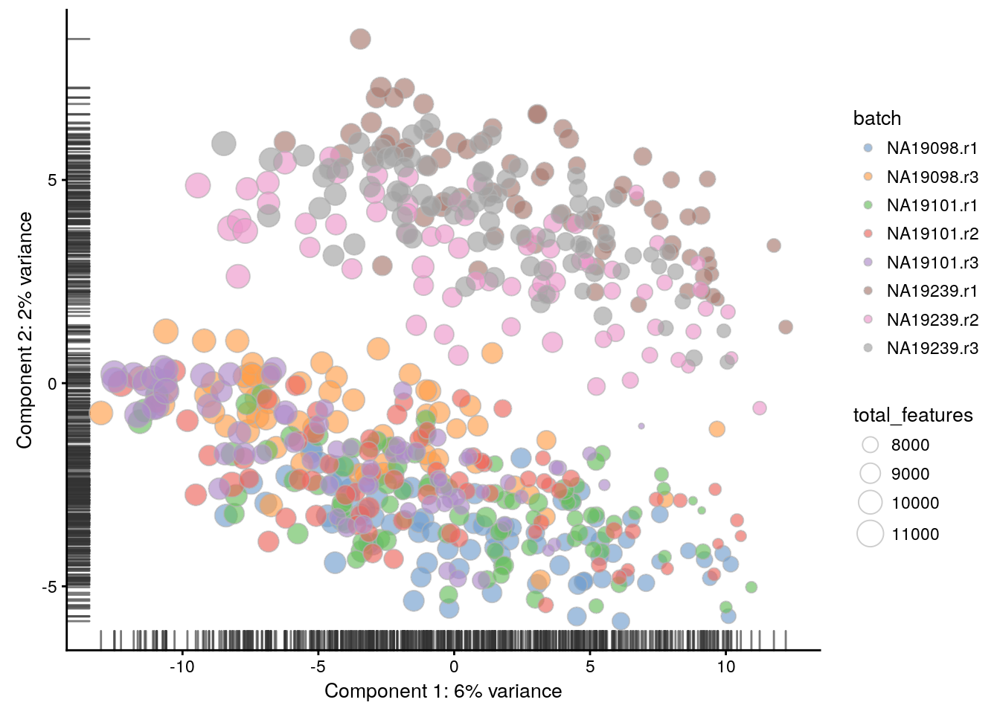
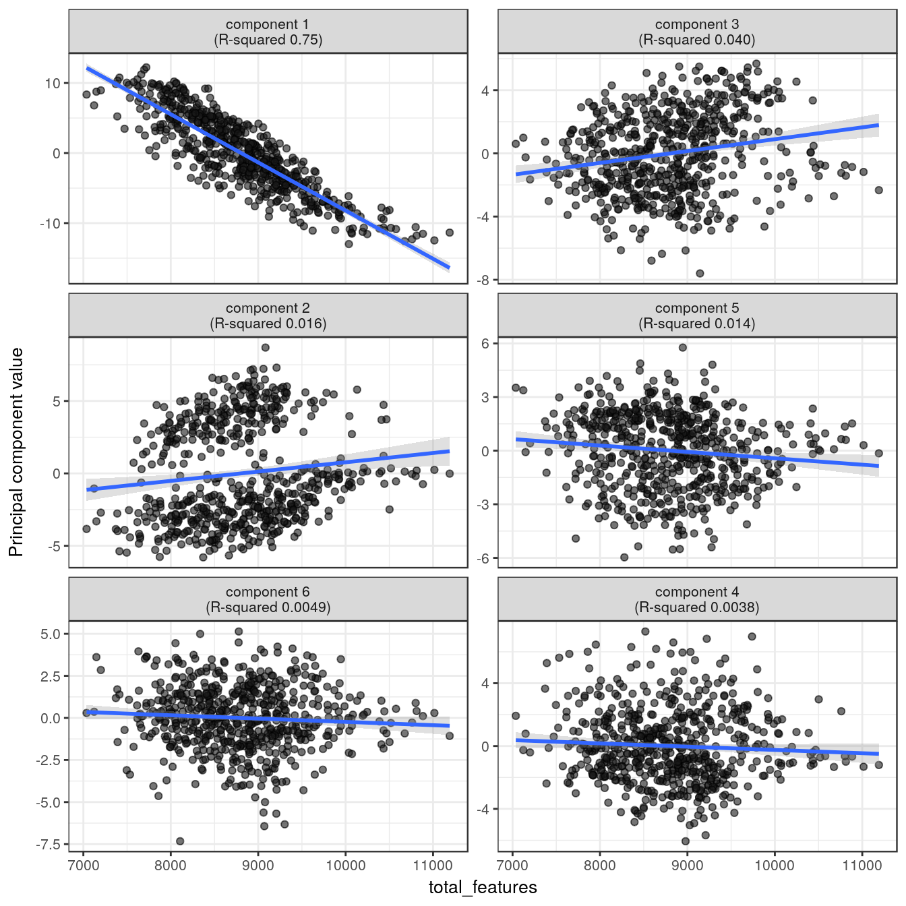
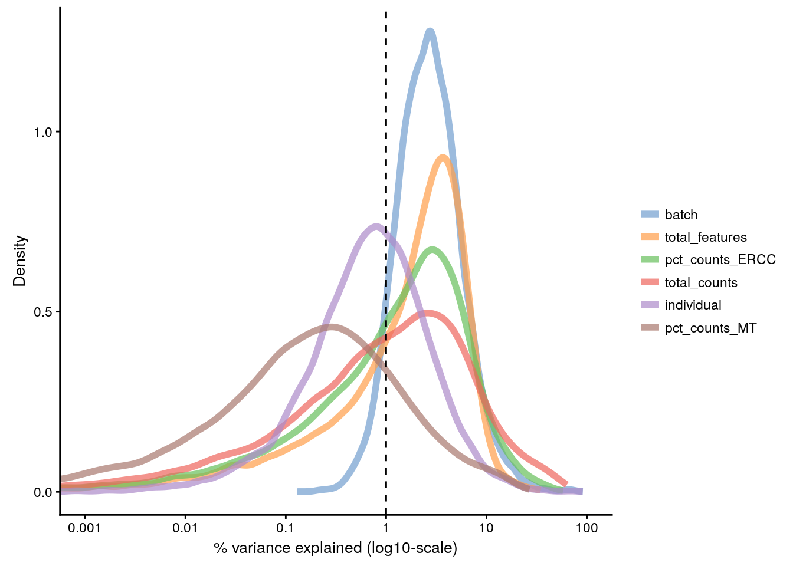

## Identifying confounding factors (Reads)


<div class="figure" style="text-align: center">

<p class="caption">(\#fig:confound-pca-reads)PCA plot of the tung data</p>
</div>

<div class="figure" style="text-align: center">

<p class="caption">(\#fig:confound-find-pcs-total-features-reads)PC correlation with the number of detected genes</p>
</div>

<div class="figure" style="text-align: center">

<p class="caption">(\#fig:confound-find-expl-vars-reads)Explanatory variables</p>
</div>


```
## R version 3.4.2 (2017-09-28)
## Platform: x86_64-pc-linux-gnu (64-bit)
## Running under: Debian GNU/Linux 9 (stretch)
## 
## Matrix products: default
## BLAS/LAPACK: /usr/lib/libopenblasp-r0.2.19.so
## 
## locale:
##  [1] LC_CTYPE=en_US.UTF-8       LC_NUMERIC=C              
##  [3] LC_TIME=en_US.UTF-8        LC_COLLATE=en_US.UTF-8    
##  [5] LC_MONETARY=en_US.UTF-8    LC_MESSAGES=C             
##  [7] LC_PAPER=en_US.UTF-8       LC_NAME=C                 
##  [9] LC_ADDRESS=C               LC_TELEPHONE=C            
## [11] LC_MEASUREMENT=en_US.UTF-8 LC_IDENTIFICATION=C       
## 
## attached base packages:
## [1] stats4    parallel  methods   stats     graphics  grDevices utils    
## [8] datasets  base     
## 
## other attached packages:
##  [1] knitr_1.17                  scater_1.5.21              
##  [3] SingleCellExperiment_0.99.4 SummarizedExperiment_1.6.5 
##  [5] DelayedArray_0.2.7          matrixStats_0.52.2         
##  [7] GenomicRanges_1.28.6        GenomeInfoDb_1.12.3        
##  [9] IRanges_2.10.5              S4Vectors_0.14.7           
## [11] ggplot2_2.2.1               Biobase_2.36.2             
## [13] BiocGenerics_0.22.1        
## 
## loaded via a namespace (and not attached):
##  [1] viridis_0.4.0           edgeR_3.18.1           
##  [3] bit64_0.9-7             viridisLite_0.2.0      
##  [5] shiny_1.0.5             assertthat_0.2.0       
##  [7] highr_0.6               blob_1.1.0             
##  [9] GenomeInfoDbData_0.99.0 vipor_0.4.5            
## [11] yaml_2.1.14             RSQLite_2.0            
## [13] backports_1.1.1         lattice_0.20-34        
## [15] glue_1.2.0              limma_3.32.10          
## [17] digest_0.6.12           XVector_0.16.0         
## [19] colorspace_1.3-2        cowplot_0.8.0          
## [21] htmltools_0.3.6         httpuv_1.3.5           
## [23] Matrix_1.2-7.1          plyr_1.8.4             
## [25] XML_3.98-1.9            pkgconfig_2.0.1        
## [27] biomaRt_2.32.1          bookdown_0.5           
## [29] zlibbioc_1.22.0         xtable_1.8-2           
## [31] scales_0.5.0            tibble_1.3.4           
## [33] lazyeval_0.2.1          magrittr_1.5           
## [35] mime_0.5                memoise_1.1.0          
## [37] evaluate_0.10.1         beeswarm_0.2.3         
## [39] shinydashboard_0.6.1    tools_3.4.2            
## [41] data.table_1.10.4-3     stringr_1.2.0          
## [43] munsell_0.4.3           locfit_1.5-9.1         
## [45] AnnotationDbi_1.38.2    bindrcpp_0.2           
## [47] compiler_3.4.2          rlang_0.1.2            
## [49] rhdf5_2.20.0            grid_3.4.2             
## [51] RCurl_1.95-4.8          tximport_1.4.0         
## [53] rjson_0.2.15            labeling_0.3           
## [55] bitops_1.0-6            rmarkdown_1.6          
## [57] gtable_0.2.0            DBI_0.7                
## [59] reshape2_1.4.2          R6_2.2.2               
## [61] gridExtra_2.3           dplyr_0.7.4            
## [63] bit_1.1-12              bindr_0.1              
## [65] rprojroot_1.2           stringi_1.1.5          
## [67] ggbeeswarm_0.6.0        Rcpp_0.12.13
```
