# Normalization for library size

## Introduction


In the previous chapter we identified important confounding factors and explanatory variables. scater allows one to account for these variables in subsequent statistical models or to condition them out using `normaliseExprs()`, if so desired. This can be done by providing a design matrix to `normaliseExprs()`. We are not covering this topic here, but you can try to do it yourself as an exercise.

Instead we will explore how simple size-factor normalisations correcting for library size can remove the effects of some of the confounders and explanatory variables.

## Library size

Library sizes vary because scRNA-seq data is often sequenced on highly multiplexed platforms the total reads which are derived from each cell may differ substantially. Some quantification methods
(eg. [Cufflinks](http://cole-trapnell-lab.github.io/cufflinks/), [RSEM](http://deweylab.github.io/RSEM/)) incorporated library size when determining gene expression estimates thus do not require this normalization.

However, if another quantification method was used then library size must be corrected for by multiplying or dividing each column of the expression matrix by a "normalization factor" which is an estimate of the library size relative to the other cells. Many methods to correct for library size have been developped for bulk RNA-seq and can be equally applied to scRNA-seq (eg. UQ, SF, CPM, RPKM, FPKM, TPM). 


## Normalisations

The simplest way to normalize this data is to convert it to counts per
million (__CPM__) by dividing each column by its total then multiplying by
1,000,000. Note that spike-ins should be excluded from the
calculation of total expression in order to correct for total cell RNA
content, therefore we will only use endogenous genes. 


```r
calc_cpm <-
function (expr_mat, spikes = NULL) 
{
    norm_factor <- colSums(expr_mat[-spikes, ])
    return(t(t(expr_mat)/norm_factor)) * 10^6
}
```

One potential drawback of __CPM__ is if your sample contains genes that are both very highly expressed and differentially expressed across the cells. In this case, the total molecules in the cell may depend of whether such genes are on/off in the cell and normalizing by total molecules may hide the differential expression of those genes and/or falsely create differential expression for the remaining genes. 

__Note__: RPKM, FPKM and TPM are variants on CPM which further adjust counts by the length of the respective gene/transcript.

To deal with this potentiality several other measures were devised:

The __size factor (SF)__ was proposed and popularized by DESeq ([Anders and Huber (2010)](https://genomebiology.biomedcentral.com/articles/10.1186/gb-2010-11-10-r106)). First the geometric mean of each gene across all cells is calculated. The size factor for each cell is the median across genes of the ratio of the expression to the gene's geometric mean. A drawback to this method is that since it uses the geometric mean only genes with non-zero expression values across all cells can be used in its calculation, making it unadvisable for large low-depth scRNASeq experiments. edgeR & scater call this method __RLE__ for "relative log expression".


```r
calc_sf <-
function (expr_mat, spikes = NULL) 
{
    geomeans <- exp(rowMeans(log(expr_mat[-spikes, ])))
    SF <- function(cnts) {
        median((cnts/geomeans)[(is.finite(geomeans) & geomeans > 
            0)])
    }
    norm_factor <- apply(expr_mat[-spikes, ], 2, SF)
    return(t(t(expr_mat)/norm_factor))
}
```

The __upperquartile (UQ)__ was proposed by [Bullard et al (2010)](http://bmcbioinformatics.biomedcentral.com/articles/10.1186/1471-2105-11-94). Here each column is divided by the 75% quantile of the counts for each library. Often the calculated quantile is scaled by the median across cells to keep the absolute level of expression relatively consistent. A drawback to this method is that for low-depth scRNASeq experiments the large number of undetected genes may result in the 75% quantile being zero (or close to it). This limitation can be overcome by generalizing the idea and using a higher quantile (eg. the 99% quantile is the default in scater) or by excluding zeros prior to calculating the 75% quantile.


```r
calc_uq <-
function (expr_mat, spikes = NULL) 
{
    UQ <- function(x) {
        quantile(x[x > 0], 0.75)
    }
    uq <- unlist(apply(expr_mat[-spikes, ], 2, UQ))
    norm_factor <- uq/median(uq)
    return(t(t(expr_mat)/norm_factor))
}
```

Another method is called __TMM__ is the weighted trimmed mean of M-values (to the reference) proposed by [Robinson and Oshlack (2010)](https://genomebiology.biomedcentral.com/articles/10.1186/gb-2010-11-3-r25). The M-values in question are the gene-wise log2 fold changes between individual cells. One cell is used as the reference then the M-values for each other cell is calculated compared  to this reference. These values are then trimmed by removing the top and bottom ~30%, and the average of the remaining values is calculated by weighting them to account for the effect of the log scale on variance. Each non-reference cell is multiplied by the calculated factor. Two potential issues with this method are insufficient non-zero genes left after trimming, and the assumption that most genes are not differentially expressed.

Finally the `scran` package implements a variant on CPM specialized for single-cell data ([Lun et al 2016](https://genomebiology.biomedcentral.com/articles/10.1186/s13059-016-0947-7)). Briefly this method deals with the problem of vary large numbers of zero values per cell by pooling cells together calculating a normalization factor (similar to CPM) for the sum of each pool. Since each cell is found in many different pools, cell-specific factors can be deconvoluted from the collection of pool-specific factors using linear algebra. 


We will use visual inspection of PCA plots and calculation of cell-wise relative log expression (`calc_cell_RLE()`) to compare the efficiency of different normalization methods. Cells with many[few] reads have higher[lower] than median expression for most genes resulting in a positive[negative] RLE across the cell, whereas normalized cells have an RLE close to zero.


```r
calc_cell_RLE <-
function (expr_mat, spikes = NULL) 
{
    RLE_gene <- function(x) {
        if (median(unlist(x)) > 0) {
            log((x + 1)/(median(unlist(x)) + 1))/log(2)
        }
        else {
            rep(NA, times = length(x))
        }
    }
    if (!is.null(spikes)) {
        RLE_matrix <- t(apply(expr_mat[-spikes, ], 1, RLE_gene))
    }
    else {
        RLE_matrix <- t(apply(expr_mat, 1, RLE_gene))
    }
    cell_RLE <- apply(RLE_matrix, 2, median, na.rm = T)
    return(cell_RLE)
}
```

The __RLE__, __TMM__, and __UQ__ size-factor methods were developed for bulk RNA-seq data and, depending on the experimental context, may not be appropriate for single-cell RNA-seq data, as their underlying assumptions may be problematically violated. [Lun et al (2016)](http://genomebiology.biomedcentral.com/articles/10.1186/s13059-016-0947-7) recently published a size-factor normalisation method specifically designed for scRNA-seq data and accounting for single-cell biases, which we will call __LSF__ (Lun Sum Factors). Briefly, expression values are summed across pools of cells and the summed values are used to compute normalization size-factors per pool. The pool-based size factors can then be deconvolved into cell-specific size factors, which can be used for normalization in the same way as other size factors. 

 __scater__ acts as a wrapper for the `calcNormFactors` function from [edgeR](https://bioconductor.org/packages/release/bioc/html/edgeR.html) which implements several library size normalization methods making it easy to apply any of these methods to our data. The __LSF__ method is implementated in the Bioconductor package [scran](https://bioconductor.org/packages/release/bioc/html/scran.html), which allows seamless integrationinto the `scater` workflow. (The `scran` package itself depends on `scater`).

__Note:__ edgeR makes extra adjustments to some of the normalization methods which may result in somewhat different results than if the original methods are followed exactly, e.g. edgeR's and scater's "RLE" method which is based on the "size factor" used by [DESeq](http://bioconductor.org/packages/release/bioc/html/DESeq.html) may give different results to the `estimateSizeFactorsForMatrix` method in the DESeq/DESeq2 packages. In addition, some versions of edgeR will not calculate the normalization factors correctly unless `lib.size` is set at 1 for all cells.

We will continue to work with the `tung` data that was used in the previous chapter.


```r
library(scRNA.seq.funcs)
library(scater)
library(scran)
options(stringsAsFactors = FALSE)
set.seed(1234567)
umi <- readRDS("tung/umi.rds")
umi.qc <- umi[rowData(umi)$use, colData(umi)$use]
endog_genes <- !rowData(umi.qc)$is_feature_control
```

### Raw

```r
plotPCA(
    umi.qc[endog_genes, ],
    exprs_values = "log2_counts",
    colour_by = "batch",
    size_by = "total_features",
    shape_by = "individual"
)
```

<div class="figure" style="text-align: center">

<p class="caption">(\#fig:norm-pca-raw)PCA plot of the tung data</p>
</div>

### CPM
`calculateCPM` from `scater` package can be used to perform this normalisation. We will save the results to the `norm_counts` assay:

```r
assay(umi.qc, "norm_counts") <- log2(calculateCPM(umi.qc, use.size.factors = FALSE) + 1)
plotPCA(
    umi.qc[endog_genes, ],
    exprs_values = "norm_counts",
    colour_by = "batch",
    size_by = "total_features",
    shape_by = "individual"
)
```

<div class="figure" style="text-align: center">
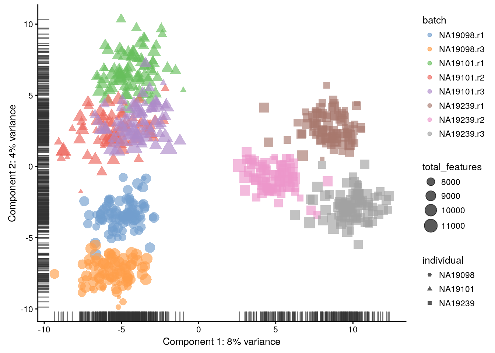
<p class="caption">(\#fig:norm-pca-cpm)PCA plot of the tung data after CPM normalisation</p>
</div>

```r
plotRLE(
    umi.qc[endog_genes, ], 
    exprs_mats = list(Raw = "log2_counts", CPM = "norm_counts"),
    exprs_logged = c(TRUE, TRUE),
    colour_by = "batch"
)
```

<div class="figure" style="text-align: center">
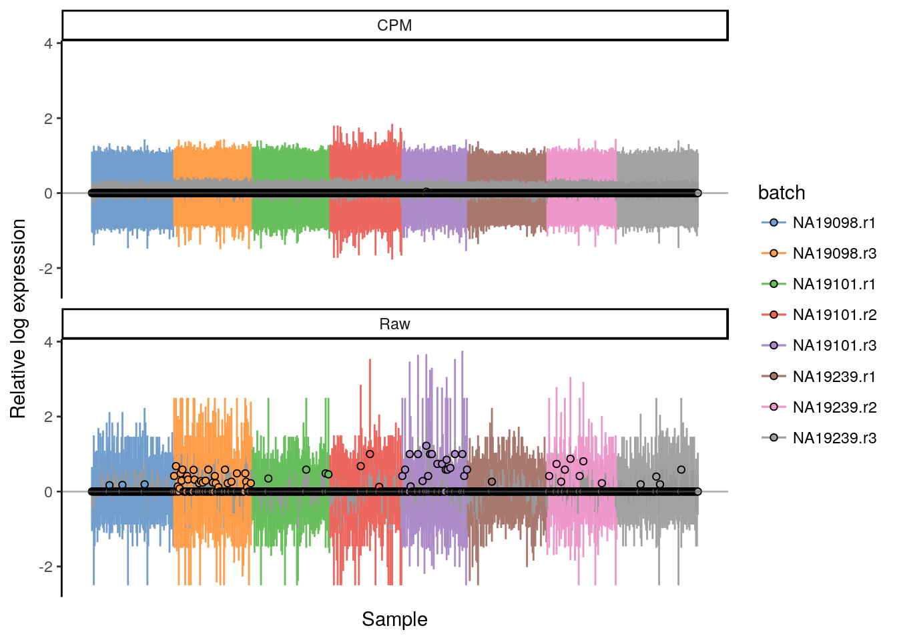
<p class="caption">(\#fig:norm-ours-rle-cpm)Cell-wise RLE of the tung data</p>
</div>


### TMM

```r
umi.qc <- normaliseExprs(
    umi.qc,
    method = "TMM",
    feature_set = endog_genes
)
```

```
## Warning in normalizeSCE(object, exprs_values = exprs_values,
## return_norm_as_exprs = return_norm_as_exprs): spike-in transcripts in
## 'ERCC' should have their own size factors
```

```r
plotPCA(
    umi.qc[endog_genes, ],
    exprs_values = "norm_cpm",
    colour_by = "batch",
    size_by = "total_features",
    shape_by = "individual"
)
```

<div class="figure" style="text-align: center">
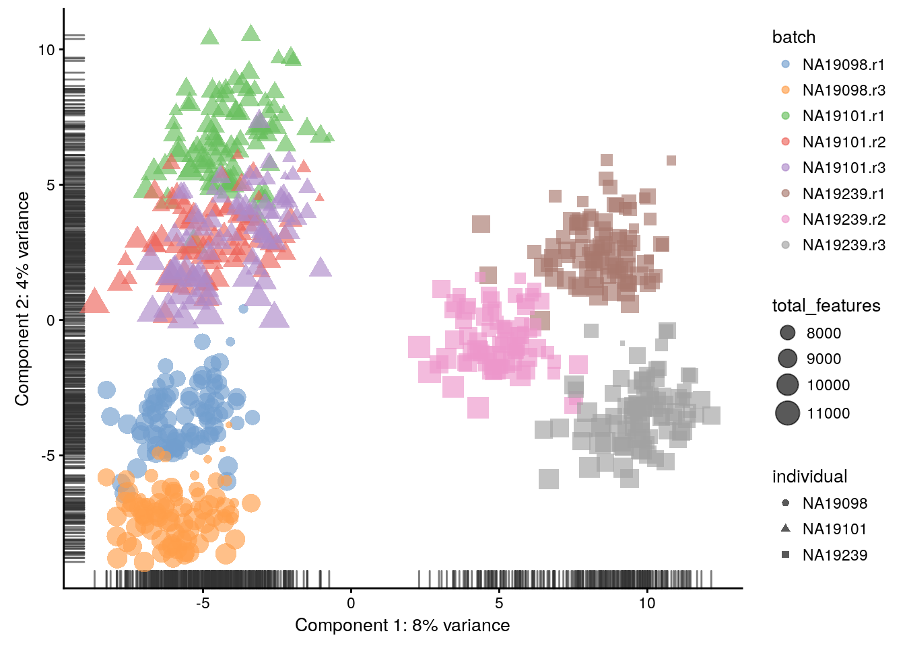
<p class="caption">(\#fig:norm-pca-tmm)PCA plot of the tung data after TMM normalisation</p>
</div>

```r
plotRLE(
    umi.qc[endog_genes, ], 
    exprs_mats = list(Raw = "log2_counts", TMM = "norm_cpm"),
    exprs_logged = c(TRUE, TRUE),
    colour_by = "batch"
)
```

<div class="figure" style="text-align: center">
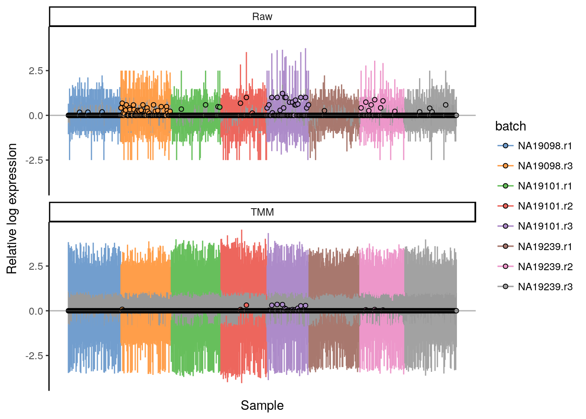
<p class="caption">(\#fig:norm-ours-rle-tmm)Cell-wise RLE of the tung data</p>
</div>

### scran

```r
qclust <- quickCluster(umi.qc, min.size = 30)
umi.qc <- computeSumFactors(umi.qc, sizes = 15, clusters = qclust)
umi.qc <- normalize(umi.qc)
```

```
## Warning in .local(object, ...): spike-in transcripts in 'ERCC' should have
## their own size factors
```

```r
plotPCA(
    umi.qc[endog_genes, ],
    colour_by = "batch",
    size_by = "total_features",
    shape_by = "individual"
)
```

<div class="figure" style="text-align: center">

<p class="caption">(\#fig:norm-pca-lsf)PCA plot of the tung data after LSF normalisation</p>
</div>

```r
plotRLE(
    umi.qc[endog_genes, ], 
    exprs_mats = list(Raw = "log2_counts", scran = "logcounts"),
    exprs_logged = c(TRUE, TRUE),
    colour_by = "batch"
)
```

<div class="figure" style="text-align: center">
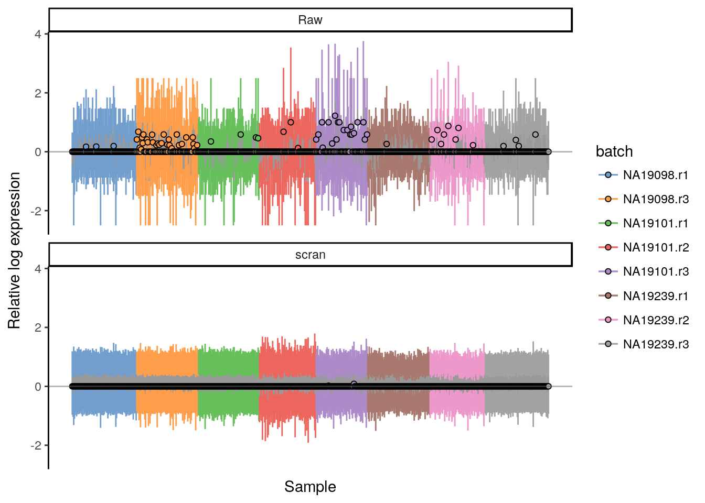
<p class="caption">(\#fig:norm-ours-rle-scran)Cell-wise RLE of the tung data</p>
</div>

### Size-factor (RLE)

```r
umi.qc <- normaliseExprs(
    umi.qc,
    method = "RLE", 
    feature_set = endog_genes
)
```

```
## Warning in normalizeSCE(object, exprs_values = exprs_values,
## return_norm_as_exprs = return_norm_as_exprs): spike-in transcripts in
## 'ERCC' should have their own size factors
```

```r
plotPCA(
    umi.qc[endog_genes, ],
    exprs_values = "norm_cpm",
    colour_by = "batch",
    size_by = "total_features",
    shape_by = "individual"
)
```

<div class="figure" style="text-align: center">
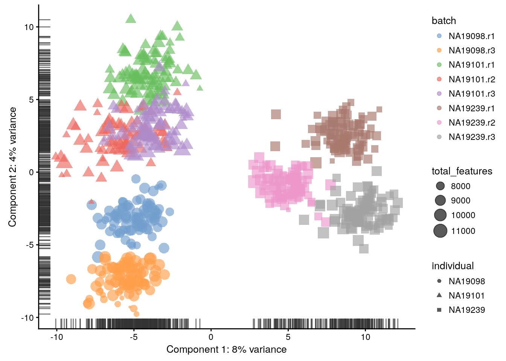
<p class="caption">(\#fig:norm-pca-rle)PCA plot of the tung data after RLE normalisation</p>
</div>

```r
plotRLE(
    umi.qc[endog_genes, ], 
    exprs_mats = list(Raw = "log2_counts", RLE = "norm_cpm"),
    exprs_logged = c(TRUE, TRUE),
    colour_by = "batch"
)
```

<div class="figure" style="text-align: center">
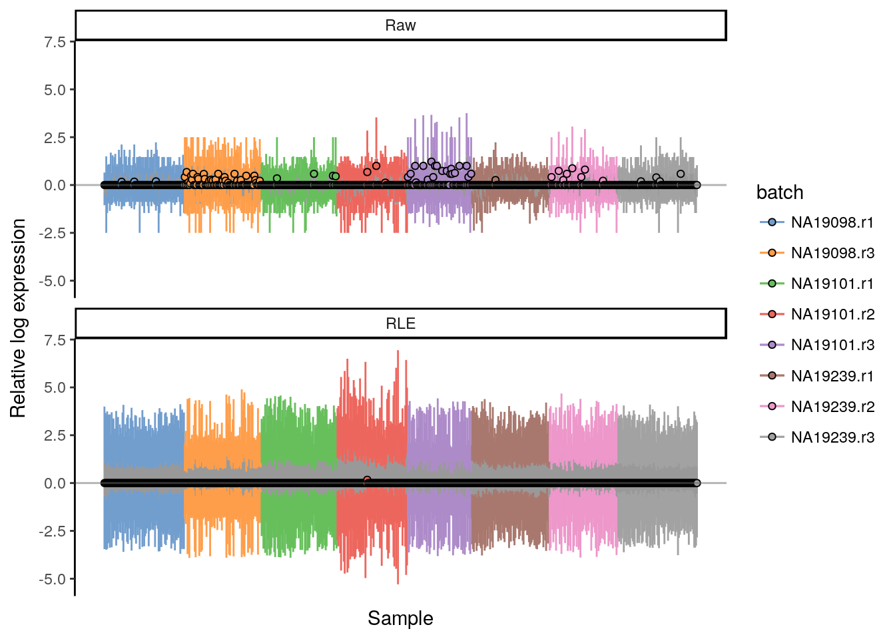
<p class="caption">(\#fig:norm-ours-rle-rle)Cell-wise RLE of the tung data</p>
</div>


### Upperquantile

```r
umi.qc <- normaliseExprs(
    umi.qc,
    method = "upperquartile", 
    feature_set = endog_genes,
    p = 0.99
)
```

```
## Warning in normalizeSCE(object, exprs_values = exprs_values,
## return_norm_as_exprs = return_norm_as_exprs): spike-in transcripts in
## 'ERCC' should have their own size factors
```

```r
plotPCA(
    umi.qc[endog_genes, ],
    exprs_values = "norm_cpm",
    colour_by = "batch",
    size_by = "total_features",
    shape_by = "individual"
)
```

<div class="figure" style="text-align: center">
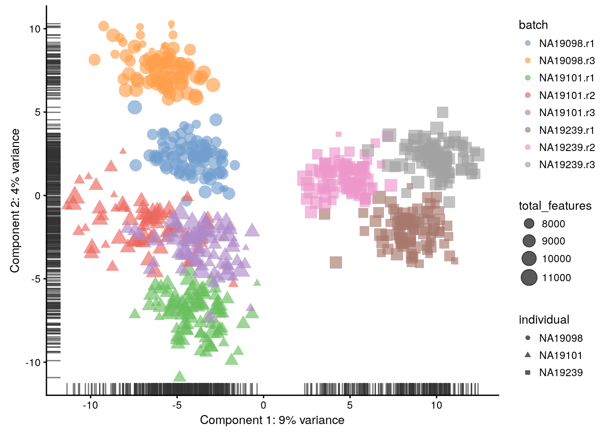
<p class="caption">(\#fig:norm-pca-uq)PCA plot of the tung data after UQ normalisation</p>
</div>

```r
plotRLE(
    umi.qc[endog_genes, ], 
    exprs_mats = list(Raw = "log2_counts", UQ = "norm_cpm"),
    exprs_logged = c(TRUE, TRUE),
    colour_by = "batch"
)
```

<div class="figure" style="text-align: center">

<p class="caption">(\#fig:norm-ours-rle-uq)Cell-wise RLE of the tung data</p>
</div>
## Downsampling 

A final way to correct for library size is to downsample the expression matrix so that each cell has approximately the same total number of molecules. The benefit of this method is that zero values will be introduced by the down sampling thus eliminating any biases due to differing numbers of detected genes. However, the major drawback is that the process is not deterministic so each time the downsampling is run the resulting expression matrix is slightly different. Thus, often analyses must be run on multiple downsamplings to ensure results are robust.


```r
Down_Sample_Matrix <-
function (expr_mat) 
{
    min_lib_size <- min(colSums(expr_mat))
    down_sample <- function(x) {
        prob <- min_lib_size/sum(x)
        return(unlist(lapply(x, function(y) {
            rbinom(1, y, prob)
        })))
    }
    down_sampled_mat <- apply(expr_mat, 2, down_sample)
    return(down_sampled_mat)
}
```


```r
assay(umi.qc, "norm_counts") <- log2(Down_Sample_Matrix(counts(umi.qc)) + 1)
plotPCA(
    umi.qc[endog_genes, ],
    exprs_values = "norm_counts",
    colour_by = "batch",
    size_by = "total_features",
    shape_by = "individual"
)
```

<div class="figure" style="text-align: center">
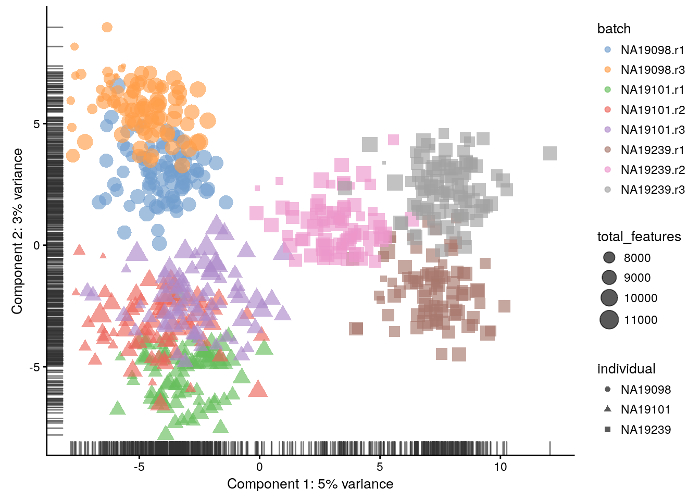
<p class="caption">(\#fig:norm-pca-downsample)PCA plot of the tung data after downsampling</p>
</div>

```r
plotRLE(
    umi.qc[endog_genes, ], 
    exprs_mats = list(Raw = "log2_counts", DownSample = "norm_counts"),
    exprs_logged = c(TRUE, TRUE),
    colour_by = "batch"
)
```

<div class="figure" style="text-align: center">

<p class="caption">(\#fig:norm-ours-rle-downsample)Cell-wise RLE of the tung data</p>
</div>

## Normalizing for gene/transcript length

Some methods combine library size and fragment/gene length normalization such as:

* __RPKM__ - Reads Per Kilobase Million (for single-end sequencing)
* __FPKM__ - Fragments Per Kilobase Million (same as __RPKM__ but for paired-end sequencing, makes sure that paired ends mapped to the same fragment are not counted twice)
* __TPM__ - Transcripts Per Kilobase Million (same as __RPKM__, but the order of normalizations is reversed - length first and sequencing depth second)

These methods are not applicable to our dataset since the end
of the transcript which contains the UMI was preferentially
sequenced. Furthermore in general these should only be calculated
using appropriate quantification software from aligned BAM files not
from read counts since often only a portion of the entire
gene/transcript is sequenced, not the entire length. If in doubt check 
for a relationship between gene/transcript length and expression level.

However, here we show how these normalisations can be calculated using scater. First, we need to find the effective transcript length in Kilobases. However, our dataset containes only gene IDs, therefore we will be using the gene lengths instead of transcripts. scater uses the [biomaRt](https://bioconductor.org/packages/release/bioc/html/biomaRt.html) package, which allows one to annotate genes by other attributes:

```r
umi.qc <- getBMFeatureAnnos(
    umi.qc,
    filters = "ensembl_gene_id", 
    attributes = c(
        "ensembl_gene_id",
        "hgnc_symbol",
        "chromosome_name",
        "start_position",
        "end_position"
    ), 
    feature_symbol = "hgnc_symbol",
    feature_id = "ensembl_gene_id",
    biomart = "ENSEMBL_MART_ENSEMBL", 
    dataset = "hsapiens_gene_ensembl",
    host = "www.ensembl.org"
)

# If you have mouse data, change the arguments based on this example:
# getBMFeatureAnnos(
#     object,
#     filters = "ensembl_transcript_id",
#     attributes = c(
#         "ensembl_transcript_id",
#         "ensembl_gene_id", 
#         "mgi_symbol",
#         "chromosome_name",
#         "transcript_biotype",
#         "transcript_start",
#         "transcript_end",
#         "transcript_count"
#     ),
#     feature_symbol = "mgi_symbol",
#     feature_id = "ensembl_gene_id",
#     biomart = "ENSEMBL_MART_ENSEMBL",
#     dataset = "mmusculus_gene_ensembl",
#     host = "www.ensembl.org"
# )
```

Some of the genes were not annotated, therefore we filter them out:

```r
umi.qc.ann <- umi.qc[!is.na(rowData(umi.qc)$ensembl_gene_id), ]
```

Now we compute the total gene length in Kilobases by using the `end_position` and `start_position` fields:

```r
eff_length <- 
    abs(rowData(umi.qc.ann)$end_position - rowData(umi.qc.ann)$start_position) / 1000
```


```r
plot(eff_length, rowMeans(counts(umi.qc.ann)))
```

<div class="figure" style="text-align: center">
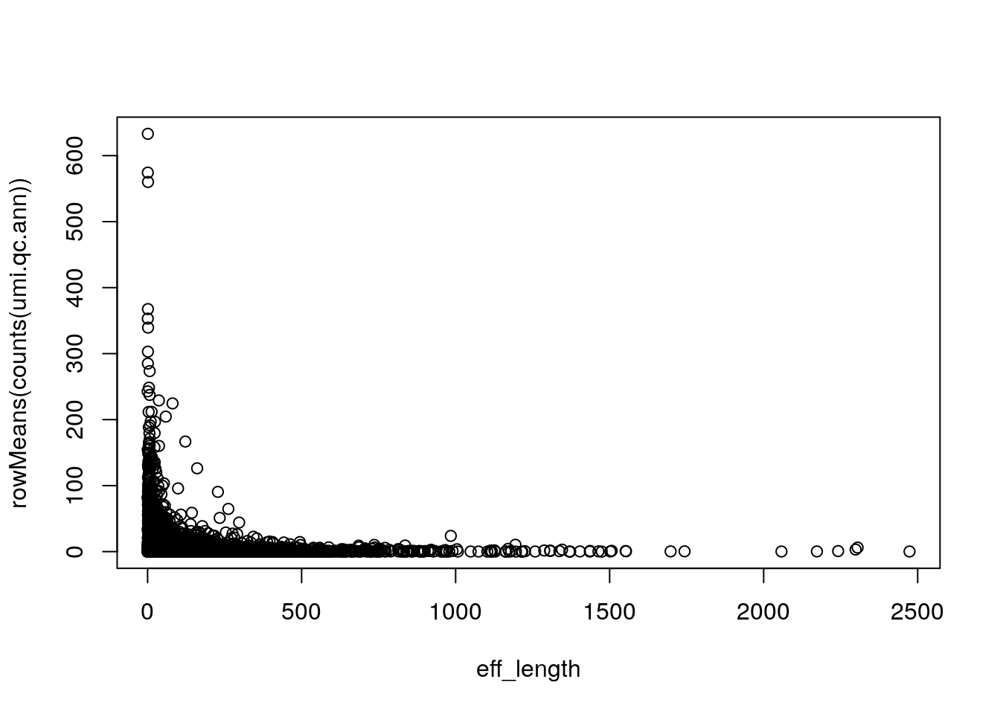
<p class="caption">(\#fig:length-vs-mean)Gene length vs Mean Expression for the raw data</p>
</div>
There is no relationship between gene length and mean expression so FPKMs & TPMs are inappropriate for this dataset. 
But we will demonstrate them anyway.

Now we are ready to perform the normalisations:

```r
tpm(umi.qc.ann) <- log2(calculateTPM(umi.qc.ann, eff_length) + 1)
```

Plot the results as a PCA plot:

```r
plotPCA(
    umi.qc.ann,
    exprs_values = "tpm",
    colour_by = "batch",
    size_by = "total_features",
    shape_by = "individual"
)
```

<div class="figure" style="text-align: center">
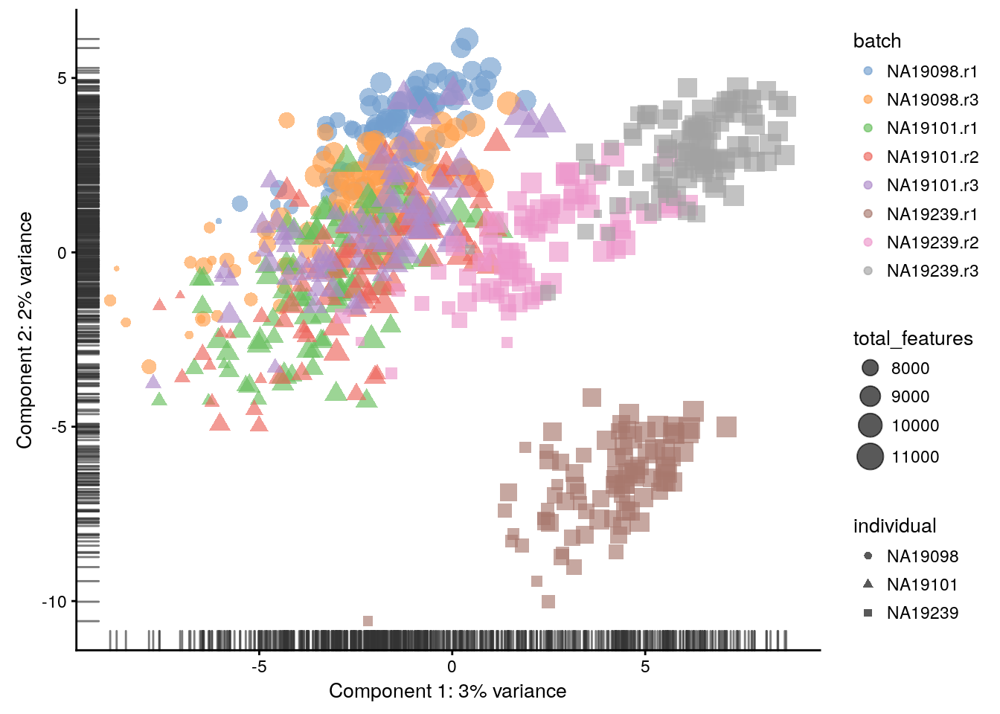
<p class="caption">(\#fig:norm-pca-fpkm)PCA plot of the tung data after TPM normalisation</p>
</div>


```r
tpm(umi.qc.ann) <- log2(calculateFPKM(umi.qc.ann, eff_length) + 1)
```


```r
plotPCA(
    umi.qc.ann,
    exprs_values = "tpm",
    colour_by = "batch",
    size_by = "total_features",
    shape_by = "individual"
)
```

<div class="figure" style="text-align: center">
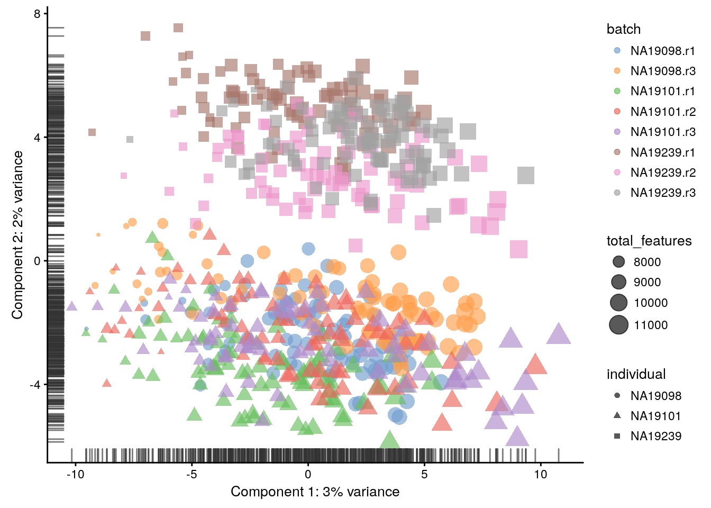
<p class="caption">(\#fig:norm-pca-tpm)PCA plot of the tung data after FPKM normalisation</p>
</div>

__Note:__ The PCA looks for differences between cells. Gene length is the same across cells for each gene thus FPKM is almost identical to the CPM plot (it is just rotated) since it performs CPM first then normalizes gene length. Whereas, TPM is different because it weights genes by their length before performing CPM. 

## Exercise

Perform the same analysis with read counts of the `tung` data. Use `tung/reads.rds` file to load the reads SCESet object. Once you have finished please compare your results to ours (next chapter).

## sessionInfo()


```
## R version 3.4.2 (2017-09-28)
## Platform: x86_64-pc-linux-gnu (64-bit)
## Running under: Debian GNU/Linux buster/sid
## 
## Matrix products: default
## BLAS: /usr/lib/x86_64-linux-gnu/blas/libblas.so.3.7.1
## LAPACK: /usr/lib/x86_64-linux-gnu/lapack/liblapack.so.3.7.1
## 
## locale:
##  [1] LC_CTYPE=en_US.UTF-8       LC_NUMERIC=C              
##  [3] LC_TIME=en_US.UTF-8        LC_COLLATE=en_US.UTF-8    
##  [5] LC_MONETARY=en_US.UTF-8    LC_MESSAGES=en_US.UTF-8   
##  [7] LC_PAPER=en_US.UTF-8       LC_NAME=C                 
##  [9] LC_ADDRESS=C               LC_TELEPHONE=C            
## [11] LC_MEASUREMENT=en_US.UTF-8 LC_IDENTIFICATION=C       
## 
## attached base packages:
## [1] stats4    parallel  methods   stats     graphics  grDevices utils    
## [8] datasets  base     
## 
## other attached packages:
##  [1] scran_1.5.12                BiocParallel_1.10.1        
##  [3] scater_1.5.19               SingleCellExperiment_0.99.4
##  [5] SummarizedExperiment_1.6.5  DelayedArray_0.2.7         
##  [7] matrixStats_0.52.2          GenomicRanges_1.28.6       
##  [9] GenomeInfoDb_1.12.3         IRanges_2.10.5             
## [11] S4Vectors_0.14.7            ggplot2_2.2.1              
## [13] Biobase_2.36.2              BiocGenerics_0.22.1        
## [15] knitr_1.17                  scRNA.seq.funcs_0.1.0      
## 
## loaded via a namespace (and not attached):
##  [1] bitops_1.0-6            bit64_0.9-7            
##  [3] rprojroot_1.2           dynamicTreeCut_1.63-1  
##  [5] tools_3.4.2             backports_1.1.1        
##  [7] DT_0.2                  R6_2.2.2               
##  [9] hypergeo_1.2-13         vipor_0.4.5            
## [11] DBI_0.7                 lazyeval_0.2.0         
## [13] colorspace_1.3-2        gridExtra_2.3          
## [15] moments_0.14            bit_1.1-12             
## [17] compiler_3.4.2          orthopolynom_1.0-5     
## [19] labeling_0.3            bookdown_0.5           
## [21] scales_0.5.0            stringr_1.2.0          
## [23] digest_0.6.12           rmarkdown_1.6          
## [25] XVector_0.16.0          pkgconfig_2.0.1        
## [27] htmltools_0.3.6         highr_0.6              
## [29] limma_3.32.10           htmlwidgets_0.9        
## [31] rlang_0.1.2             RSQLite_2.0            
## [33] FNN_1.1                 shiny_1.0.5            
## [35] bindr_0.1               zoo_1.8-0              
## [37] dplyr_0.7.4             RCurl_1.95-4.8         
## [39] magrittr_1.5            GenomeInfoDbData_0.99.0
## [41] Matrix_1.2-11           Rcpp_0.12.13           
## [43] ggbeeswarm_0.6.0        munsell_0.4.3          
## [45] viridis_0.4.0           stringi_1.1.5          
## [47] yaml_2.1.14             edgeR_3.18.1           
## [49] MASS_7.3-47             zlibbioc_1.22.0        
## [51] rhdf5_2.20.0            Rtsne_0.13             
## [53] plyr_1.8.4              grid_3.4.2             
## [55] blob_1.1.0              shinydashboard_0.6.1   
## [57] contfrac_1.1-11         lattice_0.20-35        
## [59] cowplot_0.8.0           splines_3.4.2          
## [61] locfit_1.5-9.1          igraph_1.1.2           
## [63] rjson_0.2.15            reshape2_1.4.2         
## [65] biomaRt_2.32.1          XML_3.98-1.9           
## [67] glue_1.1.1              evaluate_0.10.1        
## [69] data.table_1.10.4-2     deSolve_1.20           
## [71] httpuv_1.3.5            gtable_0.2.0           
## [73] assertthat_0.2.0        mime_0.5               
## [75] xtable_1.8-2            viridisLite_0.2.0      
## [77] tibble_1.3.4            elliptic_1.3-7         
## [79] AnnotationDbi_1.38.2    beeswarm_0.2.3         
## [81] memoise_1.1.0           tximport_1.4.0         
## [83] bindrcpp_0.2            statmod_1.4.30
```
