## Normalization practice (Reads)


<div class="figure" style="text-align: center">
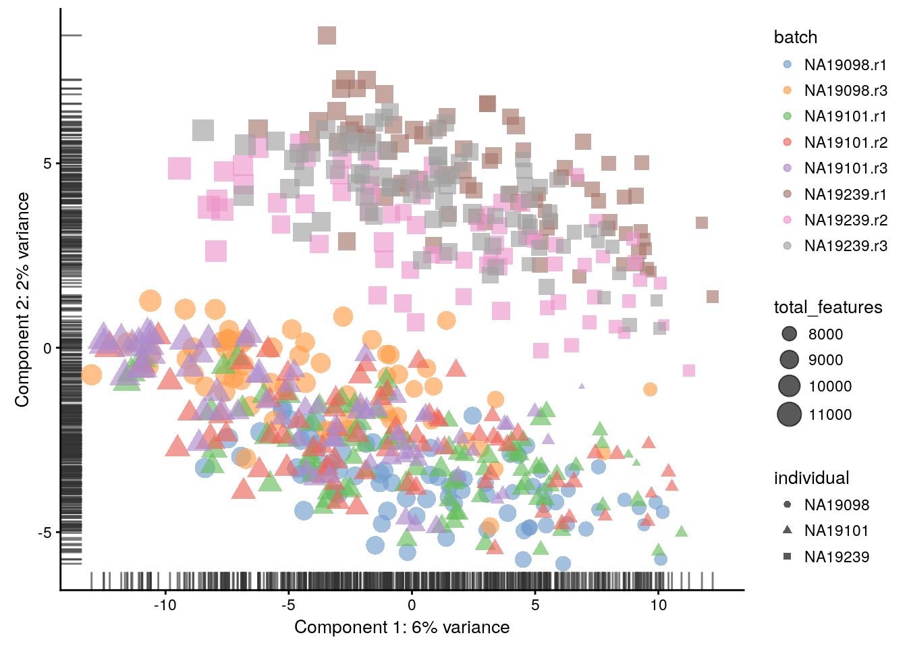
<p class="caption">(\#fig:norm-pca-raw-reads)PCA plot of the tung data</p>
</div>

<div class="figure" style="text-align: center">
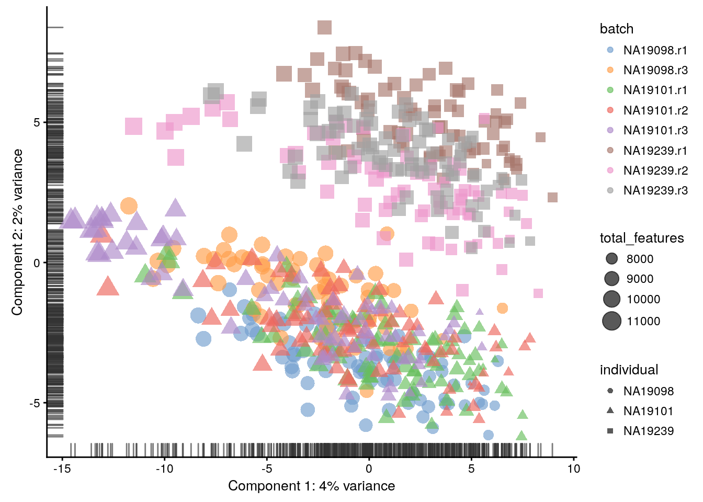
<p class="caption">(\#fig:norm-pca-cpm-reads)PCA plot of the tung data after CPM normalisation</p>
</div>
<div class="figure" style="text-align: center">
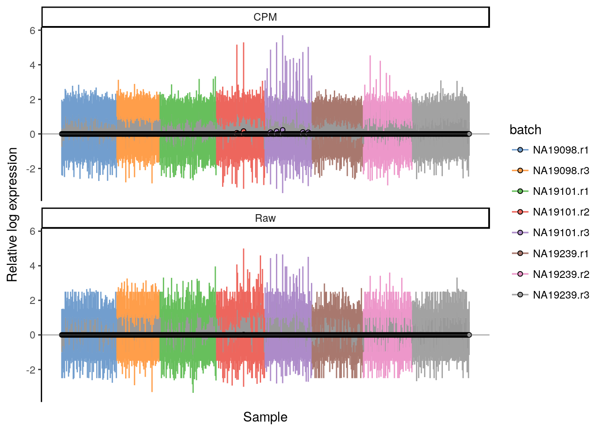
<p class="caption">(\#fig:norm-ours-rle-cpm-reads)Cell-wise RLE of the tung data</p>
</div>


```
## Warning in normalizeSCE(object, exprs_values = exprs_values, return_log
## = return_log, : spike-in transcripts in 'ERCC' should have their own size
## factors
```

<div class="figure" style="text-align: center">
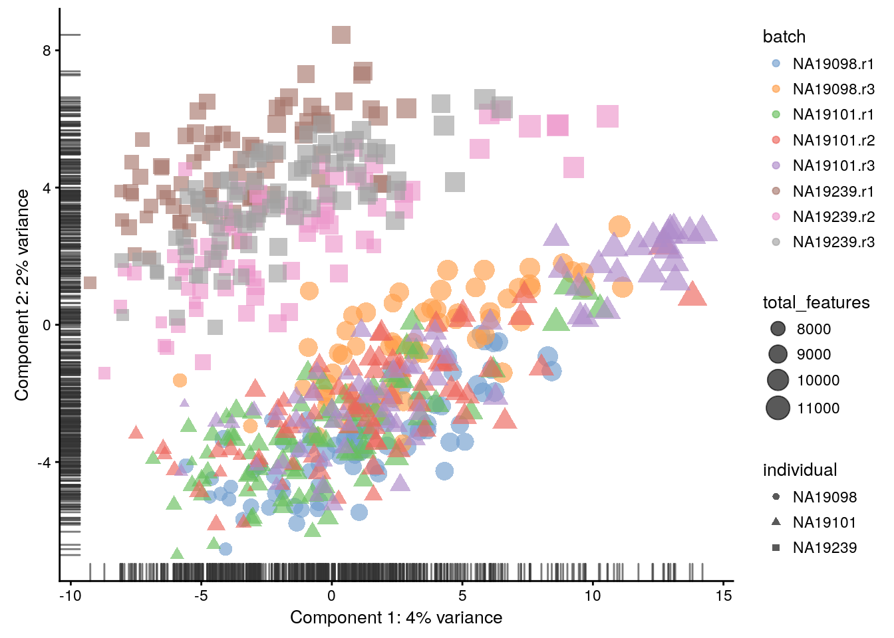
<p class="caption">(\#fig:norm-pca-rle-reads)PCA plot of the tung data after RLE normalisation</p>
</div>

<div class="figure" style="text-align: center">

<p class="caption">(\#fig:norm-ours-rle-rle-reads)Cell-wise RLE of the tung data</p>
</div>


```
## Warning in normalizeSCE(object, exprs_values = exprs_values, return_log
## = return_log, : spike-in transcripts in 'ERCC' should have their own size
## factors
```

<div class="figure" style="text-align: center">
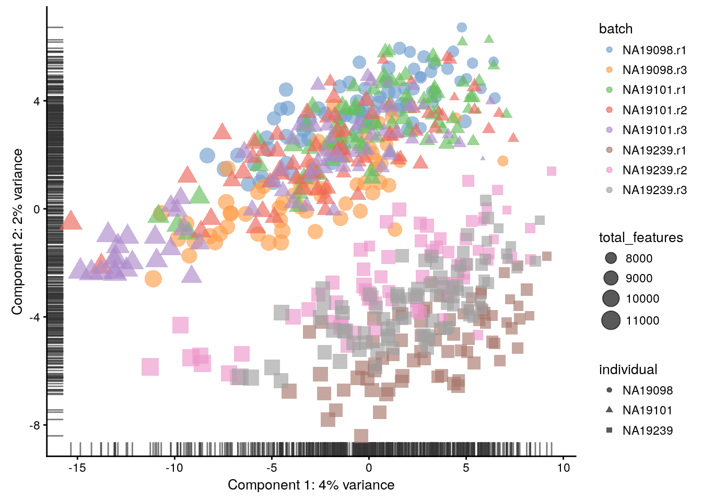
<p class="caption">(\#fig:norm-pca-uq-reads)PCA plot of the tung data after UQ normalisation</p>
</div>
<div class="figure" style="text-align: center">
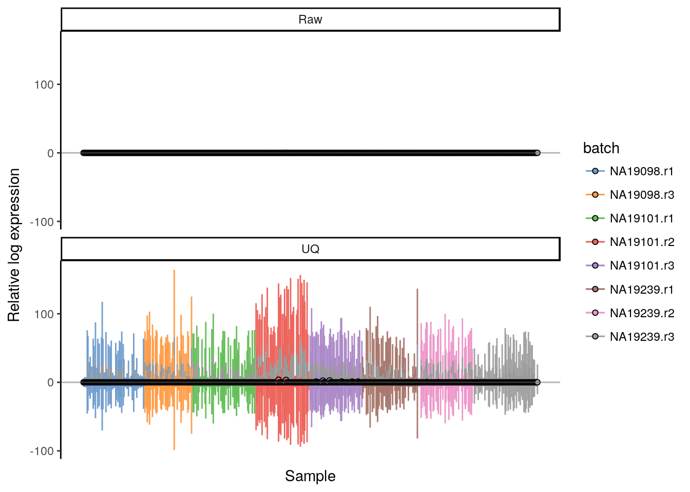
<p class="caption">(\#fig:norm-ours-rle-uq-reads)Cell-wise RLE of the tung data</p>
</div>


```
## Warning in normalizeSCE(object, exprs_values = exprs_values, return_log
## = return_log, : spike-in transcripts in 'ERCC' should have their own size
## factors
```

<div class="figure" style="text-align: center">
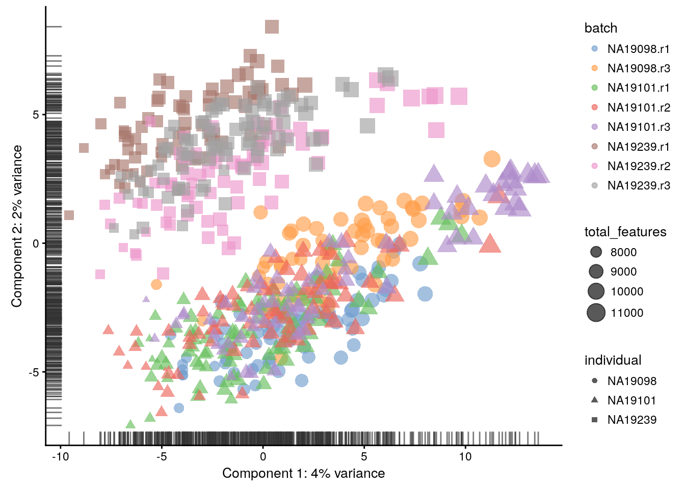
<p class="caption">(\#fig:norm-pca-tmm-reads)PCA plot of the tung data after TMM normalisation</p>
</div>
<div class="figure" style="text-align: center">
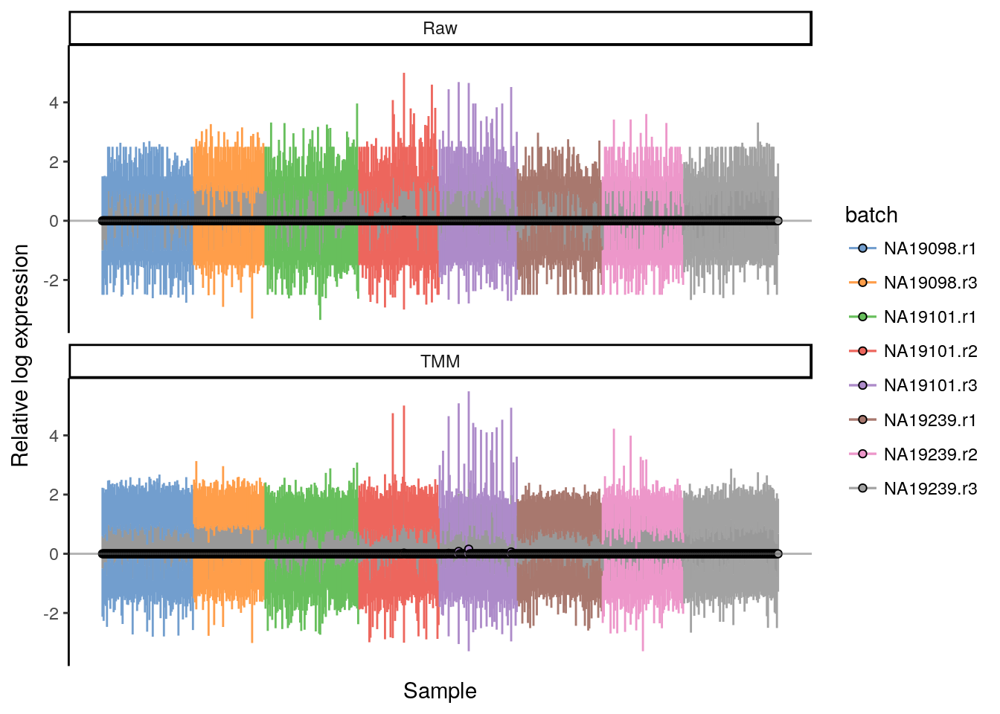
<p class="caption">(\#fig:norm-ours-rle-tmm-reads)Cell-wise RLE of the tung data</p>
</div>


```
## Warning in .local(object, ...): spike-in transcripts in 'ERCC' should have
## their own size factors
```

<div class="figure" style="text-align: center">
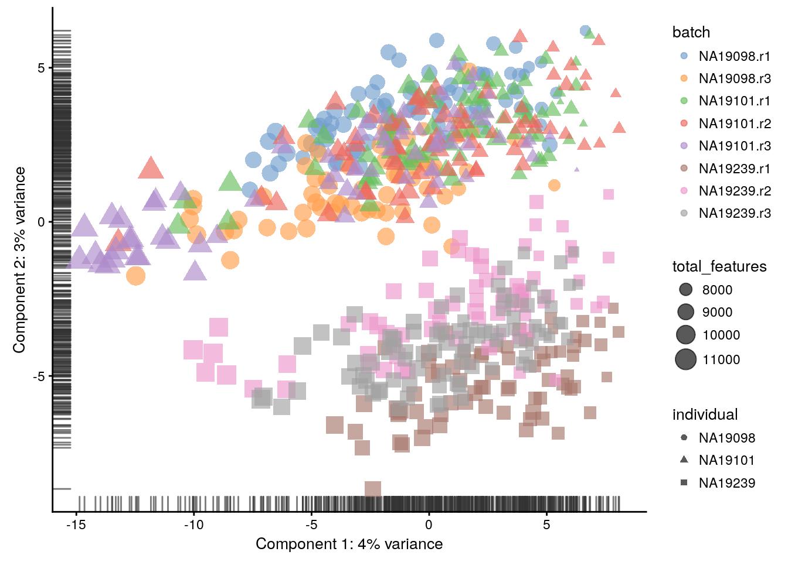
<p class="caption">(\#fig:norm-pca-lsf-umi)PCA plot of the tung data after LSF normalisation</p>
</div>

<div class="figure" style="text-align: center">
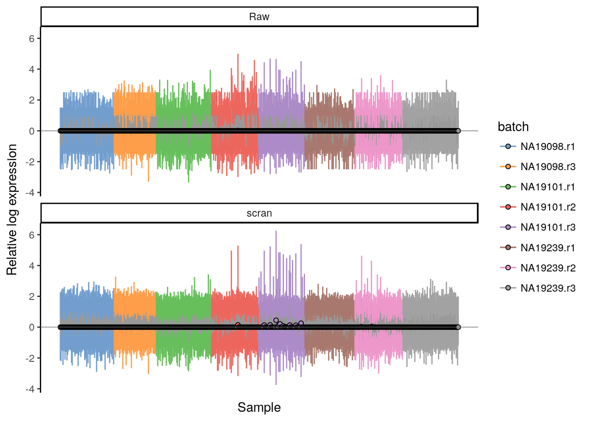
<p class="caption">(\#fig:norm-ours-rle-scran-reads)Cell-wise RLE of the tung data</p>
</div>

<div class="figure" style="text-align: center">
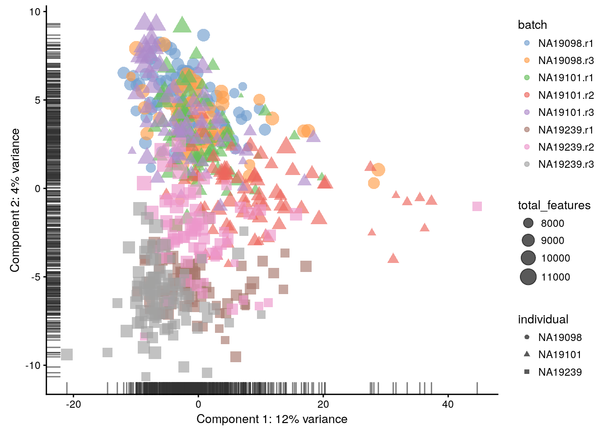
<p class="caption">(\#fig:norm-pca-downsample-reads)PCA plot of the tung data after downsampling</p>
</div>
<div class="figure" style="text-align: center">
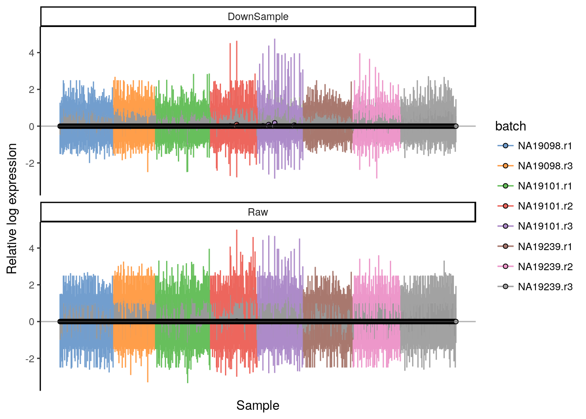
<p class="caption">(\#fig:norm-ours-rle-downsample-reads)Cell-wise RLE of the tung data</p>
</div>


<div class="figure" style="text-align: center">
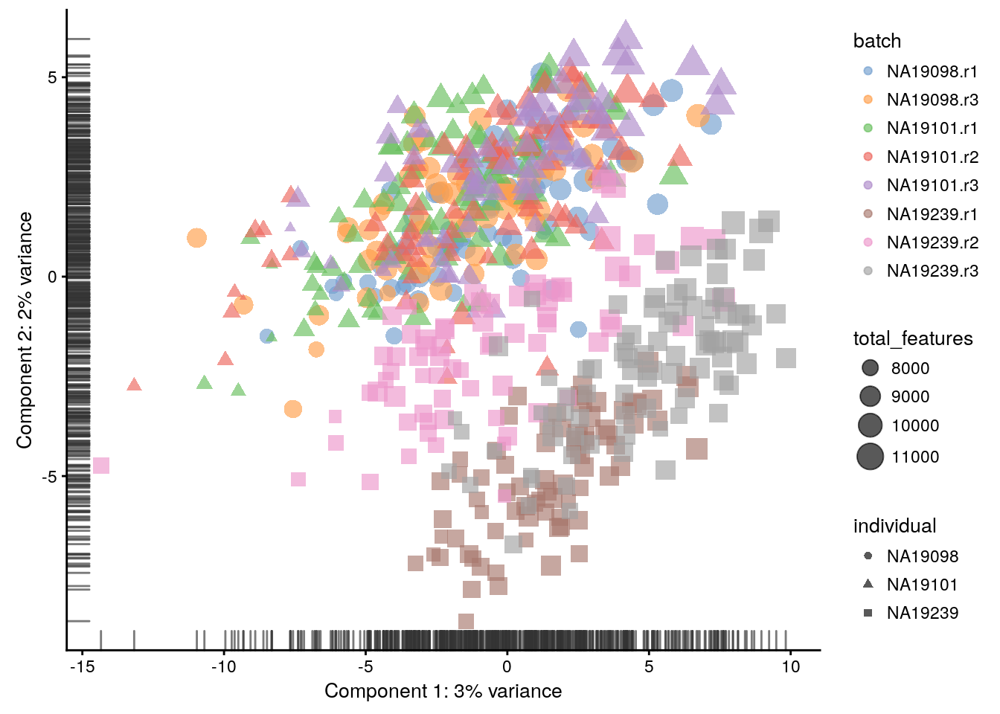
<p class="caption">(\#fig:norm-pca-tpm-reads)PCA plot of the tung data after TPM normalisation</p>
</div>


<div class="figure" style="text-align: center">
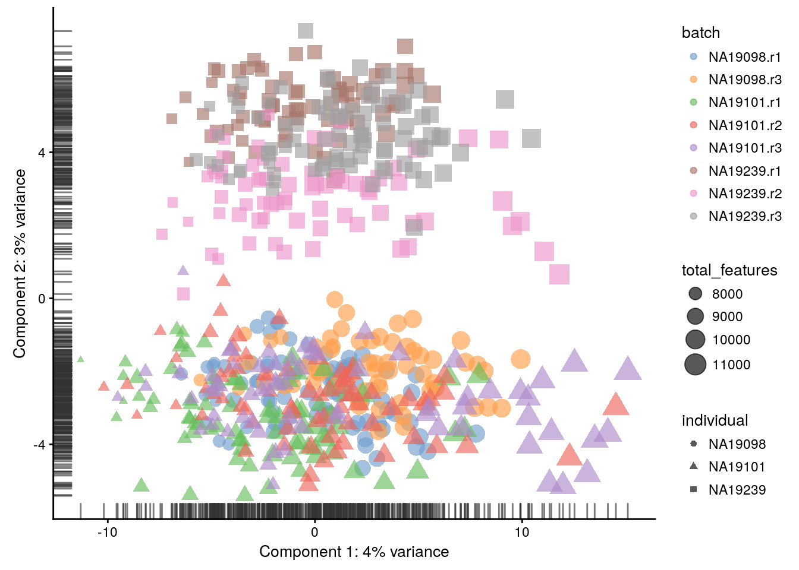
<p class="caption">(\#fig:norm-pca-fpkm-reads)PCA plot of the tung data after FPKM normalisation</p>
</div>


```
## R version 3.4.2 (2017-09-28)
## Platform: x86_64-pc-linux-gnu (64-bit)
## Running under: Debian GNU/Linux 9 (stretch)
## 
## Matrix products: default
## BLAS: /usr/lib/openblas-base/libblas.so.3
## LAPACK: /usr/lib/libopenblasp-r0.2.19.so
## 
## locale:
##  [1] LC_CTYPE=en_US.UTF-8       LC_NUMERIC=C              
##  [3] LC_TIME=en_US.UTF-8        LC_COLLATE=en_US.UTF-8    
##  [5] LC_MONETARY=en_US.UTF-8    LC_MESSAGES=C             
##  [7] LC_PAPER=en_US.UTF-8       LC_NAME=C                 
##  [9] LC_ADDRESS=C               LC_TELEPHONE=C            
## [11] LC_MEASUREMENT=en_US.UTF-8 LC_IDENTIFICATION=C       
## 
## attached base packages:
## [1] stats4    parallel  methods   stats     graphics  grDevices utils    
## [8] datasets  base     
## 
## other attached packages:
##  [1] knitr_1.17                 scran_1.6.2               
##  [3] BiocParallel_1.12.0        scater_1.6.0              
##  [5] SingleCellExperiment_1.0.0 SummarizedExperiment_1.8.0
##  [7] DelayedArray_0.4.1         matrixStats_0.52.2        
##  [9] GenomicRanges_1.30.0       GenomeInfoDb_1.14.0       
## [11] IRanges_2.12.0             S4Vectors_0.16.0          
## [13] ggplot2_2.2.1              Biobase_2.38.0            
## [15] BiocGenerics_0.24.0        scRNA.seq.funcs_0.1.0     
## 
## loaded via a namespace (and not attached):
##  [1] bitops_1.0-6            bit64_0.9-7            
##  [3] progress_1.1.2          rprojroot_1.2          
##  [5] dynamicTreeCut_1.63-1   tools_3.4.2            
##  [7] backports_1.1.1         DT_0.2                 
##  [9] R6_2.2.2                hypergeo_1.2-13        
## [11] vipor_0.4.5             DBI_0.7                
## [13] lazyeval_0.2.1          colorspace_1.3-2       
## [15] gridExtra_2.3           prettyunits_1.0.2      
## [17] moments_0.14            bit_1.1-12             
## [19] compiler_3.4.2          orthopolynom_1.0-5     
## [21] labeling_0.3            bookdown_0.5           
## [23] scales_0.5.0            stringr_1.2.0          
## [25] digest_0.6.12           rmarkdown_1.8          
## [27] XVector_0.18.0          pkgconfig_2.0.1        
## [29] htmltools_0.3.6         highr_0.6              
## [31] limma_3.34.1            htmlwidgets_0.9        
## [33] rlang_0.1.4             RSQLite_2.0            
## [35] FNN_1.1                 shiny_1.0.5            
## [37] bindr_0.1               zoo_1.8-0              
## [39] dplyr_0.7.4             RCurl_1.95-4.8         
## [41] magrittr_1.5            GenomeInfoDbData_0.99.1
## [43] Matrix_1.2-7.1          Rcpp_0.12.13           
## [45] ggbeeswarm_0.6.0        munsell_0.4.3          
## [47] viridis_0.4.0           stringi_1.1.5          
## [49] yaml_2.1.14             edgeR_3.20.1           
## [51] MASS_7.3-45             zlibbioc_1.24.0        
## [53] rhdf5_2.22.0            Rtsne_0.13             
## [55] plyr_1.8.4              grid_3.4.2             
## [57] blob_1.1.0              shinydashboard_0.6.1   
## [59] contfrac_1.1-11         lattice_0.20-34        
## [61] cowplot_0.9.1           splines_3.4.2          
## [63] locfit_1.5-9.1          igraph_1.1.2           
## [65] rjson_0.2.15            reshape2_1.4.2         
## [67] biomaRt_2.34.0          XML_3.98-1.9           
## [69] glue_1.2.0              evaluate_0.10.1        
## [71] data.table_1.10.4-3     deSolve_1.20           
## [73] httpuv_1.3.5            gtable_0.2.0           
## [75] assertthat_0.2.0        mime_0.5               
## [77] xtable_1.8-2            viridisLite_0.2.0      
## [79] tibble_1.3.4            elliptic_1.3-7         
## [81] AnnotationDbi_1.40.0    beeswarm_0.2.3         
## [83] memoise_1.1.0           tximport_1.6.0         
## [85] bindrcpp_0.2            statmod_1.4.30
```

