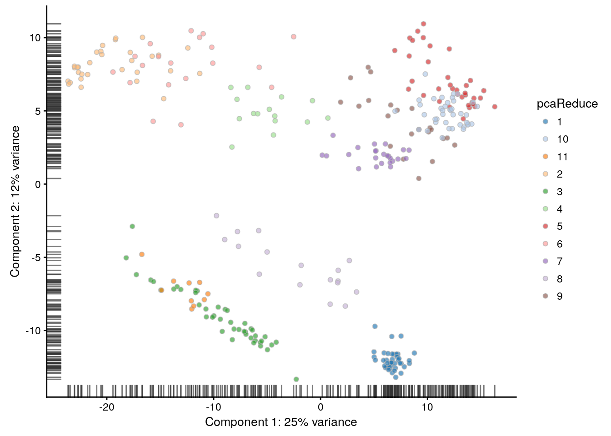

# Clustering example {#clust-methods}


```r
library(pcaMethods)
library(pcaReduce)
library(SC3)
library(scater)
library(SingleCellExperiment)
library(pheatmap)
set.seed(1234567)
```

To illustrate clustering of scRNA-seq data, we consider the `Pollen` dataset of cells from 
different human tissues [@Pollen2014-cu]. We have preprocessed the dataset and created a 
scater object in advance. We have also annotated the cells with the cell type information 
(it is the `cell_type1` column in the `phenoData` slot).

## Pollen dataset

Let's load the data and look at it:

```r
pollen <- readRDS("pollen/pollen.rds")
pollen
```

```
## class: SingleCellExperiment 
## dim: 23730 301 
## metadata(0):
## assays(2): normcounts logcounts
## rownames(23730): A1BG A1BG-AS1 ... ZZEF1 ZZZ3
## rowData names(1): feature_symbol
## colnames(301): Hi_2338_1 Hi_2338_2 ... Hi_GW16_25 Hi_GW16_26
## colData names(2): cell_type1 cell_type2
## reducedDimNames(0):
## spikeNames(0):
```

Let's look at the cell type annotation:

```r
table(colData(pollen)$cell_type1)
```

```
## 
##   2338   2339     BJ   GW16   GW21 GW21+3  hiPSC   HL60   K562   Kera 
##     22     17     37     26      7     17     24     54     42     40 
##    NPC 
##     15
```

A simple PCA analysis already separates some strong cell types and provides some insights in the data structure:

```r
plotPCA(pollen, colour_by = "cell_type1")
```


## SC3

Let's run `SC3` clustering on the Pollen data. The advantage of the `SC3` is that it can directly take a [scater](http://bioconductor.org/packages/scater/) object (see previous chapters) as an input.

Now let's image we do not know the number of clusters _k_ (cell types). `SC3` can estimate a number of clusters for you:

```r
pollen <- sc3_prepare(pollen, ks = 2:5)
```

```
## Setting SC3 parameters...
```

```
## Setting a range of k...
```

```r
pollen <- sc3_estimate_k(pollen)
```

```
## Estimating k...
```

```r
metadata(pollen)$sc3$k_estimation
```

```
## [1] 11
```

Interestingly, the number of cell types predicted by `SC3` is the same as the number of cell types in the Pollen data annotation.

Now we are ready to run `SC3` (we also ask it to calculate biological properties of the clusters): 

```r
pollen <- sc3(pollen, ks = 11, biology = TRUE)
```

```
## Setting SC3 parameters...
```

```
## Setting a range of k...
```

```
## Calculating distances between the cells...
```

```
## Performing transformations and calculating eigenvectors...
```

```
## Performing k-means clustering...
```

```
## Calculating consensus matrix...
```

```
## Calculating biology...
```

`SC3` result consists of several different outputs (please look in [@Kiselev2016-bq] and [SC3 vignette](http://bioconductor.org/packages/release/bioc/vignettes/SC3/inst/doc/my-vignette.html) for more details). Here we show some of them:

Consensus matrix:

```r
sc3_plot_consensus(pollen, k = 11, show_pdata = "cell_type1")
```


Silhouette plot:

```r
sc3_plot_silhouette(pollen, k = 11)
```


Heatmap of the expression matrix:

```r
sc3_plot_expression(pollen, k = 11, show_pdata = "cell_type1")
```


Identified marker genes:

```r
sc3_plot_markers(pollen, k = 11, show_pdata = "cell_type1")
```


PCA plot with highlighted `SC3` clusters:

```r
plotPCA(pollen, colour_by = "sc3_11_clusters")
```


Note, that one can also run `SC3` in an interactive `Shiny` session:

```r
sc3_interactive(pollen)
```

This command will open `SC3` in a web browser.

* __Exercise 1__: Run `SC3` for $k$ from 9 to 13 and explore different clustering solutions in your web browser.

* __Exercise 2__: Which clusters are the most stable when $k$ is changed from 9 to 13? (Look at the "Stability" tab)

* __Exercise 3__: Check out differentially expressed genes and marker genes for the obtained clusterings. Please use $k=11$.

* __Exercise 4__: Change the marker genes threshold (the default is 0.85). Does __SC3__ find more marker genes?

## pcaReduce

`pcaReduce` operates directly on the expression matrix. It is recommended to use a gene filter and log transformation before running `pcaReduce`. We will use the default `SC3` gene filter (note that the `exprs` slot of a `scater` object is log-transformed by default).


```r
# use the same gene filter as in SC3
input <- logcounts(pollen[rowData(pollen)$sc3_gene_filter, ])
```

There are several parameters used by `pcaReduce`:
* `nbt` defines a number of `pcaReduce` runs (it is stochastic and may have different solutions after different runs)
* `q` defines number of dimensions to start clustering with. The output will contain partitions for all $k$ from 2 to q+1.
* `method` defines a method used for clustering. `S` - to perform sampling based merging, `M` - to perform merging based on largest probability.

We will run `pcaReduce` 1 time:

```r
# run pcaReduce 1 time creating hierarchies from 1 to 30 clusters
pca.red <- PCAreduce(t(input), nbt = 1, q = 30, method = 'S')[[1]]
```


```r
colData(pollen)$pcaReduce <- as.character(pca.red[,32 - 11])
plotPCA(pollen, colour_by = "pcaReduce")
```



__Exercise 5__: Run pcaReduce for $k=2$ and plot a similar PCA plot. Does it look good?

__Hint__: When running pcaReduce for different $k$s you do not need to rerun PCAreduce function, just use already calculated `pca.red` object.

__Our solution__:
<div class="figure" style="text-align: center">

<p class="caption">(\#fig:clust-pca-reduce2)Clustering solutions of pcaReduce method for $k=2$.</p>
</div>

__Exercise 6__: Compare the results between `SC3` and `pcaReduce` for $k=11$. What is
the main difference between the solutions provided by the two
different methods?

__Our solution__:


## tSNE + kmeans

[tSNE](https://lvdmaaten.github.io/tsne/) plots that we saw before (\@ref(visual-tsne)) when used the __scater__ package are made by using the [Rtsne](https://cran.r-project.org/web/packages/Rtsne/index.html) and [ggplot2](https://cran.r-project.org/web/packages/ggplot2/index.html) packages. Here we will do the same:

```r
pollen <- plotTSNE(pollen, rand_seed = 1, return_SCE = TRUE)
```

<div class="figure" style="text-align: center">

<p class="caption">(\#fig:clust-tsne)tSNE map of the patient data</p>
</div>

Note that all points on the plot above are black. This is different from what we saw before, when the cells were coloured based on the annotation. Here we do not have any annotation and all cells come from the same batch, therefore all dots are black.

Now we are going to apply _k_-means clustering algorithm to the cloud of points on the tSNE map. How many groups do you see in the cloud?

We will start with $k=8$:

```r
colData(pollen)$tSNE_kmeans <- as.character(kmeans(pollen@reducedDims$TSNE, centers = 8)$clust)
plotTSNE(pollen, rand_seed = 1, colour_by = "tSNE_kmeans")
```

<div class="figure" style="text-align: center">

<p class="caption">(\#fig:clust-tsne-kmeans2)tSNE map of the patient data with 8 colored clusters, identified by the k-means clustering algorithm</p>
</div>

__Exercise 7__: Make the same plot for $k=11$.

__Exercise 8__: Compare the results between `SC3` and `tSNE+kmeans`. Can the
results be improved by changing the `perplexity` parameter?

__Our solution__:


As you may have noticed, both `pcaReduce` and `tSNE+kmeans` are stochastic
and give different results every time they are run. To get a better
overview of the solutions, we need to run the methods multiple times. `SC3` is also stochastic, but thanks to the consensus step, it is more robust and less likely to produce different outcomes.

## SNN-Cliq

Here we run SNN-cliq with te default parameters provided in the author's example:


```r
distan <- "euclidean"
par.k <- 3
par.r <- 0.7
par.m <- 0.5
# construct a graph
scRNA.seq.funcs::SNN(
    data = t(input),
    outfile = "snn-cliq.txt",
    k = par.k,
    distance = distan
)
# find clusters in the graph
snn.res <- 
    system(
        paste0(
            "python snn-cliq/Cliq.py ", 
            "-i snn-cliq.txt ",
            "-o res-snn-cliq.txt ",
            "-r ", par.r,
            " -m ", par.m
        ),
        intern = TRUE
    )
cat(paste(snn.res, collapse = "\n"))
```

```
## input file snn-cliq.txt
## find 65 quasi-cliques
## merged into 15 clusters
## unique assign done
```

```r
snn.res <- read.table("res-snn-cliq.txt")
# remove files that were created during the analysis
system("rm snn-cliq.txt res-snn-cliq.txt")

colData(pollen)$SNNCliq <- as.character(snn.res[,1])
plotPCA(pollen, colour_by = "SNNCliq")
```


__Exercise 9__: Compare the results between `SC3` and `SNN-Cliq`.

__Our solution__:


## SINCERA

As mentioned in the previous chapter [SINCERA](https://research.cchmc.org/pbge/sincera.html) is based on hierarchical clustering. One important thing to keep in mind is that it performs a gene-level z-score transformation before doing clustering:


```r
# perform gene-by-gene per-sample z-score transformation
dat <- apply(input, 1, function(y) scRNA.seq.funcs::z.transform.helper(y))
# hierarchical clustering
dd <- as.dist((1 - cor(t(dat), method = "pearson"))/2)
hc <- hclust(dd, method = "average")
```

If the number of cluster is not known [SINCERA](https://research.cchmc.org/pbge/sincera.html) can identify __k__ as the minimum height of the hierarchical tree that generates no more than a specified number of singleton clusters (clusters containing only 1 cell)

```r
num.singleton <- 0
kk <- 1
for (i in 2:dim(dat)[2]) {
    clusters <- cutree(hc, k = i)
    clustersizes <- as.data.frame(table(clusters))
    singleton.clusters <- which(clustersizes$Freq < 2)
    if (length(singleton.clusters) <= num.singleton) {
        kk <- i
    } else {
        break;
    }
}
cat(kk)
```

```
## 14
```

Let's now visualize the SINCERA results as a heatmap:

```r
pheatmap(
    t(dat),
    cluster_cols = hc,
    cutree_cols = 14,
    kmeans_k = 100,
    show_rownames = FALSE
)
```

<div class="figure" style="text-align: center">

<p class="caption">(\#fig:clust-sincera)Clustering solutions of SINCERA method using $k=3$</p>
</div>

__Exercise 10__: Compare the results between `SC3` and `SNN-Cliq`.

__Our solution__:


__Exercise 11__: Is using the singleton cluster criteria for finding __k__ a good idea?

## sessionInfo()


```
## R version 3.4.2 (2017-09-28)
## Platform: x86_64-pc-linux-gnu (64-bit)
## Running under: Debian GNU/Linux buster/sid
## 
## Matrix products: default
## BLAS: /usr/lib/x86_64-linux-gnu/blas/libblas.so.3.7.1
## LAPACK: /usr/lib/x86_64-linux-gnu/lapack/liblapack.so.3.7.1
## 
## locale:
##  [1] LC_CTYPE=en_US.UTF-8       LC_NUMERIC=C              
##  [3] LC_TIME=en_US.UTF-8        LC_COLLATE=en_US.UTF-8    
##  [5] LC_MONETARY=en_US.UTF-8    LC_MESSAGES=en_US.UTF-8   
##  [7] LC_PAPER=en_US.UTF-8       LC_NAME=C                 
##  [9] LC_ADDRESS=C               LC_TELEPHONE=C            
## [11] LC_MEASUREMENT=en_US.UTF-8 LC_IDENTIFICATION=C       
## 
## attached base packages:
## [1] stats4    parallel  methods   stats     graphics  grDevices utils    
## [8] datasets  base     
## 
## other attached packages:
##  [1] pheatmap_1.0.8              scater_1.5.19              
##  [3] ggplot2_2.2.1               SC3_1.5.5                  
##  [5] SingleCellExperiment_0.99.4 SummarizedExperiment_1.6.5 
##  [7] DelayedArray_0.2.7          matrixStats_0.52.2         
##  [9] GenomicRanges_1.28.6        GenomeInfoDb_1.12.3        
## [11] IRanges_2.10.5              S4Vectors_0.14.7           
## [13] pcaReduce_1.0               mclust_5.3                 
## [15] mnormt_1.5-5                pcaMethods_1.68.0          
## [17] Biobase_2.36.2              BiocGenerics_0.22.1        
## [19] knitr_1.17                 
## 
## loaded via a namespace (and not attached):
##   [1] Rtsne_0.13              ggbeeswarm_0.6.0       
##   [3] colorspace_1.3-2        rjson_0.2.15           
##   [5] class_7.3-14            rprojroot_1.2          
##   [7] XVector_0.16.0          bit64_0.9-7            
##   [9] AnnotationDbi_1.38.2    mvtnorm_1.0-6          
##  [11] codetools_0.2-15        scRNA.seq.funcs_0.1.0  
##  [13] tximport_1.4.0          doParallel_1.0.11      
##  [15] robustbase_0.92-7       cluster_2.0.6          
##  [17] shinydashboard_0.6.1    shiny_1.0.5            
##  [19] rrcov_1.4-3             compiler_3.4.2         
##  [21] backports_1.1.1         assertthat_0.2.0       
##  [23] Matrix_1.2-11           lazyeval_0.2.0         
##  [25] limma_3.32.10           htmltools_0.3.6        
##  [27] tools_3.4.2             bindrcpp_0.2           
##  [29] gtable_0.2.0            glue_1.1.1             
##  [31] GenomeInfoDbData_0.99.0 reshape2_1.4.2         
##  [33] dplyr_0.7.4             doRNG_1.6.6            
##  [35] Rcpp_0.12.13            gdata_2.18.0           
##  [37] iterators_1.0.8         stringr_1.2.0          
##  [39] mime_0.5                rngtools_1.2.4         
##  [41] gtools_3.5.0            WriteXLS_4.0.0         
##  [43] hypergeo_1.2-13         statmod_1.4.30         
##  [45] XML_3.98-1.9            edgeR_3.18.1           
##  [47] DEoptimR_1.0-8          MASS_7.3-47            
##  [49] zlibbioc_1.22.0         scales_0.5.0           
##  [51] rhdf5_2.20.0            RColorBrewer_1.1-2     
##  [53] yaml_2.1.14             memoise_1.1.0          
##  [55] gridExtra_2.3           pkgmaker_0.22          
##  [57] biomaRt_2.32.1          stringi_1.1.5          
##  [59] RSQLite_2.0             highr_0.6              
##  [61] pcaPP_1.9-72            foreach_1.4.3          
##  [63] orthopolynom_1.0-5      e1071_1.6-8            
##  [65] contfrac_1.1-11         caTools_1.17.1         
##  [67] moments_0.14            rlang_0.1.2            
##  [69] pkgconfig_2.0.1         bitops_1.0-6           
##  [71] evaluate_0.10.1         lattice_0.20-35        
##  [73] ROCR_1.0-7              bindr_0.1              
##  [75] labeling_0.3            cowplot_0.8.0          
##  [77] bit_1.1-12              deSolve_1.20           
##  [79] plyr_1.8.4              magrittr_1.5           
##  [81] bookdown_0.5            R6_2.2.2               
##  [83] gplots_3.0.1            DBI_0.7                
##  [85] RCurl_1.95-4.8          tibble_1.3.4           
##  [87] KernSmooth_2.23-15      rmarkdown_1.6          
##  [89] viridis_0.4.0           locfit_1.5-9.1         
##  [91] grid_3.4.2              data.table_1.10.4-2    
##  [93] blob_1.1.0              digest_0.6.12          
##  [95] xtable_1.8-2            httpuv_1.3.5           
##  [97] elliptic_1.3-7          munsell_0.4.3          
##  [99] registry_0.3            beeswarm_0.2.3         
## [101] viridisLite_0.2.0       vipor_0.4.5
```
