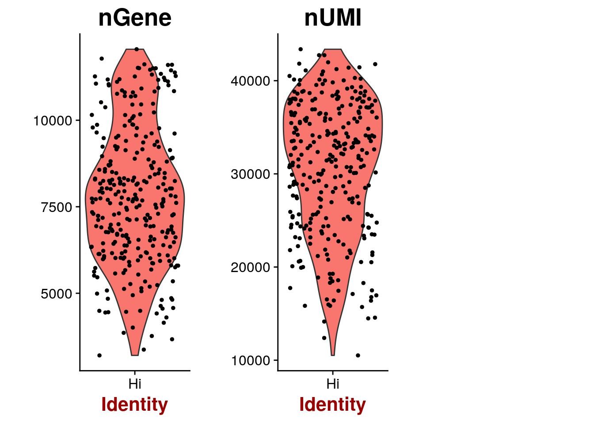
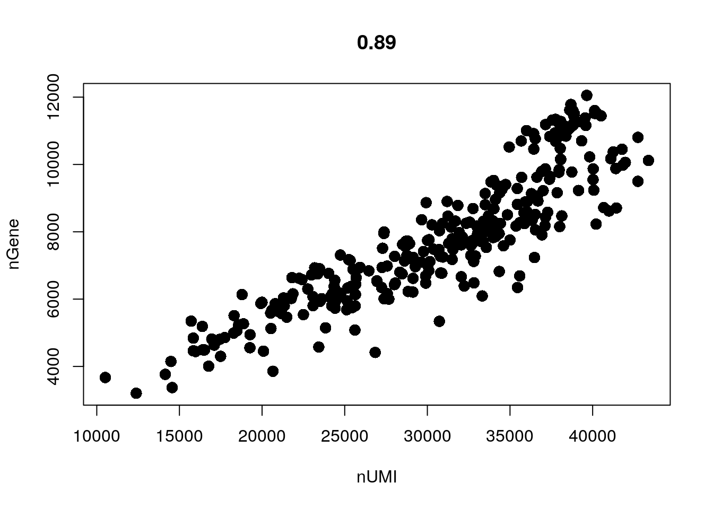
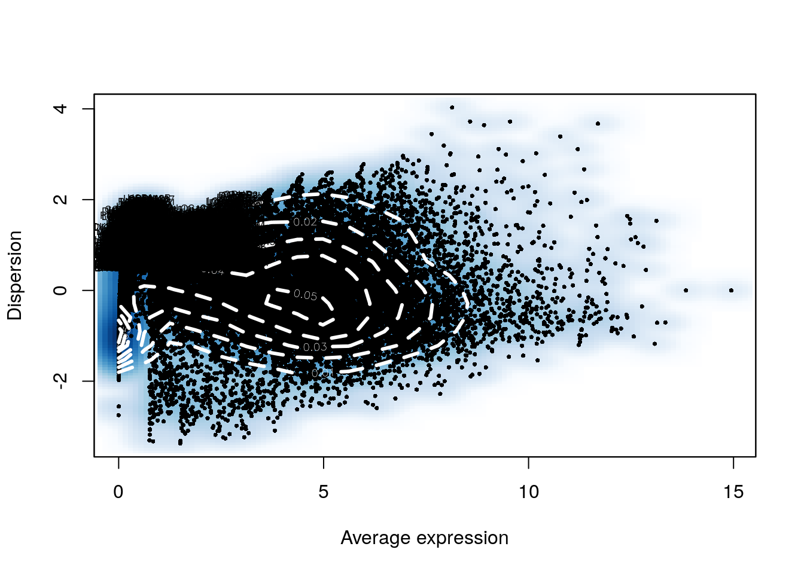
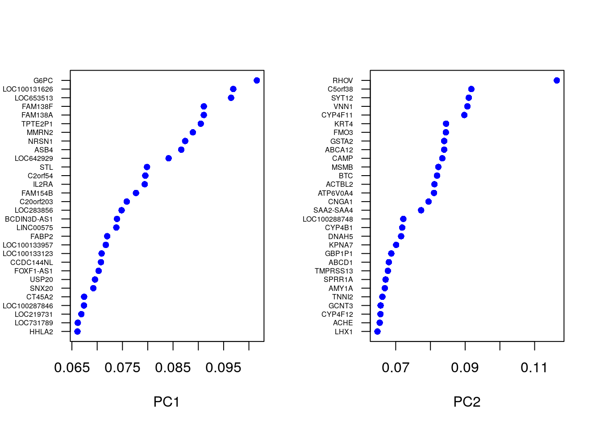
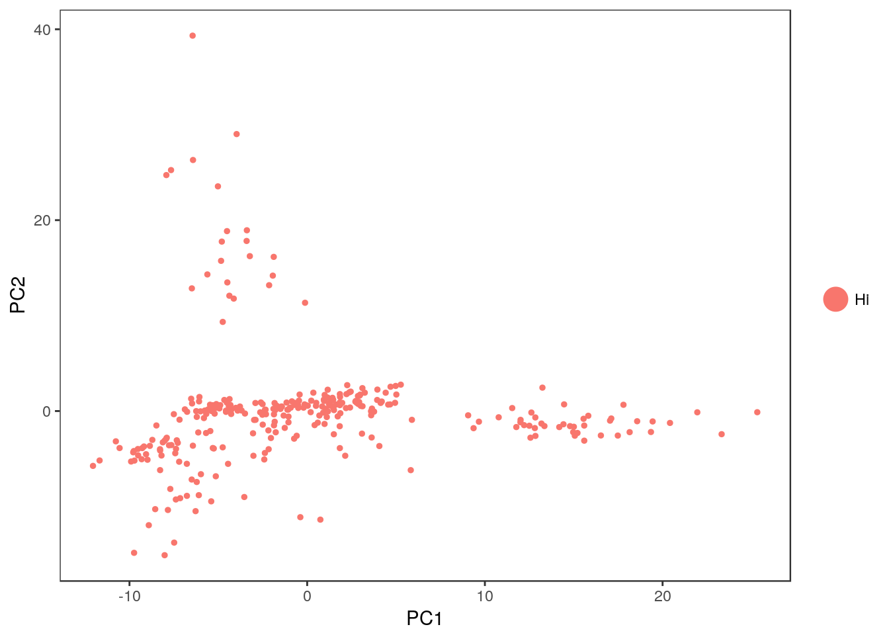
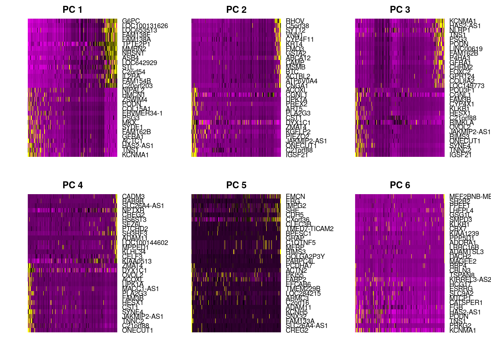
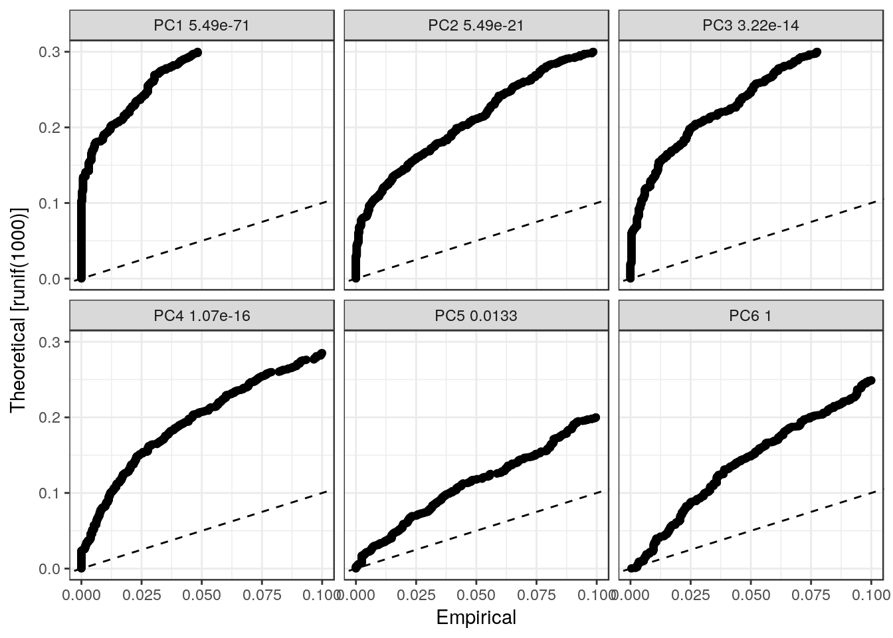
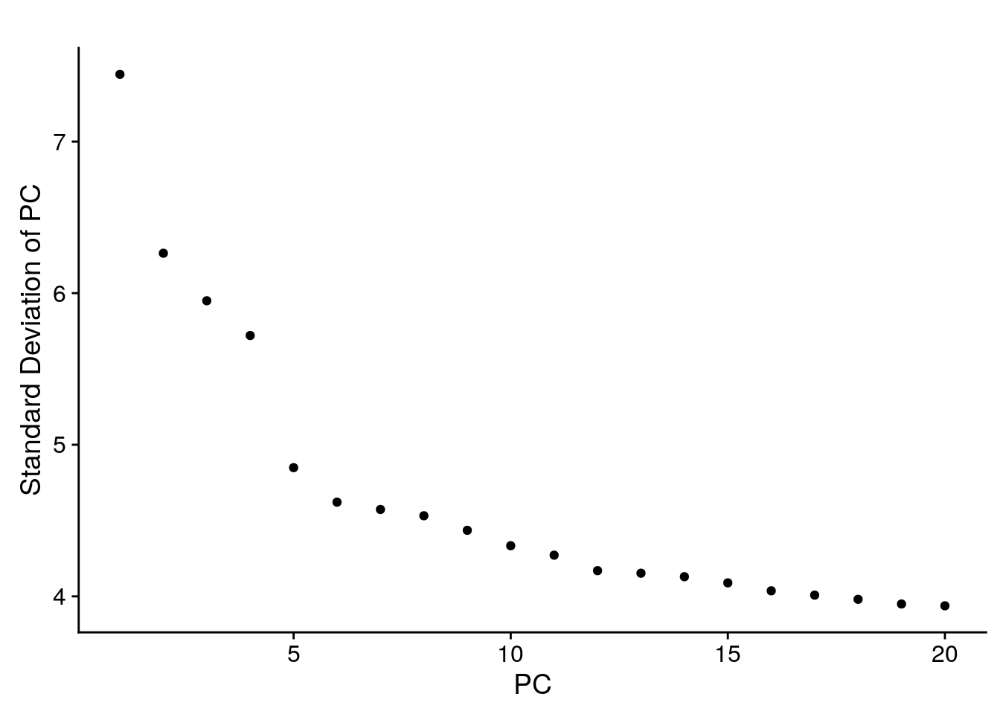

```r
set.seed(1234567)
```

# SEURAT

Let's load the data and look at it:

```r
pollen <- readRDS("pollen/pollen.rds")
```

Here we follow an [example](http://satijalab.org/seurat/get_started.html) created by the authors of `SEURAT` (8,500 Pancreas cells). We mostly use default values in various function calls, for more details please consult the documentation and the authors:


Initialize the Seurat object with the raw (non-normalized data).  Keep all genes expressed in >= 3 cells. Keep all cells with at least 200 detected genes:

```r
library(SingleCellExperiment)
library(Seurat)
seuset <- CreateSeuratObject(
    raw.data = logcounts(pollen), 
    min.cells = 3, 
    min.genes = 200
)

VlnPlot(object = seuset, features.plot = c("nGene", "nUMI"), nCol = 3)
```



```r
GenePlot(object = seuset, gene1 = "nUMI", gene2 = "nGene")
```



```r
seuset <- FindVariableGenes(
    object = seuset, 
    mean.function = ExpMean, 
    dispersion.function = LogVMR, 
    x.low.cutoff = 0.0125, 
    x.high.cutoff = 3, 
    y.cutoff = 0.5
)
```



```r
length(x = seuset@var.genes)
```

```
## [1] 2942
```

```r
seuset <- ScaleData(object = seuset, vars.to.regress = c("nUMI"))
```

```
## NormalizeData has not been run, therefore ScaleData is running on non-normalized values. Recommended workflow is to run NormalizeData first.
## ScaleData is running on non-normalized values. Recommended workflow is to run NormalizeData first.
## [1] "Regressing out nUMI"
## 
  |                                                                       
  |                                                                 |   0%
  |                                                                       
  |=                                                                |   1%
  |                                                                       
  |=                                                                |   2%
  |                                                                       
  |==                                                               |   2%
  |                                                                       
  |==                                                               |   3%
  |                                                                       
  |===                                                              |   4%
  |                                                                       
  |===                                                              |   5%
  |                                                                       
  |====                                                             |   5%
  |                                                                       
  |====                                                             |   6%
  |                                                                       
  |====                                                             |   7%
  |                                                                       
  |=====                                                            |   7%
  |                                                                       
  |=====                                                            |   8%
  |                                                                       
  |======                                                           |   9%
  |                                                                       
  |======                                                           |  10%
  |                                                                       
  |=======                                                          |  10%
  |                                                                       
  |=======                                                          |  11%
  |                                                                       
  |========                                                         |  12%
  |                                                                       
  |========                                                         |  13%
  |                                                                       
  |=========                                                        |  13%
  |                                                                       
  |=========                                                        |  14%
  |                                                                       
  |==========                                                       |  15%
  |                                                                       
  |==========                                                       |  16%
  |                                                                       
  |===========                                                      |  16%
  |                                                                       
  |===========                                                      |  17%
  |                                                                       
  |============                                                     |  18%
  |                                                                       
  |============                                                     |  19%
  |                                                                       
  |=============                                                    |  20%
  |                                                                       
  |=============                                                    |  21%
  |                                                                       
  |==============                                                   |  21%
  |                                                                       
  |==============                                                   |  22%
  |                                                                       
  |===============                                                  |  23%
  |                                                                       
  |===============                                                  |  24%
  |                                                                       
  |================                                                 |  24%
  |                                                                       
  |================                                                 |  25%
  |                                                                       
  |=================                                                |  26%
  |                                                                       
  |=================                                                |  27%
  |                                                                       
  |==================                                               |  27%
  |                                                                       
  |==================                                               |  28%
  |                                                                       
  |===================                                              |  29%
  |                                                                       
  |===================                                              |  30%
  |                                                                       
  |====================                                             |  30%
  |                                                                       
  |====================                                             |  31%
  |                                                                       
  |====================                                             |  32%
  |                                                                       
  |=====================                                            |  32%
  |                                                                       
  |=====================                                            |  33%
  |                                                                       
  |======================                                           |  33%
  |                                                                       
  |======================                                           |  34%
  |                                                                       
  |=======================                                          |  35%
  |                                                                       
  |=======================                                          |  36%
  |                                                                       
  |========================                                         |  36%
  |                                                                       
  |========================                                         |  37%
  |                                                                       
  |=========================                                        |  38%
  |                                                                       
  |=========================                                        |  39%
  |                                                                       
  |==========================                                       |  39%
  |                                                                       
  |==========================                                       |  40%
  |                                                                       
  |===========================                                      |  41%
  |                                                                       
  |===========================                                      |  42%
  |                                                                       
  |============================                                     |  42%
  |                                                                       
  |============================                                     |  43%
  |                                                                       
  |============================                                     |  44%
  |                                                                       
  |=============================                                    |  44%
  |                                                                       
  |=============================                                    |  45%
  |                                                                       
  |==============================                                   |  46%
  |                                                                       
  |==============================                                   |  47%
  |                                                                       
  |===============================                                  |  47%
  |                                                                       
  |===============================                                  |  48%
  |                                                                       
  |================================                                 |  49%
  |                                                                       
  |================================                                 |  50%
  |                                                                       
  |=================================                                |  50%
  |                                                                       
  |=================================                                |  51%
  |                                                                       
  |==================================                               |  52%
  |                                                                       
  |==================================                               |  53%
  |                                                                       
  |===================================                              |  53%
  |                                                                       
  |===================================                              |  54%
  |                                                                       
  |====================================                             |  55%
  |                                                                       
  |====================================                             |  56%
  |                                                                       
  |=====================================                            |  56%
  |                                                                       
  |=====================================                            |  57%
  |                                                                       
  |=====================================                            |  58%
  |                                                                       
  |======================================                           |  58%
  |                                                                       
  |======================================                           |  59%
  |                                                                       
  |=======================================                          |  60%
  |                                                                       
  |=======================================                          |  61%
  |                                                                       
  |========================================                         |  61%
  |                                                                       
  |========================================                         |  62%
  |                                                                       
  |=========================================                        |  63%
  |                                                                       
  |=========================================                        |  64%
  |                                                                       
  |==========================================                       |  64%
  |                                                                       
  |==========================================                       |  65%
  |                                                                       
  |===========================================                      |  66%
  |                                                                       
  |===========================================                      |  67%
  |                                                                       
  |============================================                     |  67%
  |                                                                       
  |============================================                     |  68%
  |                                                                       
  |=============================================                    |  68%
  |                                                                       
  |=============================================                    |  69%
  |                                                                       
  |=============================================                    |  70%
  |                                                                       
  |==============================================                   |  70%
  |                                                                       
  |==============================================                   |  71%
  |                                                                       
  |===============================================                  |  72%
  |                                                                       
  |===============================================                  |  73%
  |                                                                       
  |================================================                 |  73%
  |                                                                       
  |================================================                 |  74%
  |                                                                       
  |=================================================                |  75%
  |                                                                       
  |=================================================                |  76%
  |                                                                       
  |==================================================               |  76%
  |                                                                       
  |==================================================               |  77%
  |                                                                       
  |===================================================              |  78%
  |                                                                       
  |===================================================              |  79%
  |                                                                       
  |====================================================             |  79%
  |                                                                       
  |====================================================             |  80%
  |                                                                       
  |=====================================================            |  81%
  |                                                                       
  |=====================================================            |  82%
  |                                                                       
  |======================================================           |  83%
  |                                                                       
  |======================================================           |  84%
  |                                                                       
  |=======================================================          |  84%
  |                                                                       
  |=======================================================          |  85%
  |                                                                       
  |========================================================         |  86%
  |                                                                       
  |========================================================         |  87%
  |                                                                       
  |=========================================================        |  87%
  |                                                                       
  |=========================================================        |  88%
  |                                                                       
  |==========================================================       |  89%
  |                                                                       
  |==========================================================       |  90%
  |                                                                       
  |===========================================================      |  90%
  |                                                                       
  |===========================================================      |  91%
  |                                                                       
  |============================================================     |  92%
  |                                                                       
  |============================================================     |  93%
  |                                                                       
  |=============================================================    |  93%
  |                                                                       
  |=============================================================    |  94%
  |                                                                       
  |=============================================================    |  95%
  |                                                                       
  |==============================================================   |  95%
  |                                                                       
  |==============================================================   |  96%
  |                                                                       
  |===============================================================  |  97%
  |                                                                       
  |===============================================================  |  98%
  |                                                                       
  |================================================================ |  98%
  |                                                                       
  |================================================================ |  99%
  |                                                                       
  |=================================================================| 100%
## [1] "Scaling data matrix"
## 
  |                                                                       
  |                                                                 |   0%
  |                                                                       
  |=================================================================| 100%
```

```r
seuset <- RunPCA(
    object = seuset, 
    pc.genes = seuset@var.genes, 
    do.print = TRUE, 
    pcs.print = 1:5, 
    genes.print = 5
)
```

```
## [1] "PC1"
## [1] "KCNMA1"   "TNS1"     "HAS2-AS1" "ACTC1"    "GFRA1"   
## [1] ""
## [1] "G6PC"         "LOC100131626" "LOC653513"    "FAM138F"     
## [5] "FAM138A"     
## [1] ""
## [1] ""
## [1] "PC2"
## [1] "IGSF21"      "C21orf88"    "ONECUT1"     "JAKMIP2-AS1" "PIEZO2"     
## [1] ""
## [1] "RHOV"    "C5orf38" "SYT12"   "VNN1"    "CYP4F11"
## [1] ""
## [1] ""
## [1] "PC3"
## [1] "IGSF21"  "TNNC2"   "SYNE4"   "ONECUT1" "RIMS3"  
## [1] ""
## [1] "KCNMA1"   "HAS2-AS1" "NLRP1"    "TNS1"     "PSG3"    
## [1] ""
## [1] ""
## [1] "PC4"
## [1] "ONECUT1"     "C21orf88"    "TNNC2"       "JAKMIP2-AS1" "SYNE4"      
## [1] ""
## [1] "CADM3"       "RAB9B"       "SLC26A4-AS1" "NPTXR"       "CREG2"      
## [1] ""
## [1] ""
## [1] "PC5"
## [1] "CREG2"       "SLC26A4-AS1" "FAM133A"     "SNX32"       "KCNH5"      
## [1] ""
## [1] "EMCN"  "ERG"   "IMPG2" "SHE"   "CDH5" 
## [1] ""
## [1] ""
```

```r
VizPCA(object = seuset, pcs.use = 1:2)
```



```r
PCAPlot(object = seuset, dim.1 = 1, dim.2 = 2)
```



```r
seuset <- ProjectPCA(object = seuset, do.print = FALSE)

PCHeatmap(
    object = seuset, 
    pc.use = 1:6, 
    cells.use = 500, 
    do.balanced = TRUE, 
    label.columns = FALSE,
    use.full = FALSE
)
```



```r
seuset <- JackStraw(
    object = seuset, 
    num.replicate = 100, 
    do.print = FALSE
)

JackStrawPlot(object = seuset, PCs = 1:6)
```



```r
PCElbowPlot(object = seuset)
```



```r
seuset <- FindClusters(
    object = seuset, 
    reduction.type = "pca", 
    dims.use = 1:5, 
    resolution = 0.6, 
    print.output = 0, 
    save.SNN = TRUE
)

table(seuset@ident)
```

```
## 
##  0  1  2  3  4  5 
## 85 79 43 38 35 21
```

```r
mclust::adjustedRandIndex(colData(pollen)$cell_type1, seuset@ident)
```

```
## [1] 0.5147792
```

```r
# this did not work!
# Error in La.svd(x, nu, nv) : LAPACK routines cannot be loaded
# seuset <- RunTSNE(
#     object = seuset, 
#     dims.use = 1:5, 
#     do.fast = TRUE
# )
```

__Exercise 12__: Compare the results between `SC3` and `SEURAT`.

__Our solution__:

```r
pData(pollen)$SEURAT <- as.character(pollen_seurat@ident)
sc3_plot_expression(pollen, k = 11, show_pdata = "SEURAT")
```


Seurat can also find marker genes, e.g. marker genes for cluster 2:

```r
markers <- FindMarkers(pollen_seurat, 2)
FeaturePlot(pollen_seurat, 
            head(rownames(markers)), 
            cols.use = c("lightgrey", "blue"), 
            nCol = 3)
```

__Exercise 13__: Compare marker genes provided by `SEURAT` and `SC3`.

## sessionInfo()


```
## R version 3.4.2 (2017-09-28)
## Platform: x86_64-pc-linux-gnu (64-bit)
## Running under: Debian GNU/Linux buster/sid
## 
## Matrix products: default
## BLAS: /usr/lib/x86_64-linux-gnu/blas/libblas.so.3.7.1
## LAPACK: /usr/lib/x86_64-linux-gnu/lapack/liblapack.so.3.7.1
## 
## locale:
##  [1] LC_CTYPE=en_US.UTF-8       LC_NUMERIC=C              
##  [3] LC_TIME=en_US.UTF-8        LC_COLLATE=en_US.UTF-8    
##  [5] LC_MONETARY=en_US.UTF-8    LC_MESSAGES=en_US.UTF-8   
##  [7] LC_PAPER=en_US.UTF-8       LC_NAME=C                 
##  [9] LC_ADDRESS=C               LC_TELEPHONE=C            
## [11] LC_MEASUREMENT=en_US.UTF-8 LC_IDENTIFICATION=C       
## 
## attached base packages:
## [1] parallel  stats4    methods   stats     graphics  grDevices utils    
## [8] datasets  base     
## 
## other attached packages:
##  [1] Seurat_2.1.0                Matrix_1.2-11              
##  [3] cowplot_0.8.0               ggplot2_2.2.1              
##  [5] SingleCellExperiment_0.99.4 SummarizedExperiment_1.6.5 
##  [7] DelayedArray_0.2.7          matrixStats_0.52.2         
##  [9] Biobase_2.36.2              GenomicRanges_1.28.6       
## [11] GenomeInfoDb_1.12.3         IRanges_2.10.5             
## [13] S4Vectors_0.14.7            BiocGenerics_0.22.1        
## [15] knitr_1.17                 
## 
## loaded via a namespace (and not attached):
##   [1] backports_1.1.1         Hmisc_4.0-3            
##   [3] VGAM_1.0-4              NMF_0.20.6             
##   [5] sn_1.5-0                plyr_1.8.4             
##   [7] igraph_1.1.2            lazyeval_0.2.0         
##   [9] splines_3.4.2           gridBase_0.4-7         
##  [11] digest_0.6.12           foreach_1.4.3          
##  [13] htmltools_0.3.6         lars_1.2               
##  [15] gdata_2.18.0            magrittr_1.5           
##  [17] checkmate_1.8.4         cluster_2.0.6          
##  [19] doParallel_1.0.11       mixtools_1.1.0         
##  [21] ROCR_1.0-7              sfsmisc_1.1-1          
##  [23] recipes_0.1.0           gower_0.1.2            
##  [25] dimRed_0.1.0            R.utils_2.5.0          
##  [27] colorspace_1.3-2        dplyr_0.7.4            
##  [29] RCurl_1.95-4.8          bindr_0.1              
##  [31] survival_2.41-3         iterators_1.0.8        
##  [33] ape_4.1                 glue_1.1.1             
##  [35] DRR_0.0.2               registry_0.3           
##  [37] gtable_0.2.0            ipred_0.9-6            
##  [39] zlibbioc_1.22.0         XVector_0.16.0         
##  [41] kernlab_0.9-25          ddalpha_1.3.1          
##  [43] prabclus_2.2-6          DEoptimR_1.0-8         
##  [45] scales_0.5.0            mvtnorm_1.0-6          
##  [47] rngtools_1.2.4          Rcpp_0.12.13           
##  [49] dtw_1.18-1              xtable_1.8-2           
##  [51] htmlTable_1.9           tclust_1.3-1           
##  [53] foreign_0.8-69          proxy_0.4-17           
##  [55] mclust_5.3              SDMTools_1.1-221       
##  [57] Formula_1.2-2           tsne_0.1-3             
##  [59] lava_1.5.1              prodlim_1.6.1          
##  [61] htmlwidgets_0.9         FNN_1.1                
##  [63] gplots_3.0.1            RColorBrewer_1.1-2     
##  [65] fpc_2.1-10              acepack_1.4.1          
##  [67] modeltools_0.2-21       ica_1.0-1              
##  [69] pkgconfig_2.0.1         R.methodsS3_1.7.1      
##  [71] flexmix_2.3-14          nnet_7.3-12            
##  [73] caret_6.0-77            labeling_0.3           
##  [75] rlang_0.1.2             reshape2_1.4.2         
##  [77] munsell_0.4.3           tools_3.4.2            
##  [79] ranger_0.8.0            ggridges_0.4.1         
##  [81] evaluate_0.10.1         stringr_1.2.0          
##  [83] yaml_2.1.14             ModelMetrics_1.1.0     
##  [85] robustbase_0.92-7       caTools_1.17.1         
##  [87] purrr_0.2.4             bindrcpp_0.2           
##  [89] pbapply_1.3-3           nlme_3.1-131           
##  [91] R.oo_1.21.0             RcppRoll_0.2.2         
##  [93] compiler_3.4.2          ggjoy_0.4.0            
##  [95] tibble_1.3.4            stringi_1.1.5          
##  [97] lattice_0.20-35         trimcluster_0.1-2      
##  [99] diffusionMap_1.1-0      data.table_1.10.4-2    
## [101] bitops_1.0-6            irlba_2.3.1            
## [103] R6_2.2.2                latticeExtra_0.6-28    
## [105] bookdown_0.5            KernSmooth_2.23-15     
## [107] gridExtra_2.3           codetools_0.2-15       
## [109] MASS_7.3-47             gtools_3.5.0           
## [111] assertthat_0.2.0        CVST_0.2-1             
## [113] pkgmaker_0.22           rprojroot_1.2          
## [115] withr_2.0.0             mnormt_1.5-5           
## [117] GenomeInfoDbData_0.99.0 diptest_0.75-7         
## [119] grid_3.4.2              rpart_4.1-11           
## [121] timeDate_3012.100       tidyr_0.7.2            
## [123] class_7.3-14            rmarkdown_1.6          
## [125] segmented_0.5-2.2       Rtsne_0.13             
## [127] numDeriv_2016.8-1       scatterplot3d_0.3-40   
## [129] lubridate_1.6.0         base64enc_0.1-3
```
