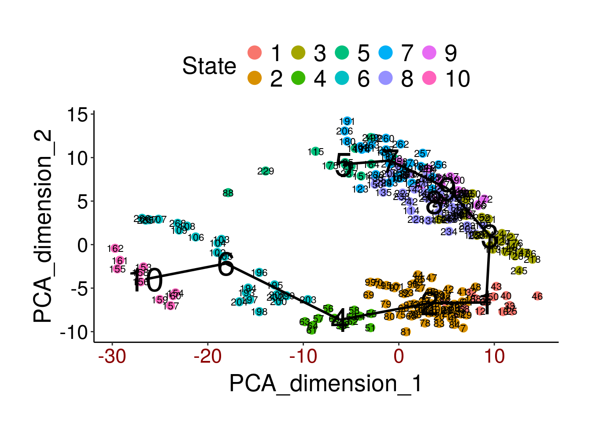
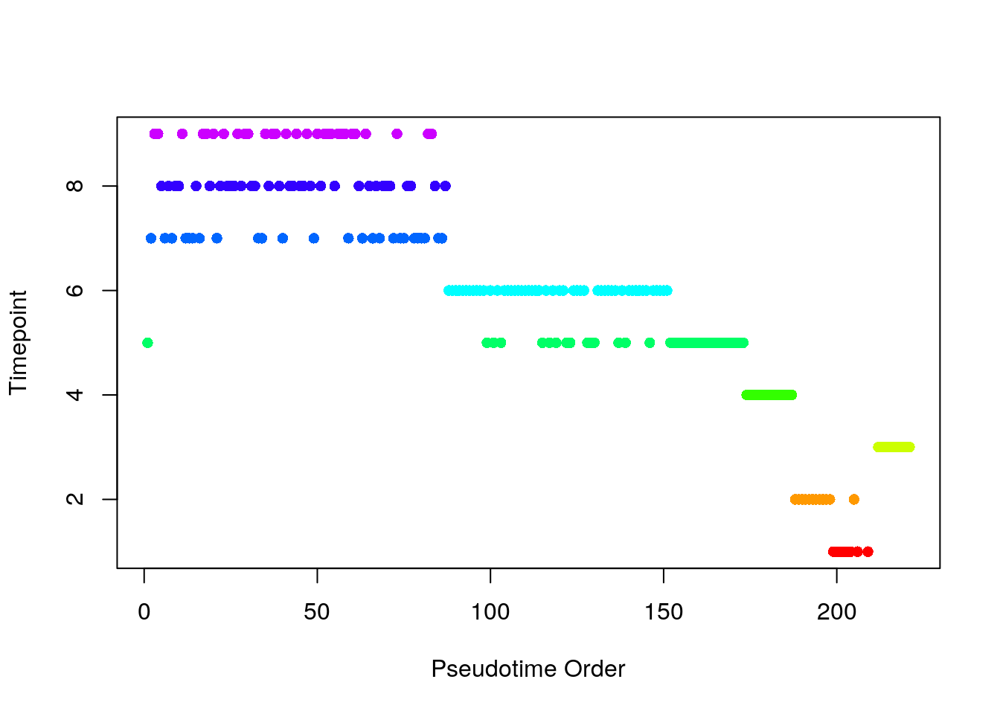
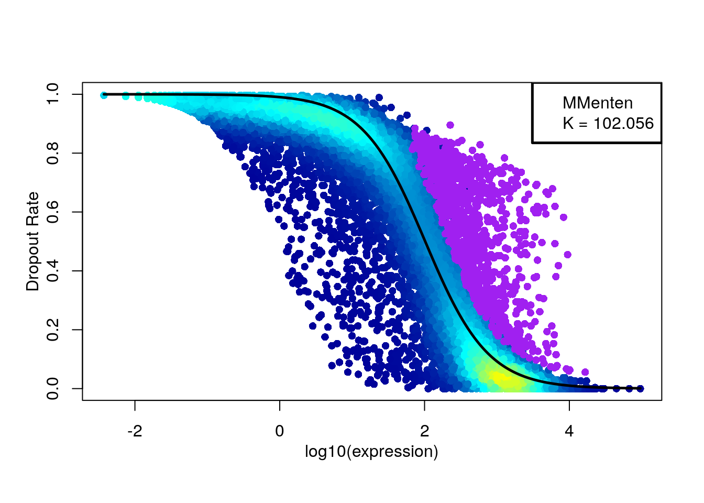
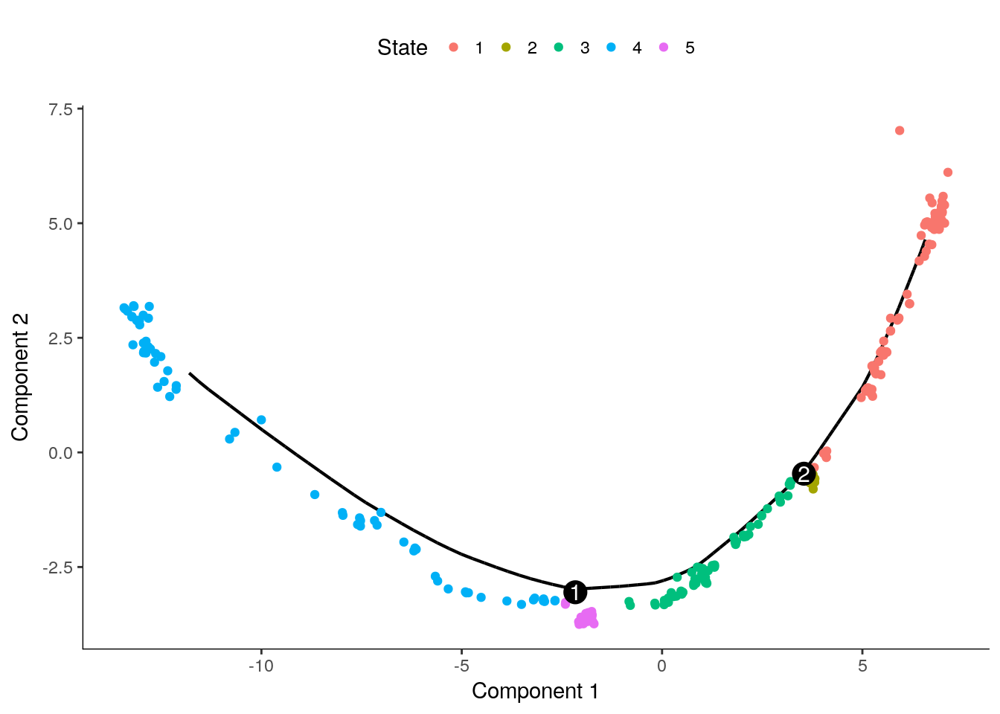
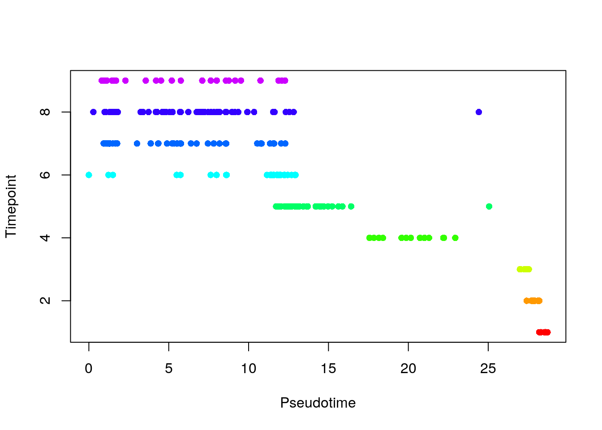
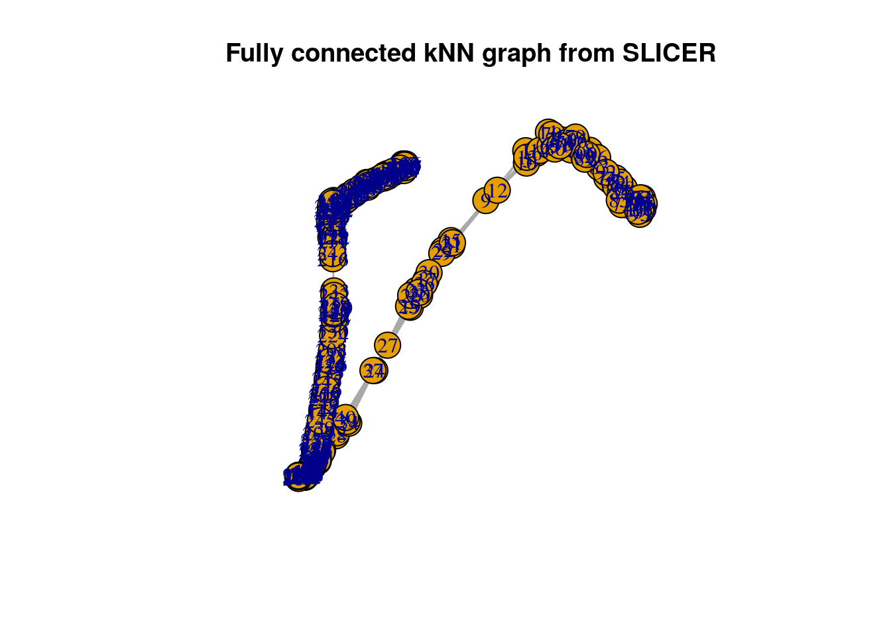
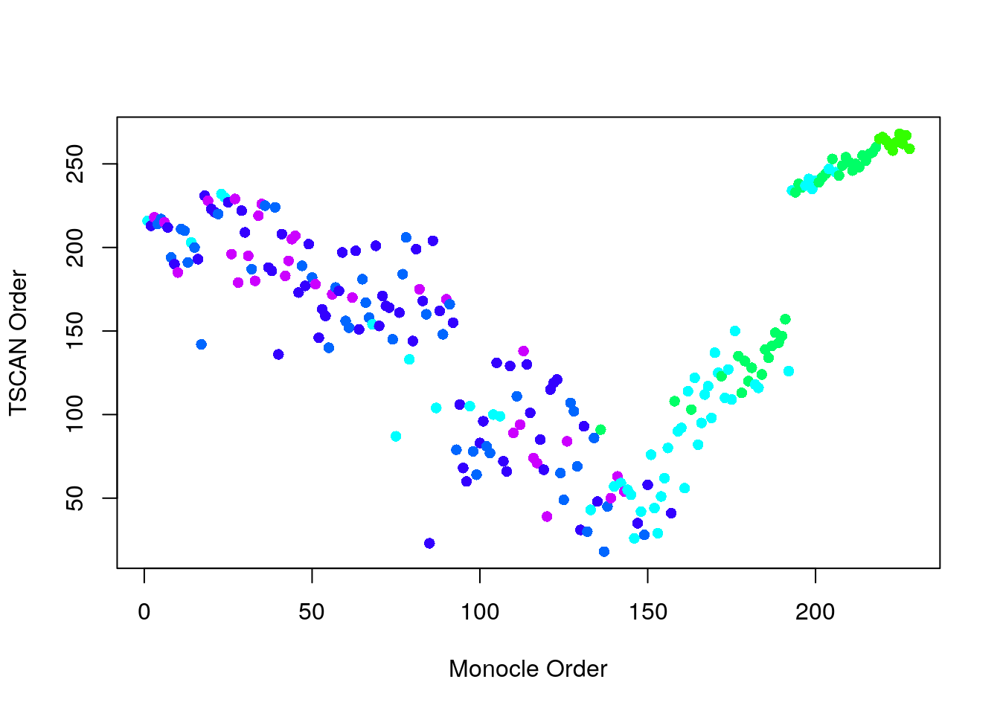
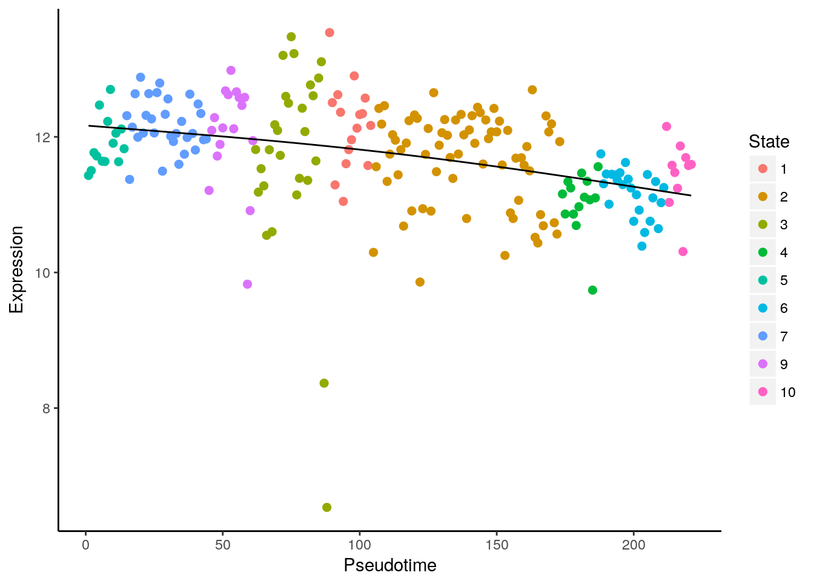
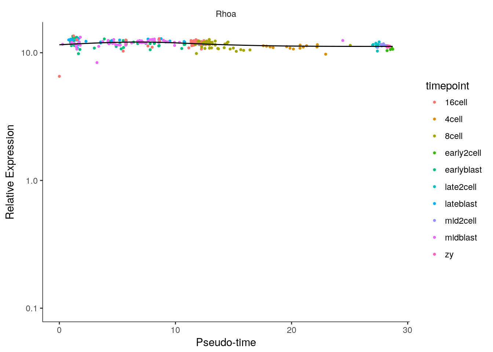

## Pseudotime analysis


```r
library(SingleCellExperiment)
library(TSCAN)
library(M3Drop)
library(monocle)
library(destiny)
library(SLICER)
set.seed(1)
```

In many situations, one is studying a process where cells change
continuously. This includes, for example, many differentiation processes
taking place during development: following a stimulus, cells
will change from one cell-type to another. Ideally, we would like to
monitor the expression levels of an individual cell over
time. Unfortunately, such monitoring is not possible with scRNA-seq
since the cell is lysed (destroyed) when the RNA is extracted.

Instead, we must sample at multiple time-points and obtain snapshots
of the gene expression profiles. Since some of the cells will proceed
faster along the differentiation than others, each snapshot may
contain cells at varying points along the developmental
progression. We use statistical methods to order the cells along one
or more trajectories which represent the underlying developmental
trajectories, this ordering is referred to as "pseudotime".

In this chapter we will consider four different tools: Monocle, TSCAN,
destiny and SLICER for ordering cells according to their pseudotime
development. To illustrate the methods we will be using a dataset on
mouse embryonic development [@Deng2014-mx]. The dataset consists of
268 cells from 10 different time-points of early mouse development. In this case, there is no need for pseudotime alignment since the cell labels provide information about the development trajectory. Thus, the labels allow us to establish a ground truth so that we can evaluate and compare the different methods.

A recent review by Cannoodt et al provides a detailed summary of the
various computational methods for trajectory inference from
single-cell transcriptomics [@Cannoodt2016-uj]. They discuss several
tools, but unfortunately for our purposes many of these tools do not
have complete or well-maintained implementations, and/or are not
implemented in R.

Cannoodt et al cover:

* SCUBA - Matlab implementation
* Wanderlust - Matlab (and requires registration to even download)
* Wishbone - Python
* SLICER - R, but package only available on Github
* SCOUP - C++ command line tool
* Waterfall - R, but one R script in supplement
* Mpath - R pkg, but available as tar.gz on Github; function
documentation but no vignette/workflow
* Monocle - Bioconductor package
* TSCAN - Bioconductor package

Unfortunately only two tools discussed (Monocle and TSCAN) meet the
gold standard of open-source software hosted in a reputable repository.

The following figures from the paper summarise some of the features of
the various tools.

<div class="figure" style="text-align: center">

<p class="caption">(\#fig:pseudotime-methods-description)Descriptions of trajectory inference methods for single-cell transcriptomics data (Fig. 2 from Cannoodt et al, 2016).</p>
</div>

<div class="figure" style="text-align: center">

<p class="caption">(\#fig:pseudotime-methods)Characterization of trajectory inference methods for single-cell transcriptomics data (Fig. 3 from Cannoodt et al, 2016).</p>
</div>


### TSCAN

TSCAN combines clustering with pseudotime analysis. First it clusters the cells using `mclust`,
which is based on a mixture of normal distributions. Then it builds a minimum spanning tree to connect the clusters. The branch of this tree that connects the largest number of clusters is the main branch which is used to determine pseudotime.

First we will try to use all genes to order the cells.

```r
deng_counts <- readRDS("deng/deng-reads.rds")
cellLabels <- colData(deng_counts)$cell_type2
deng <- logcounts(deng_counts)
colnames(deng) <- cellLabels
procdeng <- TSCAN::preprocess(deng)
colnames(procdeng) <- 1:ncol(deng)
dengclust <- TSCAN::exprmclust(procdeng, clusternum = 10)
TSCAN::plotmclust(dengclust)
```



```r
dengorderTSCAN <- TSCAN::TSCANorder(dengclust, orderonly = F)
pseudotime_order_tscan <- as.character(dengorderTSCAN$sample_name)
```

We can also examine which timepoints have been assigned to each state:


```r
cellLabels[dengclust$clusterid == 10]
```

```
##  [1] late2cell mid2cell  mid2cell  mid2cell  mid2cell  mid2cell  mid2cell 
##  [8] mid2cell  mid2cell  mid2cell  mid2cell  mid2cell  mid2cell 
## 10 Levels: 16cell 4cell 8cell early2cell earlyblast ... zy
```

```r
colours <- rainbow(n = 10) # red = early, violet = late
tmp <-
    factor(
        cellLabels[as.numeric(pseudotime_order_tscan)],
        levels = c("early2cell", "mid2cell", "late2cell", "4cell", "8cell",
                   "16cell", "earlyblast", "midblast", "lateblast")
    )
plot(
    as.numeric(tmp),
    xlab = "Pseudotime Order",
    ylab = "Timepoint",
    col = colours[tmp],
    pch = 16
)
```



__Exercise 1__ Compare results for different numbers of clusters (`clusternum`).

### monocle

Monocle skips the clustering stage of TSCAN and directly builds a
minimum spanning tree on a reduced dimension representation of the
cells to connect all cells. Monocle then identifies the longest path
in this tree to determine pseudotime. If the data contains diverging
trajectories (i.e. one cell type differentiates into two different
cell-types), monocle can identify these. Each of the resulting forked paths is
defined as a separate cell state.

Unfortunately, Monocle does not work when all the genes are used, so
we must carry out feature selection. First, we use M3Drop:

```r
m3dGenes <- as.character(
    M3DropFeatureSelection(counts(deng_counts))$Gene
)
```

```
## Warning in bg__calc_variables(expr_mat): Warning: Removing 1134 invariant
## genes.
```



```r
d <- deng[which(rownames(deng) %in% m3dGenes), ]
d <- d[!duplicated(rownames(d)), ]
```

Now run monocle:

```r
colnames(d) <- 1:ncol(d)
geneNames <- rownames(d)
rownames(d) <- 1:nrow(d)
pd <- data.frame(timepoint = cellLabels)
pd <- new("AnnotatedDataFrame", data=pd)
fd <- data.frame(gene_short_name = geneNames)
fd <- new("AnnotatedDataFrame", data=fd)

dCellData <- newCellDataSet(d, phenoData = pd, featureData = fd, expressionFamily = tobit())
dCellData <- setOrderingFilter(dCellData, which(geneNames %in% m3dGenes))
dCellData <- estimateSizeFactors(dCellData)
dCellDataSet <- reduceDimension(dCellData, pseudo_expr = 1)
dCellDataSet <- orderCells(dCellDataSet, reverse = FALSE)
plot_cell_trajectory(dCellDataSet)
```



```r
# Store the ordering
pseudotime_monocle <-
    data.frame(
        Timepoint = phenoData(dCellDataSet)$timepoint,
        pseudotime = phenoData(dCellDataSet)$Pseudotime,
        State=phenoData(dCellDataSet)$State
    )
rownames(pseudotime_monocle) <- 1:ncol(d)
pseudotime_order_monocle <-
    rownames(pseudotime_monocle[order(pseudotime_monocle$pseudotime), ])
```

We can again compare the inferred pseudotime to the known sampling timepoints.

```r
monocle_time_point <- factor(
     pseudotime_monocle$Timepoint,
     levels = c("early2cell", "mid2cell", "late2cell", "4cell", "8cell",
                   "16cell", "earlyblast", "midblast", "lateblast")
)

plot(
    pseudotime_monocle$pseudotime,
    monocle_time_point,
    xlab = "Pseudotime",
    ylab = "Timepoint",
    col = colours[monocle_time_point],
    pch = 16
)
```



### Diffusion maps

[Diffusion maps](https://en.wikipedia.org/wiki/Diffusion_map) were introduced by [Ronald Coifman and Stephane Lafon](http://www.sciencedirect.com/science/article/pii/S1063520306000546), and the underlying idea is to assume that the data are samples from a diffusion process. The method infers the low-dimensional manifold by estimating the eigenvalues and eigenvectors for the diffusion operator related to the data.

[Haghverdi et al](http://biorxiv.org/content/biorxiv/early/2015/08/04/023309.full.pdf) have applied the diffusion maps concept to the analysis of single-cell RNA-seq data to create an R package called [destiny](http://bioconductor.org/packages/destiny).


```r
dm <- DiffusionMap(t(log2(deng + 1)))
tmp <- factor(
    colnames(deng),
    levels = c(
        "early2cell",
        "mid2cell",
        "late2cell",
        "4cell",
        "8cell",
        "16cell",
        "earlyblast",
        "midblast",
        "lateblast"
    )
)
plot(
    eigenvectors(dm)[,1],
    eigenvectors(dm)[,2],
    xlab = "Diffusion component 1",
    ylab = "Diffusion component 2",
    col = colours[tmp],
    pch = 16
)
```


Like the other methods, destiny does a good job at ordering the early time-points, but it is unable to distinguish the later ones.

__Exercise 2__ Do you get a better resolution between the later time points by considering additional eigenvectors?

__Exercise 3__ How does the ordering change if you only use the genes identified by M3Drop?


### SLICER

The SLICER method is an algorithm for constructing trajectories that
describe gene expression changes during a sequential biological
process, just as Monocle and TSCAN are. SLICER is designed to capture
highly nonlinear gene expression changes, automatically select genes
related to the process, and detect multiple branch and loop features
in the trajectory [@Welch2016-jr]. The SLICER R package is available
from its [GitHub repository](https://github.com/jw156605/SLICER) and
can be installed from there using the `devtools` package.

We use the `select_genes` function in SLICER to automatically select
the genes to use in builing the cell trajectory. The function uses
"neighbourhood variance" to identify genes that vary smoothly, rather
than fluctuating randomly, across the set of cells. Following this, we
determine which value of "k" (number of nearest neighbours) yields an embedding that
most resembles a trajectory. Then we estimate the [locally linear
embedding](https://en.wikipedia.org/wiki/Nonlinear_dimensionality_reduction) of the cells.


```r
require("lle")
slicer_genes <- select_genes(t(deng))
k <- select_k(t(deng[slicer_genes,]), kmin = 30, kmax=60)
```

```
## finding neighbours
## calculating weights
## computing coordinates
## finding neighbours
## calculating weights
## computing coordinates
## finding neighbours
## calculating weights
## computing coordinates
## finding neighbours
## calculating weights
## computing coordinates
## finding neighbours
## calculating weights
## computing coordinates
## finding neighbours
## calculating weights
## computing coordinates
## finding neighbours
## calculating weights
## computing coordinates
```

```r
slicer_traj_lle <- lle(t(deng[slicer_genes,]), m = 2, k)$Y
```

```
## finding neighbours
## calculating weights
## computing coordinates
```

```r
plot(slicer_traj_lle, xlab = "LLE Comp 1", ylab = "LLE Comp 2",
     main = "Locally linear embedding of cells from SLICER", 
     col=colours[tmp], pch=16)
```


With the locally linear embedding computed we can construct a
k-nearest neighbour graph that is fully connected. This plot displays
a (yellow) circle for each cell, with the cell ID number overlaid in
blue. Here we show the graph computed using 10 nearest
neighbours. Here, SLICER appears to detect one major trajectory with
one branch.


```r
slicer_traj_graph <- conn_knn_graph(slicer_traj_lle, 10)
plot(slicer_traj_graph, main = "Fully connected kNN graph from SLICER")
```



From this graph we can identify "extreme" cells that are candidates
for start/end cells in the trajectory.


```r
ends <- find_extreme_cells(slicer_traj_graph, slicer_traj_lle)
```


```r
start <- ends[1]
```

Having defined a start cell we can order the cells in the estimated pseudotime.


```r
pseudotime_order_slicer <- cell_order(slicer_traj_graph, start)
branches <- assign_branches(slicer_traj_graph, start)

pseudotime_slicer <-
    data.frame(
        Timepoint = cellLabels,
        pseudotime = NA,
        State = branches
    )
pseudotime_slicer$pseudotime[pseudotime_order_slicer] <-
    1:length(pseudotime_order_slicer)
```

We can again compare the inferred pseudotime to the known sampling
timepoints. SLICER does not provide a pseudotime value per se, just an
ordering of cells.


```r
slicer_time_point <- factor(
     pseudotime_slicer$Timepoint,
     levels = c("early2cell", "mid2cell", "late2cell", "4cell", "8cell",
                   "16cell", "earlyblast", "midblast", "lateblast")
)

plot(
    pseudotime_slicer$pseudotime,
    slicer_time_point,
    xlab = "Pseudotime",
    ylab = "Timepoint",
    col = colours[slicer_time_point],
    pch = 16
)
```


Like the previous method, SLICER here provides a good ordering for the
early time points and struggles for later time points.

__Exercise 4__ How do the results change for different k? (e.g. k = 5) What about changing the number of nearest neighbours in
the call to `conn_knn_graph`?

__Exercise 5__ How does the ordering change if you use a different set
of genes from those chosen by SLICER (e.g. the genes identified by M3Drop)?


### Comparison of the methods

How do the trajectories inferred by TSCAN and Monocle compare?

```r
matched_ordering <-
    match(
        pseudotime_order_tscan,
        pseudotime_order_monocle
    )
timepoint_ordered <-
    monocle_time_point[order(pseudotime_monocle$pseudotime)]
plot(
    matched_ordering,
    xlab = "Monocle Order",
    ylab = "TSCAN Order",
    col = colours[timepoint_ordered],
    pch = 16
)
```



__Exercise 6__: Compare destiny and SLICER to TSCAN and Monocle.

### Expression of genes through time

Each package also enables the visualization of expression through pseudotime. Following individual genes is very helpful for identifying genes that play an important role in the differentiation process. We illustrate the procedure using the `Rhoa` gene.

__TSCAN__

```r
colnames(deng) <- 1:ncol(deng)
TSCAN::singlegeneplot(
    deng[rownames(deng) == "Rhoa", ],
    dengorderTSCAN
)
```



__Monocle__

```r
monocle::plot_genes_in_pseudotime(
    dCellDataSet[fData(dCellDataSet)$gene == "Rhoa",],
    color_by = "timepoint"
)
```



Of course, pseudotime values computed with any method can be added to
the `colData` slot of an `SCE` object. Having done that, the full
plotting capabilities of the `scater` package can be used to
investigate relationships between gene expression, cell populations
and pseudotime. This would be particularly useful for the SLICER
results, as SLICER does not provide plotting functions.

__Exercise 7__: Repeat the exercise using a subset of the genes, e.g. the set of highly variable genes that can be obtained using `Brennecke_getVariableGenes()`

### sessionInfo()


```
## R version 3.4.2 (2017-09-28)
## Platform: x86_64-pc-linux-gnu (64-bit)
## Running under: Debian GNU/Linux 9 (stretch)
## 
## Matrix products: default
## BLAS/LAPACK: /usr/lib/libopenblasp-r0.2.19.so
## 
## locale:
##  [1] LC_CTYPE=en_US.UTF-8       LC_NUMERIC=C              
##  [3] LC_TIME=en_US.UTF-8        LC_COLLATE=en_US.UTF-8    
##  [5] LC_MONETARY=en_US.UTF-8    LC_MESSAGES=C             
##  [7] LC_PAPER=en_US.UTF-8       LC_NAME=C                 
##  [9] LC_ADDRESS=C               LC_TELEPHONE=C            
## [11] LC_MEASUREMENT=en_US.UTF-8 LC_IDENTIFICATION=C       
## 
## attached base packages:
##  [1] splines   parallel  stats4    methods   stats     graphics  grDevices
##  [8] utils     datasets  base     
## 
## other attached packages:
##  [1] lle_1.1                     snowfall_1.84-6.1          
##  [3] snow_0.4-2                  MASS_7.3-45                
##  [5] scatterplot3d_0.3-40        SLICER_0.2.0               
##  [7] destiny_2.4.5               monocle_2.4.0              
##  [9] DDRTree_0.1.5               irlba_2.3.1                
## [11] VGAM_1.0-4                  ggplot2_2.2.1              
## [13] Matrix_1.2-7.1              M3Drop_2.02.00             
## [15] numDeriv_2016.8-1           TSCAN_1.14.0               
## [17] SingleCellExperiment_0.99.4 SummarizedExperiment_1.6.5 
## [19] DelayedArray_0.2.7          matrixStats_0.52.2         
## [21] Biobase_2.36.2              GenomicRanges_1.28.6       
## [23] GenomeInfoDb_1.12.3         IRanges_2.10.5             
## [25] S4Vectors_0.14.7            BiocGenerics_0.22.1        
## [27] knitr_1.17                 
## 
## loaded via a namespace (and not attached):
##   [1] backports_1.1.1         Hmisc_4.0-3            
##   [3] RcppEigen_0.3.3.3.0     plyr_1.8.4             
##   [5] igraph_1.1.2            lazyeval_0.2.1         
##   [7] sp_1.2-5                densityClust_0.3       
##   [9] fastICA_1.2-1           digest_0.6.12          
##  [11] htmltools_0.3.6         gdata_2.18.0           
##  [13] magrittr_1.5            checkmate_1.8.5        
##  [15] tensor_1.5              cluster_2.0.6          
##  [17] limma_3.32.10           tripack_1.3-8          
##  [19] R.utils_2.5.0           xts_0.10-0             
##  [21] colorspace_1.3-2        ggrepel_0.7.0          
##  [23] dplyr_0.7.4             RCurl_1.95-4.8         
##  [25] lme4_1.1-14             spatstat_1.53-2        
##  [27] spatstat.data_1.1-1     bindr_0.1              
##  [29] survival_2.40-1         zoo_1.8-0              
##  [31] glue_1.2.0              polyclip_1.6-1         
##  [33] gtable_0.2.0            zlibbioc_1.22.0        
##  [35] XVector_0.16.0          MatrixModels_0.4-1     
##  [37] car_2.1-5               DEoptimR_1.0-8         
##  [39] abind_1.4-5             SparseM_1.77           
##  [41] VIM_4.7.0               scales_0.5.0           
##  [43] sgeostat_1.0-27         pheatmap_1.0.8         
##  [45] Rcpp_0.12.13            xtable_1.8-2           
##  [47] laeken_0.4.6            htmlTable_1.9          
##  [49] foreign_0.8-67          proxy_0.4-19           
##  [51] mclust_5.3              Formula_1.2-2          
##  [53] vcd_1.4-3               htmlwidgets_0.9        
##  [55] FNN_1.1                 gplots_3.0.1           
##  [57] RColorBrewer_1.1-2      acepack_1.4.1          
##  [59] pkgconfig_2.0.1         R.methodsS3_1.7.1      
##  [61] deldir_0.1-14           nnet_7.3-12            
##  [63] alphahull_2.1           labeling_0.3           
##  [65] rlang_0.1.2             reshape2_1.4.2         
##  [67] munsell_0.4.3           tools_3.4.2            
##  [69] splancs_2.01-40         evaluate_0.10.1        
##  [71] stringr_1.2.0           yaml_2.1.14            
##  [73] goftest_1.1-1           robustbase_0.92-7      
##  [75] caTools_1.17.1          bindrcpp_0.2           
##  [77] nlme_3.1-129            mime_0.5               
##  [79] quantreg_5.34           slam_0.1-40            
##  [81] R.oo_1.21.0             compiler_3.4.2         
##  [83] pbkrtest_0.4-7          curl_3.0               
##  [85] e1071_1.6-8             spatstat.utils_1.7-1   
##  [87] smoother_1.1            tibble_1.3.4           
##  [89] statmod_1.4.30          stringi_1.1.5          
##  [91] highr_0.6               lattice_0.20-34        
##  [93] nloptr_1.0.4            HSMMSingleCell_0.110.0 
##  [95] combinat_0.0-8          lmtest_0.9-35          
##  [97] data.table_1.10.4-3     bitops_1.0-6           
##  [99] httpuv_1.3.5            R6_2.2.2               
## [101] latticeExtra_0.6-28     bookdown_0.5           
## [103] KernSmooth_2.23-15      gridExtra_2.3          
## [105] boot_1.3-18             gtools_3.5.0           
## [107] assertthat_0.2.0        rprojroot_1.2          
## [109] qlcMatrix_0.9.5         GenomeInfoDbData_0.99.0
## [111] mgcv_1.8-22             grid_3.4.2             
## [113] rpart_4.1-10            class_7.3-14           
## [115] minqa_1.2.4             rmarkdown_1.6          
## [117] Rtsne_0.13              TTR_0.23-2             
## [119] bbmle_1.0.20            shiny_1.0.5            
## [121] base64enc_0.1-3
```
