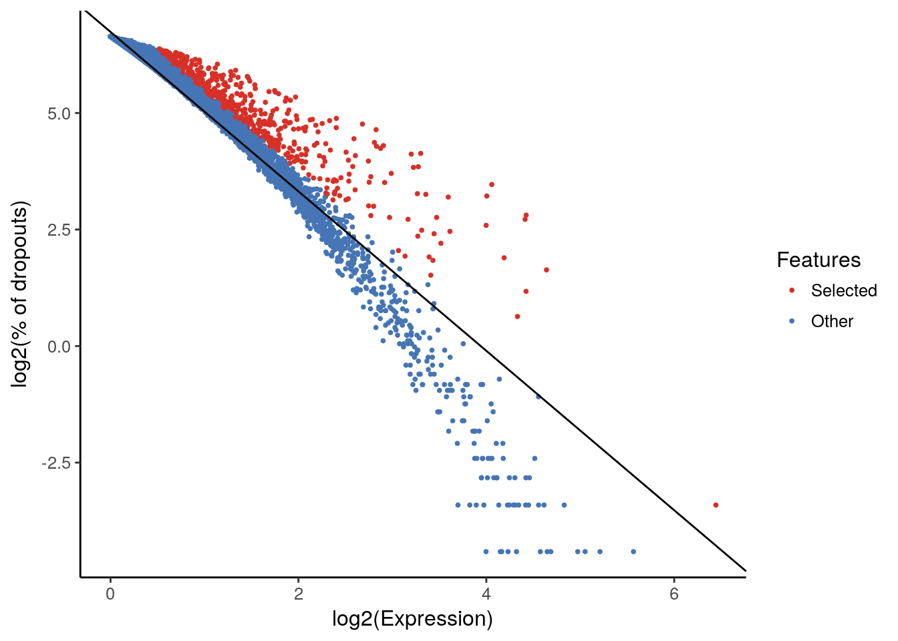
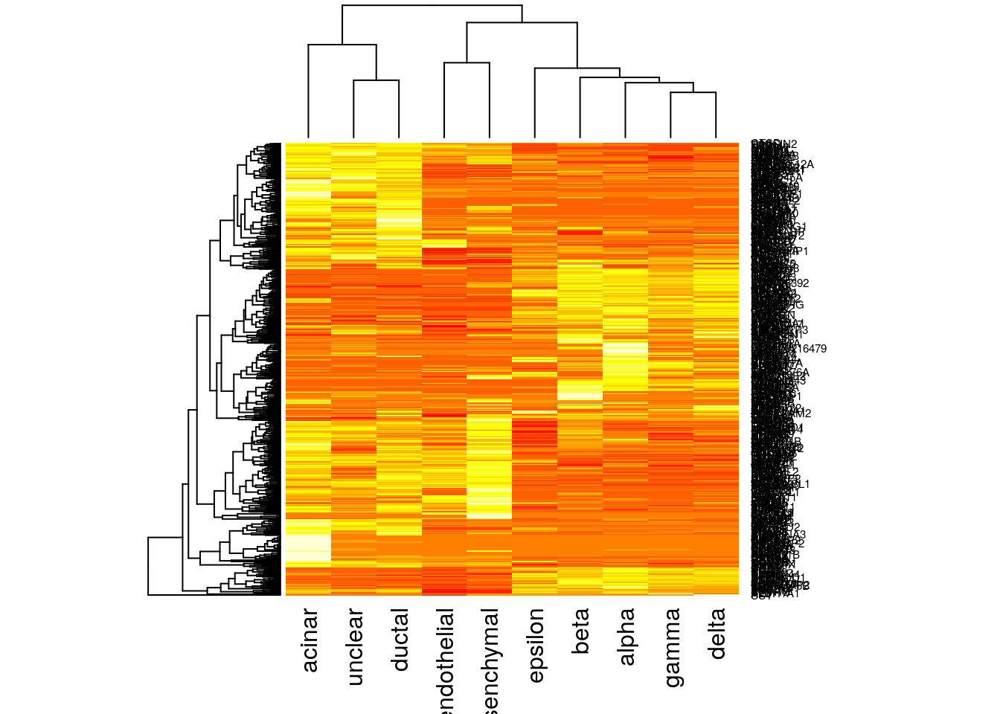

## Projecting scRNA-seq data


```r
library(scmap)
library(scater)
library(SingleCellExperiment)
set.seed(1234567)
```

As more and more scRNA-seq datasets become available, carrying out comparisons between them is key. A central application is to compare datasets of similar biological origin collected by different labs to ensure that the annotation and the analysis is consistent. Moreover, as very large references, e.g. the Human Cell Atlas (HCA) [@Regev2017-mw], become available, an important application will be to project cells from a new sample (e.g. from a disease tissue) onto the reference to characterize differences in composition, or to detect new cell-types. Conceptually, such projections are similar to the popular BLAST method [@Altschul1990-ts], which makes it possible to quickly find the closest match in a database for a newly identified nucleotide or amino acid sequence. 

We recently developed `scmap` [@Kiselev2017-nb] - a method for projecting cells from a scRNA-seq experiment onto the cell-types identified in other experiments. Additionally, a cloud version of `scmap` can be run for free, without restrictions, from [http://www.hemberg-lab.cloud/scmap](http://www.hemberg-lab.cloud/scmap).

### Datasets

We will run `scmap` on two human pancreas datasets: [@Muraro2016-yk] and [@Segerstolpe2016-wc]. Since the pancreas has been widely studied, these datasets are well annotated. As usual cell type labels are stored in the `cell_type1` column of the `colData` slots.

```r
muraro <- readRDS("pancreas/muraro.rds")
segerstolpe <- readRDS("pancreas/segerstolpe.rds")
```

`scmap` can be used to perform both types of projections to either a single dataset or to a reference collection of datasets (Atlas):

<div class="figure" style="text-align: center">

<p class="caption">(\#fig:unnamed-chunk-4)scmap can be used to compare the annotations of two different samples by providing a one to one mapping between the cells.</p>
</div>

<div class="figure" style="text-align: center">

<p class="caption">(\#fig:unnamed-chunk-5) scmap can also be used to project cells from a new experiment onto an annotated reference.</p>
</div>

### Feature Selection
Once we have a `SingleCellExperiment` object we can run `scmap`. Firstly, we need to select the most informative features from our input dataset:

```r
muraro <- selectFeatures(muraro, suppress_plot = FALSE)
```

```
## Warning in linearModel(object, n_features): Your object does not contain
## counts() slot. Dropouts were calculated using logcounts() slot...
```



Features highlighted with the red colour will be used in the futher analysis (projection).

Features are stored in the `scmap_features` column of the `rowData` slot of the input object. By default scmap selects 500 features (it can also be controlled by setting `n_features` parameter):

```r
table(rowData(muraro)$scmap_features)
```

```
## 
## FALSE  TRUE 
## 18627   500
```

### `scmap-cluster`

The `scmap-cluster` index of a reference dataset is created by finding the median gene expression for each cluster. By default scmap uses the `cell_type1` column of the `colData` slot in the reference to identify clusters. Other columns can be manually selected by adjusting `cluster_col` parameter:

```r
muraro <- indexCluster(muraro)
```

The function indexCluster automatically writes the scmap_cluster_index item of the metadata slot of the reference dataset.

```r
head(metadata(muraro)$scmap_cluster_index)
```

```
##           alpha   ductal endothelial    delta   acinar     beta   unclear
## A1CF   2.006376 0.000000    0.000000 1.001412 1.001412 1.001412 0.0000000
## ABCC3  0.000000 2.596810    0.000000 0.000000 2.331011 0.000000 3.2707107
## ABCC8  2.596810 0.000000    0.000000 3.017474 0.000000 4.649591 0.0000000
## ABLIM1 2.331011 2.006376    0.000000 1.588734 1.001412 2.006376 3.3451141
## ACTN1  1.588734 2.331011    2.006376 1.588734 3.017474 1.588734 0.7943671
## ADAM9  1.001412 3.190246    1.001412 0.000000 3.345114 1.001412 1.9117070
##           gamma mesenchymal  epsilon
## A1CF   1.001412    0.000000 2.331011
## ABCC3  0.000000    0.000000 0.000000
## ABCC8  3.485498    0.000000 2.006376
## ABLIM1 0.000000    0.000000 1.588734
## ACTN1  1.588734    4.711531 1.588734
## ADAM9  0.000000    2.331011 0.000000
```

One can also visualise the index:

```r
heatmap(as.matrix(metadata(muraro)$scmap_cluster_index))
```



#### Projecting

Once the `scmap-cluster` index has been generated we can use it to project `segerstolpe` dataset to `muraro` dataset. This can be done with one index at a time, but `scmap` also allows for simultaneous projection to multiple indexes if they are provided as a list:


```r
scmapCluster_results <- scmapCluster(
  projection = segerstolpe, 
  index_list = list(
    muraro = metadata(muraro)$scmap_cluster_index
  )
)
```

```
## Warning in setFeatures(projection, rownames(index)): Features C19orf77,
## CSDA, LOC100216479 are not present in the 'SCESet' object and therefore
## were not set.
```

### Results

`scmap-cluster` projects the query dataset to all projections defined in the index_list. The results of cell label assignements are merged into one matrix:

```r
head(scmapCluster_results$scmap_cluster_labs)
```

```
##      muraro      
## [1,] "unassigned"
## [2,] "unassigned"
## [3,] "alpha"     
## [4,] "delta"     
## [5,] "gamma"     
## [6,] "unassigned"
```

Corresponding similarities are stored in the scmap_cluster_siml item:

```r
head(scmapCluster_results$scmap_cluster_siml)
```

```
##         muraro
## [1,] 0.4452916
## [2,] 0.6571171
## [3,] 0.8016826
## [4,] 0.7209766
## [5,] 0.7448156
## [6,] 0.4971898
```

`scmap` also provides combined results of all reference dataset (choose labels corresponding to the largest similarity across reference datasets):

```r
head(scmapCluster_results$combined_labs)
```

```
## [1] "unassigned" "unassigned" "alpha"      "delta"      "gamma"     
## [6] "unassigned"
```

Clearly the projection is almost perfect. With `scmap` one can also plot a [Sankey diagram](https://developers.google.com/chart/interactive/docs/gallery/sankey) (however, `cell_type1` columns have to be provided in the `colData` slots of both the reference and the projection datasets):

```r
plot(
  getSankey(
    colData(segerstolpe)$cell_type1, 
    scmapCluster_results$scmap_cluster_labs[,'muraro'],
    plot_height = 400
  )
)
```

<!-- Sankey generated in R 3.4.3 by googleVis 0.6.2 package -->
<!-- Wed Jan 17 13:55:18 2018 -->


<!-- jsHeader -->
<script type="text/javascript">
 
// jsData 
function gvisDataSankeyID6fd5a38d841 () {
var data = new google.visualization.DataTable();
var datajson =
[
 [
"not applicable ",
" unassigned",
998
],
[
"alpha ",
" alpha",
869
],
[
"ductal ",
" ductal",
383
],
[
"beta ",
" beta",
260
],
[
"gamma ",
" gamma",
192
],
[
"acinar ",
" acinar",
181
],
[
"delta ",
" delta",
111
],
[
"PSC ",
" mesenchymal",
53
],
[
"unclassified endocrine ",
" unassigned",
41
],
[
"co-expression ",
" beta",
31
],
[
"endothelial ",
" endothelial",
14
],
[
"mast ",
" unassigned",
7
],
[
"epsilon ",
" epsilon",
6
],
[
"MHC class II ",
" unassigned",
5
],
[
"unclassified ",
" unassigned",
2
],
[
"acinar ",
" ductal",
4
],
[
"alpha ",
" unassigned",
16
],
[
"alpha ",
" beta",
1
],
[
"beta ",
" unassigned",
10
],
[
"co-expression ",
" alpha",
7
],
[
"co-expression ",
" unassigned",
1
],
[
"delta ",
" beta",
1
],
[
"delta ",
" unassigned",
2
],
[
"ductal ",
" unclear",
1
],
[
"ductal ",
" unassigned",
2
],
[
"endothelial ",
" unassigned",
2
],
[
"epsilon ",
" unassigned",
1
],
[
"gamma ",
" alpha",
2
],
[
"gamma ",
" unassigned",
3
],
[
"not applicable ",
" alpha",
161
],
[
"not applicable ",
" acinar",
17
],
[
"not applicable ",
" beta",
16
],
[
"not applicable ",
" ductal",
72
],
[
"not applicable ",
" delta",
9
],
[
"not applicable ",
" mesenchymal",
11
],
[
"not applicable ",
" endothelial",
7
],
[
"not applicable ",
" gamma",
14
],
[
"PSC ",
" beta",
1
] 
];
data.addColumn('string','From');
data.addColumn('string','To');
data.addColumn('number','# of cells');
data.addRows(datajson);
return(data);
}
 
// jsDrawChart
function drawChartSankeyID6fd5a38d841() {
var data = gvisDataSankeyID6fd5a38d841();
var options = {};
options["width"] = 400;
options["height"] = 400;
options["sankey"] = {
                node:{
                    label:{
                        fontName:'Arial',
                        fontSize:11,color:
                        '#000000',
                        bold:true,
                        italic:false
                    },
                    colors:'#FFFFFF',
                    nodePadding:12
                },iterations:0
            };

    var chart = new google.visualization.Sankey(
    document.getElementById('SankeyID6fd5a38d841')
    );
    chart.draw(data,options);
    

}
  
 
// jsDisplayChart
(function() {
var pkgs = window.__gvisPackages = window.__gvisPackages || [];
var callbacks = window.__gvisCallbacks = window.__gvisCallbacks || [];
var chartid = "sankey";
  
// Manually see if chartid is in pkgs (not all browsers support Array.indexOf)
var i, newPackage = true;
for (i = 0; newPackage && i < pkgs.length; i++) {
if (pkgs[i] === chartid)
newPackage = false;
}
if (newPackage)
  pkgs.push(chartid);
  
// Add the drawChart function to the global list of callbacks
callbacks.push(drawChartSankeyID6fd5a38d841);
})();
function displayChartSankeyID6fd5a38d841() {
  var pkgs = window.__gvisPackages = window.__gvisPackages || [];
  var callbacks = window.__gvisCallbacks = window.__gvisCallbacks || [];
  window.clearTimeout(window.__gvisLoad);
  // The timeout is set to 100 because otherwise the container div we are
  // targeting might not be part of the document yet
  window.__gvisLoad = setTimeout(function() {
  var pkgCount = pkgs.length;
  google.load("visualization", "1", { packages:pkgs, callback: function() {
  if (pkgCount != pkgs.length) {
  // Race condition where another setTimeout call snuck in after us; if
  // that call added a package, we must not shift its callback
  return;
}
while (callbacks.length > 0)
callbacks.shift()();
} });
}, 100);
}
 
// jsFooter
</script>
 
<!-- jsChart -->  
<script type="text/javascript" src="https://www.google.com/jsapi?callback=displayChartSankeyID6fd5a38d841"></script>
 
<!-- divChart -->
  
<div id="SankeyID6fd5a38d841" 
  style="width: 400; height: 400;">
</div>

### sessionInfo()


```
## R version 3.4.3 (2017-11-30)
## Platform: x86_64-pc-linux-gnu (64-bit)
## Running under: Debian GNU/Linux 9 (stretch)
## 
## Matrix products: default
## BLAS: /usr/lib/openblas-base/libblas.so.3
## LAPACK: /usr/lib/libopenblasp-r0.2.19.so
## 
## locale:
##  [1] LC_CTYPE=en_US.UTF-8       LC_NUMERIC=C              
##  [3] LC_TIME=en_US.UTF-8        LC_COLLATE=en_US.UTF-8    
##  [5] LC_MONETARY=en_US.UTF-8    LC_MESSAGES=C             
##  [7] LC_PAPER=en_US.UTF-8       LC_NAME=C                 
##  [9] LC_ADDRESS=C               LC_TELEPHONE=C            
## [11] LC_MEASUREMENT=en_US.UTF-8 LC_IDENTIFICATION=C       
## 
## attached base packages:
## [1] stats4    parallel  methods   stats     graphics  grDevices utils    
## [8] datasets  base     
## 
## other attached packages:
##  [1] bindrcpp_0.2               scater_1.6.1              
##  [3] SingleCellExperiment_1.0.0 SummarizedExperiment_1.8.1
##  [5] DelayedArray_0.4.1         matrixStats_0.52.2        
##  [7] GenomicRanges_1.30.1       GenomeInfoDb_1.14.0       
##  [9] IRanges_2.12.0             S4Vectors_0.16.0          
## [11] ggplot2_2.2.1              Biobase_2.38.0            
## [13] BiocGenerics_0.24.0        scmap_1.1.5               
## [15] googleVis_0.6.2            knitr_1.18                
## 
## loaded via a namespace (and not attached):
##  [1] viridis_0.4.1          httr_1.3.1             edgeR_3.20.6          
##  [4] bit64_0.9-7            jsonlite_1.5           viridisLite_0.2.0     
##  [7] shiny_1.0.5            assertthat_0.2.0       highr_0.6             
## [10] blob_1.1.0             vipor_0.4.5            GenomeInfoDbData_1.0.0
## [13] yaml_2.1.16            progress_1.1.2         pillar_1.1.0          
## [16] RSQLite_2.0            backports_1.1.2        lattice_0.20-34       
## [19] limma_3.34.5           glue_1.2.0             digest_0.6.14         
## [22] XVector_0.18.0         randomForest_4.6-12    colorspace_1.3-2      
## [25] htmltools_0.3.6        httpuv_1.3.5           Matrix_1.2-7.1        
## [28] plyr_1.8.4             XML_3.98-1.9           pkgconfig_2.0.1       
## [31] biomaRt_2.34.1         bookdown_0.5           zlibbioc_1.24.0       
## [34] xtable_1.8-2           scales_0.5.0           tibble_1.4.1          
## [37] proxy_0.4-21           lazyeval_0.2.1         magrittr_1.5          
## [40] mime_0.5               memoise_1.1.0          evaluate_0.10.1       
## [43] class_7.3-14           beeswarm_0.2.3         shinydashboard_0.6.1  
## [46] data.table_1.10.4-3    tools_3.4.3            prettyunits_1.0.2     
## [49] stringr_1.2.0          locfit_1.5-9.1         munsell_0.4.3         
## [52] AnnotationDbi_1.40.0   compiler_3.4.3         e1071_1.6-8           
## [55] rlang_0.1.6            rhdf5_2.22.0           grid_3.4.3            
## [58] RCurl_1.95-4.10        tximport_1.6.0         rjson_0.2.15          
## [61] labeling_0.3           bitops_1.0-6           rmarkdown_1.8         
## [64] gtable_0.2.0           codetools_0.2-15       DBI_0.7               
## [67] reshape2_1.4.3         R6_2.2.2               gridExtra_2.3         
## [70] dplyr_0.7.4            bit_1.1-12             bindr_0.1             
## [73] rprojroot_1.3-2        ggbeeswarm_0.6.0       stringi_1.1.6         
## [76] Rcpp_0.12.14
```


