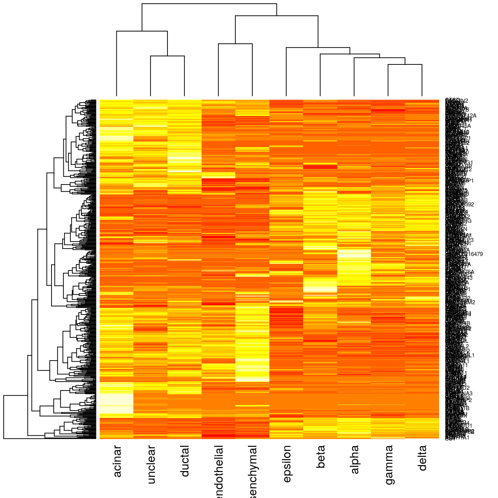

## Projecting scRNA-seq data


```r
library(scmap)
library(scater)
library(SingleCellExperiment)
set.seed(1234567)
```

As more and more scRNA-seq datasets become available, carrying out comparisons between them is key. A central application is to compare datasets of similar biological origin collected by different labs to ensure that the annotation and the analysis is consistent. Moreover, as very large references, e.g. the Human Cell Atlas (HCA) [@Regev2017-mw], become available, an important application will be to project cells from a new sample (e.g. from a disease tissue) onto the reference to characterize differences in composition, or to detect new cell-types. Conceptually, such projections are similar to the popular BLAST method [@Altschul1990-ts], which makes it possible to quickly find the closest match in a database for a newly identified nucleotide or amino acid sequence. 

We recently developed `scmap` [@Kiselev2017-nb] - a method for projecting cells from a scRNA-seq experiment onto the cell-types identified in other experiments. Additionally, a cloud version of `scmap` can be run for free, without restrictions, from [http://www.hemberg-lab.cloud/scmap](http://www.hemberg-lab.cloud/scmap).

### Datasets

We will run `scmap` on two human pancreas datasets: [@Muraro2016-yk] and [@Segerstolpe2016-wc]. Since the pancreas has been widely studied, these datasets are well annotated. As usual cell type labels are stored in the `cell_type1` column of the `colData` slots.

```r
muraro <- readRDS("pancreas/muraro.rds")
segerstolpe <- readRDS("pancreas/segerstolpe.rds")
```

`scmap` can be used to perform both types of projections to either a single dataset or to a reference collection of datasets (Atlas):

<div class="figure" style="text-align: center">

<p class="caption">(\#fig:unnamed-chunk-4)scmap can be used to compare the annotations of two different samples by providing a one to one mapping between the cells.</p>
</div>

<div class="figure" style="text-align: center">

<p class="caption">(\#fig:unnamed-chunk-5) scmap can also be used to project cells from a new experiment onto an annotated reference.</p>
</div>

### Run `scmap`

#### Feature Selection
Once we have a `SingleCellExperiment` object we can run `scmap`. Firstly, we need to select the most informative features from our input dataset:

```r
muraro <- getFeatures(muraro, suppress_plot = FALSE)
```

```
## Warning in linearModel(object, n_features): Your object does not contain
## counts() slot. Dropouts were calculated using logcounts() slot...
```


Genes highlighted with the red colour will be used in the futher analysis (projection).

#### Projecting

We will project the `segerstolpe` dataset to `muraro` dataset:

```r
segerstolpe <- projectData(projection = segerstolpe, reference = muraro)
```

```
## Warning in setFeatures(projection_local, as.data.frame(rowData(reference))
## $feature_symbol[as.data.frame(rowData(reference))$scmap_features]):
## Features C19orf77, CSDA, LOC100216479 are not present in the 'SCESet'
## object and therefore were not set.
```

In your own analysis you can choose any two scRNASeq datasets and project them to each other. Note that the `getFeatures` functions has to be run on the reference dataset before running the `projectData` function.

### Results

Let's look at the results. The labels produced by `scmap` are located in the `scmap_labs` column of the `colData` slot of the projection dataset. We will compare them to the original labels provided by the authors of the publication:

```r
colData(segerstolpe)[,c("scmap_labs", "scmap_siml")]
```

```
## DataFrame with 3514 rows and 2 columns
##                  scmap_labs scmap_siml
##                 <character>  <numeric>
## AZ_A1            unassigned  0.4452916
## AZ_A10           unassigned  0.6571171
## AZ_A11                alpha  0.8016826
## AZ_A12                delta  0.7209766
## AZ_A2                 gamma  0.7448156
## ...                     ...        ...
## HP1526901T2D_P5  unassigned  0.3884353
## HP1526901T2D_P6  unassigned  0.3858811
## HP1526901T2D_P7        beta  0.8698103
## HP1526901T2D_P8  unassigned  0.3668804
## HP1526901T2D_P9        beta  0.8691188
```

Clearly the projection is almost perfect. With `scmap` one can also plot a [Sankey diagram](https://developers.google.com/chart/interactive/docs/gallery/sankey) (however, `cell_type1` columns have to be provided in the `colData` slots of both the reference and the projection datasets):

```r
plot(getSankey(colData(segerstolpe)$cell_type1, colData(segerstolpe)$scmap_labs))
```

<!-- Sankey generated in R 3.4.2 by googleVis 0.6.2 package -->
<!-- Tue Nov  7 12:55:23 2017 -->


<!-- jsHeader -->
<script type="text/javascript">
 
// jsData 
function gvisDataSankeyID699616b5948 () {
var data = new google.visualization.DataTable();
var datajson =
[
 [
"not applicable ",
" unassigned",
998
],
[
"alpha ",
" alpha",
869
],
[
"ductal ",
" ductal",
383
],
[
"beta ",
" beta",
260
],
[
"gamma ",
" gamma",
192
],
[
"acinar ",
" acinar",
181
],
[
"delta ",
" delta",
111
],
[
"PSC ",
" mesenchymal",
53
],
[
"unclassified endocrine ",
" unassigned",
41
],
[
"co-expression ",
" beta",
31
],
[
"endothelial ",
" endothelial",
14
],
[
"mast ",
" unassigned",
7
],
[
"epsilon ",
" epsilon",
6
],
[
"MHC class II ",
" unassigned",
5
],
[
"unclassified ",
" unassigned",
2
],
[
"acinar ",
" ductal",
4
],
[
"alpha ",
" unassigned",
16
],
[
"alpha ",
" beta",
1
],
[
"beta ",
" unassigned",
10
],
[
"co-expression ",
" alpha",
7
],
[
"co-expression ",
" unassigned",
1
],
[
"delta ",
" beta",
1
],
[
"delta ",
" unassigned",
2
],
[
"ductal ",
" unclear",
1
],
[
"ductal ",
" unassigned",
2
],
[
"endothelial ",
" unassigned",
2
],
[
"epsilon ",
" unassigned",
1
],
[
"gamma ",
" alpha",
2
],
[
"gamma ",
" unassigned",
3
],
[
"not applicable ",
" alpha",
161
],
[
"not applicable ",
" acinar",
17
],
[
"not applicable ",
" beta",
16
],
[
"not applicable ",
" ductal",
72
],
[
"not applicable ",
" delta",
9
],
[
"not applicable ",
" mesenchymal",
11
],
[
"not applicable ",
" endothelial",
7
],
[
"not applicable ",
" gamma",
14
],
[
"PSC ",
" beta",
1
] 
];
data.addColumn('string','From');
data.addColumn('string','To');
data.addColumn('number','# of cells');
data.addRows(datajson);
return(data);
}
 
// jsDrawChart
function drawChartSankeyID699616b5948() {
var data = gvisDataSankeyID699616b5948();
var options = {};
options["width"] = 400;
options["height"] = 600;
options["sankey"] = {
                node:{
                    label:{
                        fontName:'Arial',
                        fontSize:11,color:
                        '#000000',
                        bold:true,
                        italic:false
                    },
                    colors:'#FFFFFF',
                    nodePadding:12
                },iterations:0
            };

    var chart = new google.visualization.Sankey(
    document.getElementById('SankeyID699616b5948')
    );
    chart.draw(data,options);
    

}
  
 
// jsDisplayChart
(function() {
var pkgs = window.__gvisPackages = window.__gvisPackages || [];
var callbacks = window.__gvisCallbacks = window.__gvisCallbacks || [];
var chartid = "sankey";
  
// Manually see if chartid is in pkgs (not all browsers support Array.indexOf)
var i, newPackage = true;
for (i = 0; newPackage && i < pkgs.length; i++) {
if (pkgs[i] === chartid)
newPackage = false;
}
if (newPackage)
  pkgs.push(chartid);
  
// Add the drawChart function to the global list of callbacks
callbacks.push(drawChartSankeyID699616b5948);
})();
function displayChartSankeyID699616b5948() {
  var pkgs = window.__gvisPackages = window.__gvisPackages || [];
  var callbacks = window.__gvisCallbacks = window.__gvisCallbacks || [];
  window.clearTimeout(window.__gvisLoad);
  // The timeout is set to 100 because otherwise the container div we are
  // targeting might not be part of the document yet
  window.__gvisLoad = setTimeout(function() {
  var pkgCount = pkgs.length;
  google.load("visualization", "1", { packages:pkgs, callback: function() {
  if (pkgCount != pkgs.length) {
  // Race condition where another setTimeout call snuck in after us; if
  // that call added a package, we must not shift its callback
  return;
}
while (callbacks.length > 0)
callbacks.shift()();
} });
}, 100);
}
 
// jsFooter
</script>
 
<!-- jsChart -->  
<script type="text/javascript" src="https://www.google.com/jsapi?callback=displayChartSankeyID699616b5948"></script>
 
<!-- divChart -->
  
<div id="SankeyID699616b5948" 
  style="width: 400; height: 600;">
</div>

### Creating a precomputed Reference

The cell type centroids can be precomputed by using the `createReference` method:

```r
reference <- createReference(muraro[rowData(muraro)$scmap_features, ])
```

One can also visualise the cell type centroids, e.g.:

```r
heatmap(as.matrix(reference))
```



Exactly the same projection as above can be performed by providing the precomputed reference instead of the `SingleCellExperiment` object:

```r
segerstolpe <- projectData(projection = segerstolpe, reference = reference)
```

```
## Warning in setFeatures(projection_local, rownames(reference)): Features
## C19orf77, CSDA, LOC100216479 are not present in the 'SCESet' object and
## therefore were not set.
```

```r
colData(segerstolpe)[,c("scmap_labs", "scmap_siml")]
```

```
## DataFrame with 3514 rows and 2 columns
##                  scmap_labs scmap_siml
##                 <character>  <numeric>
## AZ_A1            unassigned  0.4452916
## AZ_A10           unassigned  0.6571171
## AZ_A11                alpha  0.8016826
## AZ_A12                delta  0.7209766
## AZ_A2                 gamma  0.7448156
## ...                     ...        ...
## HP1526901T2D_P5  unassigned  0.3884353
## HP1526901T2D_P6  unassigned  0.3858811
## HP1526901T2D_P7        beta  0.8698103
## HP1526901T2D_P8  unassigned  0.3668804
## HP1526901T2D_P9        beta  0.8691188
```

### sessionInfo()


```
## R version 3.4.2 (2017-09-28)
## Platform: x86_64-pc-linux-gnu (64-bit)
## Running under: Debian GNU/Linux 9 (stretch)
## 
## Matrix products: default
## BLAS/LAPACK: /usr/lib/libopenblasp-r0.2.19.so
## 
## locale:
##  [1] LC_CTYPE=en_US.UTF-8       LC_NUMERIC=C              
##  [3] LC_TIME=en_US.UTF-8        LC_COLLATE=en_US.UTF-8    
##  [5] LC_MONETARY=en_US.UTF-8    LC_MESSAGES=C             
##  [7] LC_PAPER=en_US.UTF-8       LC_NAME=C                 
##  [9] LC_ADDRESS=C               LC_TELEPHONE=C            
## [11] LC_MEASUREMENT=en_US.UTF-8 LC_IDENTIFICATION=C       
## 
## attached base packages:
## [1] stats4    parallel  methods   stats     graphics  grDevices utils    
## [8] datasets  base     
## 
## other attached packages:
##  [1] bindrcpp_0.2               scater_1.6.0              
##  [3] SingleCellExperiment_1.0.0 SummarizedExperiment_1.8.0
##  [5] DelayedArray_0.4.1         matrixStats_0.52.2        
##  [7] GenomicRanges_1.30.0       GenomeInfoDb_1.14.0       
##  [9] IRanges_2.12.0             S4Vectors_0.16.0          
## [11] ggplot2_2.2.1              Biobase_2.38.0            
## [13] BiocGenerics_0.24.0        scmap_1.0.0               
## [15] googleVis_0.6.2            knitr_1.17                
## 
## loaded via a namespace (and not attached):
##  [1] viridis_0.4.0           edgeR_3.20.1           
##  [3] bit64_0.9-7             jsonlite_1.5           
##  [5] viridisLite_0.2.0       shiny_1.0.5            
##  [7] assertthat_0.2.0        highr_0.6              
##  [9] blob_1.1.0              vipor_0.4.5            
## [11] GenomeInfoDbData_0.99.1 yaml_2.1.14            
## [13] progress_1.1.2          RSQLite_2.0            
## [15] backports_1.1.1         lattice_0.20-34        
## [17] limma_3.34.0            glue_1.2.0             
## [19] digest_0.6.12           XVector_0.18.0         
## [21] randomForest_4.6-12     colorspace_1.3-2       
## [23] htmltools_0.3.6         httpuv_1.3.5           
## [25] Matrix_1.2-7.1          plyr_1.8.4             
## [27] XML_3.98-1.9            pkgconfig_2.0.1        
## [29] biomaRt_2.34.0          bookdown_0.5           
## [31] zlibbioc_1.24.0         xtable_1.8-2           
## [33] scales_0.5.0            tibble_1.3.4           
## [35] proxy_0.4-19            lazyeval_0.2.1         
## [37] magrittr_1.5            mime_0.5               
## [39] memoise_1.1.0           evaluate_0.10.1        
## [41] class_7.3-14            beeswarm_0.2.3         
## [43] shinydashboard_0.6.1    tools_3.4.2            
## [45] data.table_1.10.4-3     prettyunits_1.0.2      
## [47] stringr_1.2.0           locfit_1.5-9.1         
## [49] munsell_0.4.3           AnnotationDbi_1.40.0   
## [51] compiler_3.4.2          e1071_1.6-8            
## [53] rlang_0.1.4             rhdf5_2.22.0           
## [55] grid_3.4.2              RCurl_1.95-4.8         
## [57] tximport_1.6.0          rjson_0.2.15           
## [59] labeling_0.3            bitops_1.0-6           
## [61] rmarkdown_1.6           gtable_0.2.0           
## [63] codetools_0.2-15        DBI_0.7                
## [65] reshape2_1.4.2          R6_2.2.2               
## [67] gridExtra_2.3           dplyr_0.7.4            
## [69] bit_1.1-12              bindr_0.1              
## [71] rprojroot_1.2           ggbeeswarm_0.6.0       
## [73] stringi_1.1.5           Rcpp_0.12.13
```


